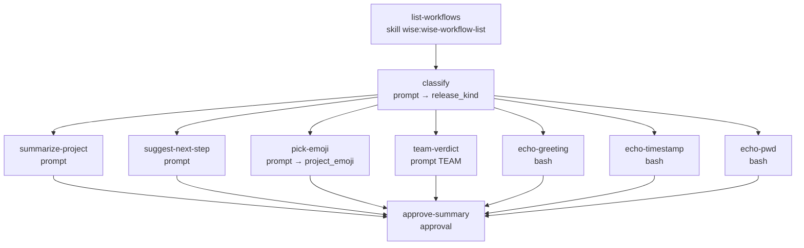

# example-workflow

<!-- This README is the source of truth for how the workflow
     LOOKS to users. Keep it in sync with workflow.yaml +
     prompts/*.md — every edit to the flow, steps, outputs,
     or fragment list belongs here too. See
     CONTRIBUTING.md §9.6 for the invariant. -->

Reference workflow that exercises four of the six step types
(`skill`, `prompt`, `bash`, `approval` — `ask` and `interactive`
are not exercised here), the parallel-wave dispatcher, AND the
per-step agent / model / effort fields including a multi-agent
**team** step. Harmless to run — it only lists the available
workflows, classifies the current project, and runs seven parallel
fan-out steps that either subagent-prompt (one of them a team) or
`echo` under a randomised sleep. Use it to verify the workflow
subsystem after an install, a schema change, or a dep upgrade.

## When to use

- After installing / updating the wise plugin, to confirm the
  engine, `workflows.py` helpers, and step-type dispatch all
  work end-to-end.
- While developing the workflow subsystem — change an engine
  helper, run this, see if anything regressed.
- As a reference when authoring a new workflow — the YAML
  exercises parallel waves (same `depends_on`), `outputs` capture,
  `until:` regex, and an approval gate.

## When not to use

- It's not a "real" workflow — it doesn't do anything useful
  beyond proving the subsystem is wired correctly.

## Prerequisites

- `/wise-init` completed at least once so the workflow engine's
  fast-path finds Python + PyYAML.
- Run from inside a git repository — `project-selection: prompt`
  auto-detects the project from the current directory and asks
  you to confirm it.

## Flow



The seven steps between `classify` and `approve-summary` share
`depends_on: [classify]`, so they run as one parallel wave. In
wave-sync mode the conductor batches them into a single turn;
in synchronous mode the approval is auto-approved.

The workflow sets `agents: auto`, and the five `prompt` steps cover
every agent-binding path so the dispatch logic is smoke-tested:
`agent: off` + `model: haiku` (classify), a forced role + `effort`
(summarize-project → `wise:technical-writer`, low), explicit
`agent: auto` (suggest-next-step), policy-inherited auto
(pick-emoji), and a multi-agent **team** with a lead + per-member
model override (team-verdict → `wise:architect` lead +
`wise:product-manager` + `wise:qa-engineer`, conductor-synthesized).
See [Agents, model and effort](../../../../docs/wise/workflows.md#agents-model-and-effort).

## Steps

| Step | Type | Purpose |
|---|---|---|
| `list-workflows` | `skill` | Invokes `wise:wise-workflow-list` so Claude sees the available workflows. |
| `classify` | `prompt` | One word — `frontend` / `backend` / `fullstack` / `other` — validated against an `until:` regex with 2 retries. Captures `release_kind`. Runs as plain `general-purpose` (`agent: off`) on `model: haiku`. |
| `summarize-project` | `prompt` | One-sentence summary of a `{{project.kind}}` project. Forced to `wise:technical-writer` (`agent:`) at `effort: low`. |
| `suggest-next-step` | `prompt` | One-sentence improvement suggestion. Explicit `agent: auto` — the conductor picks the best-fit roster role. |
| `pick-emoji` | `prompt` | Single emoji matching the project kind. Captures `project_emoji`. Inherits the workflow `agents: auto` policy (no `agent:` set). |
| `team-verdict` | `prompt` (team) | One-line priority take, worked by a **team**: `wise:architect` (lead) + `wise:product-manager` + `wise:qa-engineer` on shared `model: haiku`, conductor-synthesized into one result. |
| `echo-greeting` | `bash` | `sleep RANDOM; echo "hello from {{project.name}}"`. |
| `echo-timestamp` | `bash` | `sleep RANDOM; date -u`. |
| `echo-pwd` | `bash` | `sleep RANDOM; pwd`. |
| `approve-summary` | `approval` | Final gate. In wave-sync mode an AskUserQuestion confirms the run; in sync it auto-approves. |

## Inputs

None.

## Outputs

| Name | Source | Used for |
|---|---|---|
| `release_kind` | `classify` | Templated into downstream step prompts. |
| `project_emoji` | `pick-emoji` | Included in the `approve-summary` message. |

## Examples

```
/wise-workflow-run example-workflow
```

## Related

- [Definition YAML](./workflow.yaml)
- [`docs/wise/workflows.md`](../../../../docs/wise/workflows.md) —
  user-facing workflow reference.
