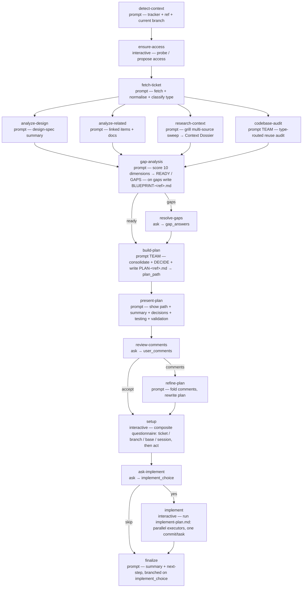

# ticket-plan

<!-- This README is the source of truth for how the workflow
     LOOKS to users. Keep it in sync with workflow.yaml +
     prompts/*.md — every edit to the flow, steps, outputs,
     or fragment list belongs here too. See
     CONTRIBUTING.md §9.6 for the invariant. -->

Turn a ticket from any task tracker into an implementation plan. The
workflow identifies which tracker the ticket belongs to, confirms it
can reach that tracker (probing for an MCP or CLI and proposing install
options when it can't), fetches and normalises the ticket, analyses
design links + related tickets + reference docs in parallel, runs a
grill **multi-source context sweep** (the ticket's comment thread +
screenshots, wiki / Slack / Drive / design channels where reachable,
codebase + git history) and a "reuse first" codebase audit, then
**gap-checks** the evidence: when critical dimensions are unknown it
writes a `BLUEPRINT-<ref>.md` with targeted per-person questions and
lets you answer inline (or pause the run and take them to your team);
otherwise — **autonomously, no question-by-question wizard** — it
consolidates the findings and makes every scope / approach / component
/ design / testing decision, writes a `PLAN-<ref>.md` into the run
directory, and **presents the consolidated decision + plan for you to
review and comment**. Only after the plan is settled does it ask the
git / session **setup** choices, as one composite questionnaire.

## When to use

- You've been assigned a ticket (Jira, Linear, GitHub / GitLab Issues,
  Asana, …) and want to go from "I've read the summary" to "I've got a
  written plan ready to implement" without re-reading every linked
  document by hand.
- The ticket has design links and you want a design-spec summary
  surfaced explicitly.
- The ticket has parent / linked tickets / reference docs you'd
  otherwise skim and forget.

## When not to use

- Quick fixes that don't need planning (typo, one-line change) — skip
  the workflow and just edit.
- A ticket you only want researched / clarified, not planned yet — use
  the standalone [`/wise-grill`](../../skills/wise-grill/SKILL.md)
  skill instead; it runs the same research + gap analysis and stops at
  the plan-or-blueprint fork, without the branch / setup / implement
  tail. (Tickets without enough information no longer disqualify this
  workflow — the `gap-analysis` step catches them and produces the
  questions to ask.)

## Prerequisites

- Run from inside the project's git repository —
  `project-selection: current` auto-detects the project from cwd.
- `/wise-init` completed at least once.
- No tracker plugin needs to be pre-installed — the `ensure-access`
  step probes for a tracker MCP / CLI at run time and proposes install
  options (or a manual-paste fallback) when none is found.

## Flow



No setup questions fire before the plan: the `gap-analysis` gate
either passes the evidence straight through (READY) or surfaces its
targeted questions once via `resolve-gaps` (GAPS — answer inline, or
interrupt and `/wise-workflow-resume` after asking your team; anything
left open proceeds on the stated default, recorded as an assumption).
Decisions are then made autonomously in `build-plan`, presented in
`present-plan`, optionally adjusted via `review-comments` →
`refine-plan`, and only then does the single `setup` questionnaire
collect ticket / branch / base / session choices. `build-plan` depends
on `gap-analysis` + `resolve-gaps` with
`trigger-rule: none-failed-min-one-success` (a when-skipped
`resolve-gaps` doesn't block it, but a failed / skip-propagated
`gap-analysis` does — the plan is never built from a missing
investigation); `setup` depends on `review-comments` + `refine-plan`
with `trigger-rule: all-done`, so it runs whether or not `refine-plan`
fired.

After setup, `ask-implement` offers a yes/no opt-in to implement the
plan right now. On **yes**, the conditional `implement` step runs the
shared `implement-plan.md` procedure in-session — dispatching each task
wave's tasks to parallel executor subagents and landing one atomic
commit per task (nothing is pushed). On **skip**, `implement` is
bypassed and the plan is left for later. `finalize` depends on both
`ask-implement` and `implement` with `trigger-rule: all-done`, so it
closes the run either way, branching its message on the choice.

The pre-flight `control-mode` is pinned to `auto-advance`: the
workflow runs wave-to-wave on its own, with **no between-wave
"continue?" menu**, and stops only for its own in-step questions
(`ensure-access`, `resolve-gaps`, `review-comments`, `setup`,
`ask-implement`). This
DAG is mostly one step per wave, so wave-sync's between-wave menu
would interrupt after nearly every step; auto-advance keeps the
in-step prompts while dropping that menu. (synchronous mode is the
wrong choice — it would auto-skip those prompts.)

The pre-flight `rename_session` prompt is pinned to `skip` — at
pre-flight all we have is the run ULID; the rename is folded into the
`setup` questionnaire once the ticket ref is known.

The four analysis steps share `depends_on: [fetch-ticket]`, so they
run as one parallel wave — typically the longest wave of the run — on
the current branch (the analysis is read-only; no branch is created
until `setup`).

## Steps

| Step | Type | Purpose |
|---|---|---|
| `detect-context` | `prompt` | Identifies the tracker from the input URL/id (host map, WebSearch fallback) and reads the current git branch; emits tracker slug + bare ticket ref + current branch. |
| `ensure-access` | `interactive` | Probes for a tracker MCP / CLI; when none is found, web-searches for options and proposes installs (or a manual-paste fallback) via AskUserQuestion. |
| `fetch-ticket` | `prompt` | Fetches the ticket via the established access, normalises it into a tracker-agnostic shape, and classifies it as frontend / backend / fullstack / other. |
| `analyze-design` | `prompt` | Design-spec summary (layout / states / responsive) from any design links. Emits `NO-DESIGN` for backend tickets or when there are none. Dispatched to `wise:ux-designer` on `opus`, `effort: high` (design specs are load-bearing for the plan). |
| `analyze-related` | `prompt` | Fetches linked / parent tickets + reference docs. Emits `NO-RELATED` when empty. |
| `research-context` | `prompt` | The grill multi-source sweep ([`grill/research-sources.md`](../../references/grill/research-sources.md)): harvests the lexicon of unresolved terms, probes every reachable channel (tracker comments + screenshots, wiki, Slack, Drive, design, codebase + git history, web), works the channel families under bounded search rules, and returns the Context Dossier (incl. the People map and sources-unavailable list) — persisted to `<run-dir>/research/dossier.md` so the isolated `gap-analysis` subagent can read it. Runs on `opus`, `effort: high` (the dossier is the evidence base every later step plans off). |
| `codebase-audit` | `prompt` | Type-routed "reuse first" audit — UI layer for frontend, API/data/service layer for backend, both for fullstack. Dispatched to a **team** — `wise:software-engineer` (lead) + `wise:architect` — on `sonnet`, `effort: high`. |
| `gap-analysis` | `prompt` | Scores the ten dimensions of [`grill/gap-analysis.md`](../../references/grill/gap-analysis.md) against the dossier file at `<run-dir>/research/dossier.md` (supplementing thin sections with its own Read/Grep of the project) and prints the scorecard. On GAPS, writes `BLUEPRINT-<ref>.md` ([`grill/blueprint-format.md`](../../references/grill/blueprint-format.md)) into the run directory and prints the paste-ready per-person question blocks. Emits `readiness` + `open_questions`. Dispatched to `wise:architect` on `sonnet`, `effort: high`. |
| `resolve-gaps` | `ask` | `when: readiness == 'gaps'` — free-text: answer any of the surfaced questions inline, or skip to proceed on the stated defaults (each recorded as a `default-accepted` assumption). Interrupt + `/wise-workflow-resume` to take the questions to the team instead. |
| `build-plan` | `prompt` | Cross-functional planning **team**: consolidates the four analyses + gap scorecard, folds in `gap_answers` (answered = CLEAR evidence; unanswered = default-accepted assumptions; updates the blueprint's Clarifications log when one exists), and makes every decision autonomously (with rationale), then writes `PLAN-<ref>.md` into the run directory; emits its path as `plan_path`. Team — `wise:architect` (lead, `opus`) + `wise:product-manager` + `wise:software-engineer` + `wise:qa-engineer` on `sonnet`, conductor-synthesized, `effort: high`. |
| `present-plan` | `prompt` | Informational — surfaces the plan-file path + Summary, Design Notes, Decisions Made, Testing, and Validation sections for review. |
| `review-comments` | `ask` | Free-text: comment to adjust the plan, or skip to accept it as-is. Skip is the approval. |
| `refine-plan` | `prompt` | `when: user_comments != ''` — folds the comments in and overwrites the plan once. Dispatched to `wise:architect` on `opus`, `effort: high`. |
| `setup` | `interactive` | One composite questionnaire — ticket-ref confirm + branch (omitted when current branch already equals the target) + base + session rename — then acts (create/switch the branch, named exactly the ticket ref per `branch-naming.md`; print the `/rename` command). |
| `ask-implement` | `ask` | Binary opt-in: start implementing the plan now, or skip to save it for later. Records `implement_choice`. |
| `implement` | `interactive` | `when: implement_choice == 'yes'` — runs the shared `implement-plan.md` procedure on the work branch: each task wave's tasks dispatched to parallel executor subagents, one atomic commit per task, no push. |
| `finalize` | `prompt` | Closing summary (branch, plan path), branched on `implement_choice`: when it implemented, points at `/wise-code-review-auto` + `/wise-pr-create`; otherwise the `/wise-implement-plan-auto <plan_path>` / save-for-later pointer. |

The workflow sets `agents: auto`. The analytical / authoring `prompt`
steps pin roster roles and **teams**:

- `analyze-design` → `wise:ux-designer`.
- `codebase-audit` → a team — `wise:software-engineer` (lead) +
  `wise:architect` — covering both implementation-level and
  structural/pattern-level reuse.
- `gap-analysis` → `wise:architect` (the READY / GAPS judgement is a
  planning call).
- `build-plan` → a cross-functional team — `wise:architect` (lead) +
  `wise:product-manager` + `wise:software-engineer` + `wise:qa-engineer`
  — whose drafts the conductor synthesizes into the plan.
- `refine-plan` → `wise:architect`.

**Model tiering:** `opus` for the heavy planning brain (`build-plan`'s
architect lead + `refine-plan`) and the load-bearing evidence steps
(`analyze-design` + `research-context` — everything downstream plans
off what these two surface); `sonnet` for every other step. The
tracker-fetch and git steps (`detect-context`, `fetch-ticket`,
`analyze-related`, `research-context` — the sweep needs whatever
tracker / wiki / chat MCP tools the session has) and the presentation
steps (`present-plan`,
`finalize`) carry no `agent:` and stay on `general-purpose` via the
conductor's tool-aware auto-selection — they need tracker-MCP / git
tools no scoped role carries — but still run on their pinned model
(`opus` for `research-context`, `sonnet` for the rest). See
[Agents, model and effort](../../../../docs/wise/workflows.md#agents-model-and-effort).

## Inputs

| Name | Required | Description |
|---|---|---|
| `ticket_id` | yes | A ticket URL (`https://acme.atlassian.net/browse/PROJ-1`, `https://linear.app/acme/issue/ENG-45`, …) or a bare id (`PROJ-123`, `ENG-45`, `#678`). `detect-context` resolves the tracker and the bare ref from it. |

## Outputs

| Name | Source | Used for |
|---|---|---|
| `tracker_slug` | `detect-context` | The short tracker name (jira / linear / gh / …); used in the plan heading. |
| `ticket_ref` | `detect-context` | The bare ticket ref; the target branch name (per `branch-naming.md`), the session label, and the plan heading. |
| `current_branch` | `detect-context` | The branch at run start; compared against the target in `setup` to decide whether to ask the branch question. |
| `readiness` / `open_questions` | `gap-analysis` | `ready` or `gaps` + the open-question count; `gaps` gates the `resolve-gaps` ask. |
| `gap_answers` | `resolve-gaps` | The user's inline answers (may be empty); folded into `build-plan` as CLEAR evidence, with unanswered questions proceeding on their defaults. |
| `plan_path` | `build-plan` | Absolute path to `PLAN-<ref>.md` in the run directory; surfaced in `present-plan` / `finalize` and consumable by `/wise-implement-plan-auto`. |
| `user_comments` | `review-comments` | Drives `refine-plan` when non-empty. |
| `work_branch` / `session_renamed` | `setup` | The branch the run ended on, and whether the session was renamed. |
| `implement_choice` | `ask-implement` | `yes` when the user opted to implement now; gates the `implement` step and branches `finalize`. |
| `impl_waves` / `impl_tasks` / `impl_done` / `impl_failed` | `implement` | Implementation tallies (set only when `implement` ran). |

The plan file lives at `<run-dir>/plans/PLAN-<ref>.md` (beside
`state.yaml`, off the project tree), so it persists with the run and
never lands in the feature branch — and, when the gap analysis found
gaps, `BLUEPRINT-<ref>.md` sits beside it as the question / decision
record. `/wise-workflow-status <run-ulid>` shows `plan_path`.

## Examples

```
/wise-workflow-run ticket-plan
# Prompts for the ticket URL or id at pre-flight; no other questions
# until the plan is ready to review.
```

## Related

- [Definition YAML](./workflow.yaml)
- [`branch-naming.md`](../../references/branch-naming.md) — the ticket =
  branch rule `setup` follows.
- [`wise-estimation`](../../skills/wise-estimation/SKILL.md) — SP
  estimation reference consumed by `build-plan`.
- [`grill/research-sources.md`](../../references/grill/research-sources.md) /
  [`grill/gap-analysis.md`](../../references/grill/gap-analysis.md) /
  [`grill/blueprint-format.md`](../../references/grill/blueprint-format.md)
  — the shared grill routines behind `research-context` and
  `gap-analysis`.
- [`/wise-grill`](../../skills/wise-grill/SKILL.md) — the standalone
  research + gap-analysis pass (plan-or-blueprint fork, no setup /
  implement tail).
