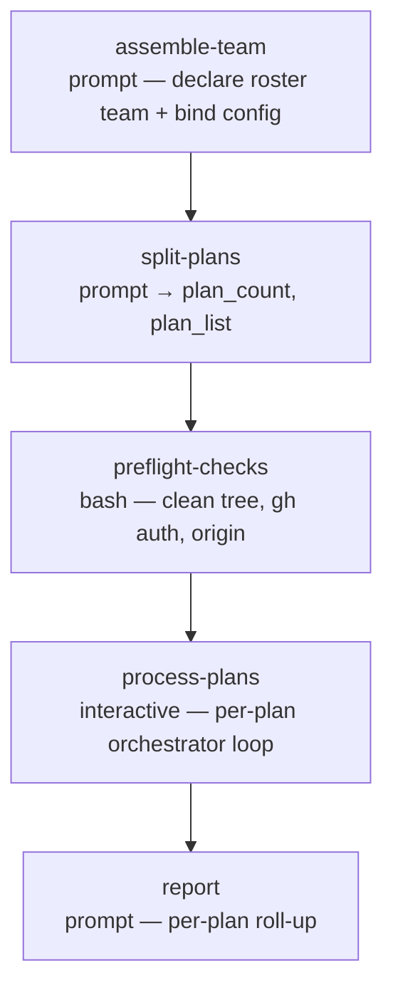

# impl-plan-auto

<!-- This README is the source of truth for how the workflow
     LOOKS to users. Keep it in sync with workflow.yaml +
     prompts/*.md — every edit to the flow, steps, outputs,
     or fragment list belongs here too. See
     CONTRIBUTING.md §9.6 for the invariant. -->

Autonomous plan-file → PR pipeline. Give it one or more ready-made
`PLAN-*.md` files — typically the plans `/wise-revise` writes into
`docs/plans/` — and for each one the wise SDLC roster **re-plans it from
the file** against current HEAD (`wise:architect`), implements it
(`wise:software-engineer`) in an isolated git worktree, runs an
independent **review↔fix loop** (`wise:code-reviewer` judges,
`wise:software-engineer` fixes) until the branch passes, commits, pushes,
opens a PR, requests the bot reviews (attaches Copilot, triggers
CodeRabbit), watches + fixes CI, then resolves every review comment — end
to end, with **no user prompts**. One worktree + branch + PR per plan.
When a PR's checks all pass, both review bots have finished, and every
comment is fixed-or-dismissed it is **merged** (squash, respecting branch
protection); a PR that can't be driven fully resolved is left open for a
human. When a PR is merged, its worktree and local branch are removed to
keep the base repo clean; a PR left open keeps its worktree for inspection.

This is the missing bridge in the `/wise-revise` story: `/wise-revise`
investigates a scope and writes executable plans, but only plans —
execution is yours to schedule. `impl-plan-auto` takes those plan
files and drives each one all the way to a merged PR.

## impl-plan-auto vs. its neighbours

| You have… | …and want | Use |
|---|---|---|
| a tracker **ticket** | full pipeline → merged PR, unattended | `ticket-auto` |
| a ready **`PLAN-*.md`** | full pipeline → merged PR, unattended | **`impl-plan-auto`** (this) |
| a ready **`PLAN-*.md`** | just implement + commit (you push / PR) | `/wise-implement-plan-auto` *(the skill)* |

Note the name overlap: `/wise-implement-plan-auto` is a **skill** (the
implement-only building block — task waves → commits, no push/PR) and
this is a **workflow** of the same stem (the full-pipeline wrapper). They
are invoked differently — `/wise-implement-plan-auto <plan>` runs the
skill; `/wise-workflow-run impl-plan-auto <plan>` runs this
workflow — and this workflow **reuses that same implement fragment**,
chaining the review / push / PR / watch / merge phases around it.

## When to use

- You ran `/wise-revise`, have one or more plans in `docs/plans/`, and
  want each turned into a reviewed-ready (often merged) PR unattended —
  fire it and come back to a set of PRs.
- The plans are clear enough that reasonable autonomous decisions won't
  go badly wrong.

## When not to use

- You want to review / adjust the plan before any code — `/wise-revise`
  already gave you the file; edit it, or use the interactive
  `ticket-plan` workflow.
- You want a human in the loop for CI fixes or review comments — use the
  standalone `/wise-pr-watch` on your own PR.
- You're starting from a tracker ticket, not a plan file — use
  `ticket-auto`.

## Prerequisites

- `/wise-init` completed at least once (Python + Node + gh CLI + auth).
- Run from inside the project's git repository — `project-selection:
  current` auto-detects it; the base working tree must be **clean**
  (`preflight-checks` refuses a dirty base).
- Each named plan file should exist and be readable. Relative paths
  resolve against the repo root — the same place `/wise-revise` writes
  `docs/plans/`. A missing plan file is recorded as a failed plan and the
  run continues with the rest (it never aborts the batch).
- Recommended ≤ 5 plans per run (each plan's full pipeline is
  substantial; see Notes).

## Flow



`process-plans` is the engine of the workflow. For each plan it runs an
isolated sub-pipeline:

```
ensure-worktree (create or adopt; carry over .worktreeinclude) → re-plan from file → implement
        → review↔fix loop (reviewer ⇄ fixer) → commit+push → create PR
        → request review → watch + fix CI loop
        → record (+ remove worktree & local branch if merged)
```

The wise workflow engine has no DAG loops, so the per-plan loop and each
per-plan pipeline live *inside* the `process-plans` step (`type:
interactive`, run in the conductor with full Bash/Task access). Every
heavy sub-task is delegated to a `Task` subagent to keep the step's
context bounded.

`control-mode` is pinned `synchronous`, `worktree` `current`,
`rename_session` `skip` — the only pre-flight input is the plan-file list
(required) and an optional free-form `config_prompt`. There are no `ask` /
`approval` steps, and no tuning questions: every quality / depth dial
takes its maximum-value default (e.g. the review gate runs at **high**
effort — five reviewer lenses + a confidence pass). The review↔fix cycle
cap and the CI-fix cap both default to 10 (each overridable from
`config_prompt`).

## Steps

| Step | Type | Purpose |
|---|---|---|
| `assemble-team` | `prompt` | Run-start declaration of the roster team (`wise:architect` lead + `wise:software-engineer` + `wise:code-reviewer`) and binding of the operator `config_prompt`. `agent: off` (plain confirmation step), `model: sonnet`. Declaration-only — explicitly guarded against planning, codebase work, or spawning any subagent. |
| `split-plans` | `prompt` | Parse `plan_files` into a clean list; emit count + semicolon-joined list. `model: sonnet`. |
| `preflight-checks` | `bash` | Refuse a dirty base repo; verify `gh` auth and an `origin` remote. (Per-plan existence is checked inside `process-plans` — a missing plan fails just that plan.) |
| `process-plans` | `interactive` | The orchestrator — loops the plan list, running the full re-plan→implement→review↔fix→PR→watch pipeline per plan in its own worktree. |
| `report` | `prompt` | Per-plan roll-up: source plan, branch, worktree path, PR url, verdict; flags which PRs need a human (incl. `review=not-converged`); notes merged plans were auto-cleaned and lists worktree-removal commands for any that remain. Dispatched to `wise:technical-writer` on `sonnet`. |

The workflow sets `agents: auto`, but most of its work runs inside the
`process-plans` fragment, which dispatches each phase to a concrete
roster role + model — brought in **fresh per phase** so transcripts
release and the multi-plan run stays within its context budget. The
per-phase roles and models are in the [pipeline table](#per-plan-pipeline-inside-process-plans)
below; at the step level `report` → `wise:technical-writer`. Model
tiering: `opus` for the planning + review brains, `sonnet` for the
hands-on engineering and bookkeeping steps. See
[Agents, model and effort](../../../../../docs/wise/workflows.md#agents-model-and-effort).

## Per-plan pipeline (inside `process-plans`)

Driven by `prompts/process-plans.md`. Only the **Re-plan** phase is
unique to this workflow; every other phase reuses `ticket-auto`'s shared
prompts verbatim, so the two workflows stay one implementation.

| Phase | Fragment | Role · model | Notes |
|---|---|---|---|
| Re-plan | `prompts/replan-from-file.md` | `wise:architect` · opus | seeds from the provided plan, re-verifies + refreshes against current HEAD |
| Implement | `ticket-auto/prompts/implement-plan.md` | `wise:software-engineer` · sonnet | phase-gated executor, supervised — a watchdog nudges hung executors; code-simplifier per task commit |
| Review ↔ fix | `ticket-auto/prompts/review-branch-auto.md` (`fixer=delegate`) | `wise:code-reviewer` · opus ⇄ `wise:software-engineer` · sonnet | high-depth review gate (judges only) + an independent fixer, cycling before push |
| Push | `wise-commit/commit-routine.md` | (inline) | `/wise-commit-push` |
| Create PR | `ticket-auto/prompts/ensure-pr-auto.md` | (inline) | `/wise-pr-create` |
| Request review | `ticket-auto/prompts/request-review-auto.md` | (inline) | `/wise-pr-add-reviewers` |
| Watch + fix | `ticket-auto/prompts/watch-pipelines-auto.md` | `wise:software-engineer` · sonnet | `/wise-pr-watch` |

The **Re-plan** phase is the difference from `ticket-auto`: instead of
fetching a tracker ticket and authoring a plan from scratch, it reads the
**provided `PLAN-*.md` as the seed**, checks its `SOURCE_SHA` against the
worktree's current HEAD, re-verifies the cited evidence, drops findings
the codebase already fixed, refreshes drifted tasks, and writes a fresh
plan the implement phase runs. The branch name comes **from the plan
slug** (the plan filename's `<NNN>-<slug>`, used verbatim, no prefix).

The **Review ↔ fix** phase separates judging from fixing: a
`wise:code-reviewer` reviews the branch in `fixer=delegate` mode (reports
findings, applies nothing), then a `wise:software-engineer` applies
exactly those findings and commits. The two cycle — re-review verifies
each fix — until the reviewer returns `verdict=clean` or the cap (10,
`config_prompt`-overridable) is hit. On non-convergence the branch is
pushed anyway and the plan is flagged `review=not-converged` for the human
+ the CI/bot review to catch.

## Inputs

| Name | Required | Description |
|---|---|---|
| `plan_files` | yes | Comma-separated list of `PLAN-*.md` paths. Each gets its own worktree + branch + PR. Relative paths resolve against the repo root. First positional arg; when passed positionally use **no spaces** between items (`docs/plans/001-foo.md,docs/plans/002-bar.md`). |
| `config_prompt` | no | Free-form guidance to tune the run — skills / libraries to prefer, guidelines, guardrails, files to avoid, knob overrides (e.g. "cap CI fixes at 4", "cap review cycles at 5"). The `wise:architect` (re-plan phase) applies it to every decision and **predicts** any answer it implies rather than prompting; later phases honour it too. As the last input it absorbs the remainder of the command line. Blank → none (max-value defaults; CI-fix + review-cycle caps 10). |

## Outputs

| Name | Source | Used for |
|---|---|---|
| `plan_count` / `plan_list` | `split-plans` | The parsed plan list driving the orchestrator loop. |
| `plans_processed` / `plans_merged` / `plans_open` / `plans_failed` | `process-plans` | Run tallies surfaced by `report`. |

## Examples

```
/wise-workflow-run impl-plan-auto
# Bare: prompts only for the plan-file list (config_prompt is optional and skipped).

/wise-workflow-run impl-plan-auto docs/plans/001-api-caching.md,docs/plans/002-auth-debt.md
# Two plans, no prompts. Comma-separated, NO spaces. Max-value defaults.

/wise-workflow-run impl-plan-auto docs/plans/001-api-caching.md prefer the design-system lib; never touch infra/*; cap CI fixes at 4
# One plan + free-form config_prompt (everything after the first token).
# Steers the Lead Architect's re-plan decisions; still no questions asked.
```

The natural pairing:

```
/wise-revise improve performance of src/api      # writes docs/plans/NNN-*.md
/wise-workflow-run impl-plan-auto docs/plans/001-api-caching.md
```

## Notes

- **Re-plans, not blindly executes.** The provided plan is the seed; the
  architect re-verifies it against current HEAD before implementing. A
  plan whose findings the codebase already fixed is dropped (recorded in
  the report); a plan that drifted is refreshed.
- **Merges on fully resolved.** A PR is merged (squash, fallback merge
  commit) only when its checks all pass, both review bots have finished,
  and every bot comment is fixed-or-dismissed with its thread resolved.
  Branch protection is respected — if the repo requires a human approval
  the merge is left to a human and the PR stays open. Any PR that isn't
  fully resolved is left open.
- **Merged plans are cleaned up; open/failed ones are kept.** When a
  plan's PR is merged, its worktree and local branch are removed (the
  work is preserved on the remote) so the base repo stays clean. A plan
  left open for a human, or failed, keeps its worktree + branch for
  inspection — `report` lists the `git worktree remove` command for each
  one that remains. After the last plan a `git worktree prune` tidies any
  stale entries.
- **Resumable on interrupt.** Per-plan progress is checkpointed to a ledger
  under the run directory (off the git tree, surviving the interrupt). If a
  context compaction orphans the run mid-flight, `/wise-workflow-resume`
  re-enters `process-plans`, **adopts** each plan's existing worktree / branch /
  PR via live `git`/`gh` probes, and continues it from where it left off —
  pushing committed-but-unpushed work, finding or creating the PR, and driving
  it to a verdict instead of stranding it. A worktree/branch this run did not
  create is left untouched (never stomped).
- **≤ 5 plans/run recommended.** Each plan runs a full
  re-plan+implement+watch pipeline; the orchestrator delegates heavy work
  to subagents to bound context, but very large batches still risk the
  run growing long.

## Related

- [Definition YAML](./workflow.yaml)
- [`/wise-revise`](../../skills/wise-revise/SKILL.md) — the planner that
  writes the `PLAN-*.md` files this workflow consumes.
- [`ticket-auto`](../ticket-auto/README.md) — the same full pipeline, but
  starting from a tracker ticket (it re-plans from the ticket). This
  workflow reuses its implement / review / PR / watch prompts.
- [`/wise-implement-plan-auto`](../../skills/wise-implement-plan-auto/SKILL.md)
  — the implement-only **skill** (task waves → commits, no push/PR) that
  this workflow's implement phase reuses.
- [`wise-estimation`](../../skills/wise-estimation/SKILL.md) — SP
  estimation reference consulted by the re-plan phase.
