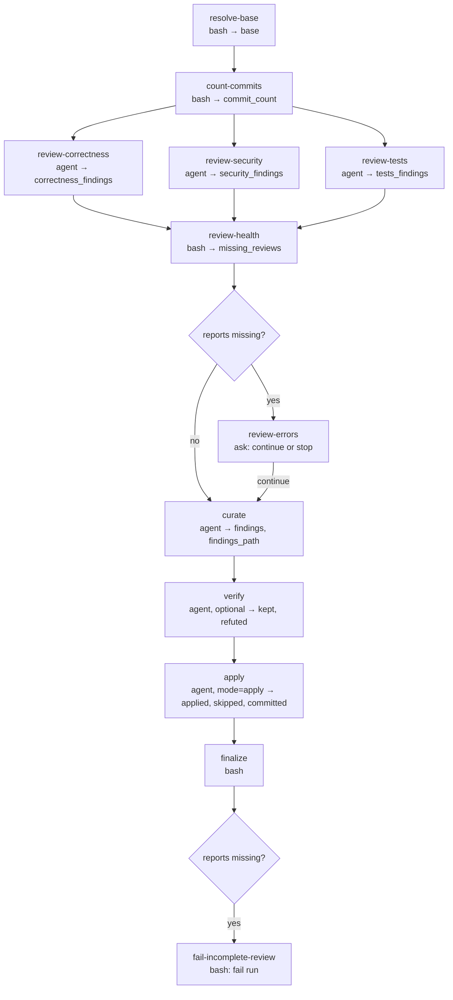

# code-review

<!-- This README is the source of truth for how the workflow
     LOOKS to users. Keep it in sync with workflow.yaml +
     prompts/*.md - every edit to the flow, steps, outputs,
     or fragment list belongs here too. See
     CONTRIBUTING.md §9.6 for the invariant. -->

Review the current branch before it reaches GitHub. Three read-only
reviewers (correctness, security, test coverage) read exactly the
commits about to be pushed (`origin/<base>..HEAD`) in one parallel
wave, a curator merges their reports into one findings file and keeps
only the concrete, high-confidence findings, an optional verifier tries
to refute each kept finding against the code, and a fixer applies what
survives and commits it in one round. In `report` mode the fixer is
skipped and the findings file is the deliverable. This is the
heavyweight tier of the plugin's two-tier quality model (the
lightweight tier is the per-commit simplify pass); it replaces the
former `/wise-code-review-auto` skill so that every agent's harness,
model and effort is a pre-flight choice. The definition is a
`version: 2` workflow run by the TS engine: each step is an isolated
harness child, so the reviewers hand their findings to the curator
through files under `<run-dir>/review/` and only counts travel as
outputs. If a reviewer fails, the run pauses for a recovery choice. It
never pushes.

## When to use

- A branch is fully committed and you want one thorough review pass
  applied before `git push` / opening a PR.
- You want a findings list without edits (`mode=report`), for example
  to review someone else's branch or to feed the findings to another
  fixer.
- You want a cheaper or a different reviewer per lens: each reviewer,
  the curator, the verifier and the fixer are separate tuning groups.

## When not to use

- A PR is already open and CI or the review bots are the concern:
  use `/wise-pr-watch` / `/wise-pr-watch-auto`.
- Per-commit cleanup: `/wise-simplify-auto` or `/wise-commit` (which
  runs the simplify pass before staging).
- Nothing to review: with zero commits over the base the run ends at
  once with every review step skipped.

## Prerequisites

- `/wise-init` completed at least once (bun or Node 24 for the engine,
  `claude` logged in; `codex` / `cursor-agent` / `gemini` / `grok` logins only when you
  pick them at pre-flight).
- Run from inside the git repository on the branch under review, with
  every change committed. `origin/<base>` must exist (the workflow
  fetches it); `gh` is used to detect the default branch when the
  `base` input is empty.

## Flow



The three reviewers share `depends_on: [count-commits]` and run as one
parallel wave. `review-health` waits for every lens even when one fails;
the conditional `review-errors` gate lets the user continue with the
available reports or skip curation before the run finalizes and fails. A
deselected `verify` or a skipped `apply` (`mode=report`, or an empty change
set) never blocks the summary.
After the summary, a missing report fails the run even when the user chose to
curate the reports that were available.

Pre-flight asks one multi-select over the optional `verify` pass
(selected by default) and the inputs below first; then, per tuning
group a selected step uses (`correctness`, `security`, `tests`,
`curate`, `verify`, `fix`; all default to `claude-opus-5 / high`),
which CLI runs it when more than one is installed, then which model
from the engine's catalog for that CLI, then the effort that model
takes. Every question is put to the user; deselecting `verify` drops
its group, and `mode: report` drops the `fix` group (its `apply` step
is gated on `mode == 'apply'`). Once the harnesses are settled, one
permission-floor question is asked per selected or fallback provider
(`Auto` recommended; `Bypass permissions` available). Answered questions
are never repeated.

## Steps

| Step | Type | Purpose |
|---|---|---|
| `resolve-base` | `bash` | The `base` input, else the repo's default branch (`gh`, then `origin/HEAD`, then `main`); fetches it and fails when `origin/<base>` does not exist. Captures `base`. |
| `count-commits` | `bash` | `git rev-list --count origin/<base>..HEAD`. Captures `commit_count`; `0` skips every step below except `finalize`. |
| `review-correctness` | `agent` | Correctness and logic lens over the diff: wrong conditions, unhandled error paths, broken invariants, races, leaks. Writes `<run-dir>/review/correctness.md`; read-only. `correctness` group. |
| `review-security` | `agent` | Security and input-handling lens: injection, missing validation, secrets, skipped auth, unsafe defaults. Writes `<run-dir>/review/security.md`; read-only. `security` group. |
| `review-tests` | `agent` | Test-coverage lens: untested behaviour, stale assertions, weakened tests, flaky patterns. Writes `<run-dir>/review/tests.md`; read-only. `tests` group. |
| `review-health` | `bash` | Waits for every reviewer and records any failed lens or missing report. `trigger-rule: all-done`. |
| `review-errors` | `ask` | Opens only when a reviewer failed or its report is missing. The user chooses whether to continue with available reports or skip curation before the run finalizes and fails. |
| `curate` | `agent` | Merges the available reports after the health check, dedupes by `file:line`, keeps only concrete correctness / security / clear-quality findings on touched lines, respects the plan's `## Decisions Made` and the guidance. Writes `<run-dir>/review/findings.md`. `curate` group. |
| `verify` | `agent` | Optional (`step-select`). Tries to refute every kept finding against the code, defaulting to refuted when ambiguous; rewrites the findings file with the survivors. `when: findings != 0`. `verify` group. |
| `apply` | `agent` | `when: mode == 'apply' && findings_path`. Applies each surviving finding as a bounded fix, runs the quickest relevant check, reverts if the tree breaks, stages and commits once (`fix(<scope>): apply code-review findings`, no attribution trailer). Never pushes. `fix` group, `mode: full-access`; `trigger-rule: none-failed`. |
| `finalize` | `bash` | One summary line with the range, the counts and the findings file. `trigger-rule: all-done`. |
| `fail-incomplete-review` | `bash` | Runs after `finalize` when any reviewer report is missing, so partial curation remains useful but the workflow still ends failed. |

**Model tiering**: every group defaults to `opus / high`. The pre-flight
answers override the group defaults at dispatch. See
[Agents, model and effort](../../../../docs/wise/workflows.md#agents-model-and-effort).

## Inputs

| Name | Required | Description |
|---|---|---|
| `base` | no | Base branch to diff against. Empty: the repo's default branch. |
| `mode` | yes | `apply` (default: fix and commit the kept findings) / `report` (write the findings file only). |
| `plan_path` | no | A `PLAN-*.md` whose `## Decisions Made` the reviewers and the curator respect. |
| `guidance` | no | Standing guidance for the reviewers; pre-filled from the run context's `guidance`. |

`mode` accepts its value positionally, e.g. `/wise-workflow-run
code-review main report`.

## Outputs

| Name | Source | Used for |
|---|---|---|
| `base` | `resolve-base` | The resolved base branch; the diff range is `origin/<base>..HEAD`. |
| `commit_count` | `count-commits` | Commits under review; `0` skips the review. |
| `<lens>_findings` / `<lens>_blocking` | the three reviewers | Per-lens counts (`correctness`, `security`, `tests`). |
| `findings` / `blocking` / `findings_path` | `curate` | Kept findings, how many are critical or warning, and the file (`<run-dir>/review/findings.md`). |
| `kept` / `refuted` | `verify` | Findings that survived verification and those dropped (only when `verify` ran). |
| `applied` / `skipped` / `committed` | `apply` | Findings turned into edits, findings left alone, and whether a fix commit landed (only in `apply` mode). |

The findings files live under `<run-dir>/review/` (off the project
tree), so a `report` run leaves nothing in the working tree.

## Examples

```
/wise-workflow-run code-review
# Pre-flight asks harness, provider permissions, model and effort per group, whether to run
# the verification pass, and the inputs; then reviews origin/<default>..HEAD,
# applies the kept findings and commits them.

/wise-workflow-run code-review release/2.4 report
# Diff against origin/release/2.4, write the findings file, change nothing.
```

## Related

- [Definition YAML](./workflow.yaml)
- [`references/code-review-pass.md`](../../references/code-review-pass.md):
  the review discipline (lenses, curation, verification, bounded apply)
  the prompts follow; also read by the PR watcher's review fallback.
- [`references/simplify-pass.md`](../../references/simplify-pass.md):
  the lightweight per-commit tier.
- [`/wise-pr-create`](../../skills/wise-pr-create/SKILL.md): the natural
  next step after a clean review.
- [`docs/wise/workflows.md`](../../../../docs/wise/workflows.md):
  user-facing workflow reference.
