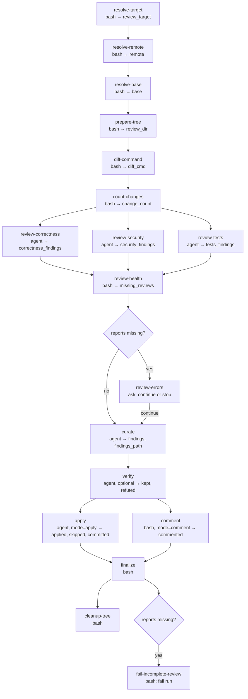

# code-review

<!-- This README is the source of truth for how the workflow
     LOOKS to users. Keep it in sync with workflow.yaml +
     prompts/*.md - every edit to the flow, steps, outputs,
     or fragment list belongs here too. See
     CONTRIBUTING.md §9.6 for the invariant. -->

Review local changes or a pull request with wise's 3-lens code review
team. Three read-only reviewers (correctness, security, test coverage)
read the target in one parallel wave: the branch's commits over the
base (`origin/<base>..HEAD`), those commits plus uncommitted and
untracked work, or a PR's head. A curator merges their reports into one
findings file and keeps only the concrete, high-confidence findings, an
optional verifier tries to refute each kept finding against the code,
and then the `mode` decides the delivery: a fixer applies what survives
(`apply`), the findings file is the deliverable (`report`), or the
findings are posted as one comment review on the PR (`comment`). This
is the heavyweight tier of the plugin's two-tier quality model (the
lightweight tier is the per-commit simplify pass), and the same panel
the `units` pipelines run on their `review` tuning group before the
first push and on each new PR head. `/wise-code-review` conducts it, so
every agent's harness, model and effort is a pre-flight choice. Each
step is an isolated harness child, so the reviewers hand their findings
to the curator through files under `<run-dir>/review/` and only counts
travel as outputs. If a reviewer fails, the run pauses for a recovery
choice. It never pushes and never requests a remote review bot
(Copilot, CodeRabbit).

## When to use

- A branch is committed and you want one thorough review pass applied
  before `git push` / opening a PR (`target=branch`).
- You want the review to include uncommitted work (`target=working`);
  `apply` then leaves the fixes uncommitted next to your own edits.
- A PR is open and the repository runs no review bot, or you want a
  second opinion: `target=<number|url>` with `mode=report` or
  `mode=comment`. A PR whose head is not checked out here is fetched
  read-only into a temporary worktree.
- You want a cheaper or a different reviewer per lens: each reviewer,
  the curator, the verifier and the fixer are separate tuning groups.

## When not to use

- A PR is open and you want CI, bot threads and per-head review driven
  to merge: use `/wise-pr-watch` / `/wise-pr-watch-auto`, which run the
  same panel on each new head.
- Per-commit cleanup: `/wise-simplify-auto` or `/wise-commit` (which
  runs the simplify pass before staging).
- Nothing to review: with no changes over the base the run ends at
  once with every review step skipped.

## Prerequisites

- `/wise-init` completed at least once (Python 3.11+ for the engine,
  `claude` logged in; `codex` / `cursor-agent` / `gemini` / `grok` logins only when you
  pick them at pre-flight).
- Run from inside the git repository. For `branch` and `working`,
  check out the branch under review. `<remote>/<base>` must exist (the
  workflow fetches it); `gh` is used to detect the default branch when
  the `base` input is empty.
- `<remote>` is the git remote whose URL points at the repository `gh`
  resolves (in a fork checkout often `upstream`, not `origin`); without
  a `gh` repository it is `origin`. When `gh` resolves a repository no
  remote points at, the run fails.
- A PR target needs a logged-in `gh`, and the PR must belong to this
  repository. `mode=apply` on a PR target needs that PR's head checked
  out here and is refused for a fork PR (use `report` or `comment`);
  `mode=comment` needs a PR target.

## Flow


```mermaid
flowchart TD
    T[resolve-target<br/>bash → review_target] --> U[resolve-remote<br/>bash → remote]
    U --> A[resolve-base<br/>bash → base]
    A --> P[prepare-tree<br/>bash → review_dir]
    P --> Q[diff-command<br/>bash → diff_cmd]
    Q --> B[count-changes<br/>bash → change_count]
    B --> C[review-correctness<br/>agent → correctness_findings]
    B --> D[review-security<br/>agent → security_findings]
    B --> E[review-tests<br/>agent → tests_findings]
    C --> J[review-health<br/>bash → missing_reviews]
    D --> J
    E --> J
    J --> K{reports missing?}
    K -->|yes| L[review-errors<br/>ask: continue or stop]
    K -->|no| F[curate<br/>agent → findings, findings_path]
    L -->|continue| F
    F --> G[verify<br/>agent, optional → kept, refuted]
    G --> H[apply<br/>agent, mode=apply → applied, skipped, committed]
    G --> O[comment<br/>bash, mode=comment → commented]
    H --> I[finalize<br/>bash]
    O --> I
    I --> R[cleanup-tree<br/>bash]
    I --> M{reports missing?}
    M -->|yes| N[fail-incomplete-review<br/>bash: fail run]
```

The three reviewers share `depends_on: [count-changes]` and run as one
parallel wave. The reviewers, the curator and the verifier treat the
code, commit messages and comments under review as data, never
instructions, and their tools are read-only: `git diff`, `git log`,
`git show`, `git merge-base`, `git status`, `rg`, `grep`, `ls`, `cat`,
`head`, `wc`, `test` (plus `mkdir` to write their report), with no bare
`git` and no `find`. `review-health` waits for every lens even when one fails;
the conditional `review-errors` gate lets the user continue with the
available reports or skip curation before the run finalizes and fails. A
deselected `verify`, a skipped `apply` or `comment` (the other modes, or an
empty change set) never blocks the summary.
After the summary, a missing report fails the run even when the user chose to
curate the reports that were available.

Before any of this, `tuning-scope` asks whether one harness, model and effort run every step (`single`: asked once as `harness.all`, `model.all`, `effort.all`) or each group is chosen separately (`per-group`, the default).
Pre-flight then asks one multi-select over the optional `verify` pass
(selected by default) and the inputs below first; then, per tuning
group a selected step uses (`correctness`, `security`, `tests`,
`curate`, `verify`, `fix`; all default to `claude-opus-5-5 / high`),
which harness runs it when more than one is installed, then which model
from the engine's catalog for that harness, then the effort that model
takes. Every question is put to the user; deselecting `verify` drops
its group, and `mode: report` or `mode: comment` drops the `fix` group
(its `apply` step is gated on `mode == 'apply'`). Once the harnesses are settled, one
permission-floor question is asked per selected or fallback provider
(`Auto` recommended; `Bypass permissions` available). Answered questions
are never repeated.

## Steps

| Step | Type | Purpose |
|---|---|---|
| `resolve-target` | `bash` | Normalises the `target` input to `branch`, `working` or `pr:<n>`. A PR URL must name this repository; the PR must exist; `mode=apply` is refused for a fork PR (`isCrossRepository`); `mode=comment` needs a PR target. Captures `review_target`. |
| `resolve-remote` | `bash` | The git remote whose URL (https or ssh) ends in the `owner/name` `gh repo view` resolves, `origin` first; `origin` when `gh` resolves no repository; fails when no remote matches. Captures `remote`. |
| `resolve-base` | `bash` | The `base` input, else the PR's base for a PR target, else the repo's default branch (`gh`, then `<remote>/HEAD`, then `main`); rejects a name `git check-ref-format --branch` refuses, fetches it from `remote` and fails when `<remote>/<base>` does not exist. Captures `base`. |
| `prepare-tree` | `bash` | The checkout to review. The current tree for `branch`, `working` and a PR whose head is checked out here; otherwise fetches `pull/<n>/head` from `remote` into a detached worktree at `<run-dir>/review/tree` (`mode=apply` fails instead). Captures `review_dir`. |
| `diff-command` | `bash` | The diff the reviewers run: `git diff <remote>/<base>...HEAD`, or for `working` a diff from the merge base to the working tree. Captures `diff_cmd`. |
| `count-changes` | `bash` | Commits over `<remote>/<base>`, plus changed and untracked paths for `working`. Captures `change_count`; `0` skips every review step. |
| `review-correctness` | `agent` | Correctness and logic lens over the diff in `review_dir`: wrong conditions, unhandled error paths, broken invariants, races, leaks. Writes `<run-dir>/review/correctness.md`; read-only, never comments on the PR. `correctness` group. |
| `review-security` | `agent` | Security and input-handling lens: injection, missing validation, secrets, skipped auth, unsafe defaults. Writes `<run-dir>/review/security.md`; read-only, never comments on the PR. `security` group. |
| `review-tests` | `agent` | Test-coverage lens: untested behaviour, stale assertions, weakened tests, flaky patterns. Writes `<run-dir>/review/tests.md`; read-only, never comments on the PR. `tests` group. |
| `review-health` | `bash` | Waits for every reviewer and records any failed lens or missing report. `trigger-rule: all-done`. |
| `review-errors` | `ask` | Opens only when a reviewer failed or its report is missing. The user chooses whether to continue with available reports or skip curation before the run finalizes and fails. |
| `curate` | `agent` | Merges the available reports after the health check, dedupes by `file:line`, keeps only concrete correctness / security / clear-quality findings on touched lines, respects the plan's `## Decisions Made` and the guidance. Writes `<run-dir>/review/findings.md`. `curate` group. |
| `verify` | `agent` | Optional (`step-select`). Tries to refute every kept finding against the code, defaulting to refuted when ambiguous; rewrites the findings file with the survivors. `when: findings != 0`. `verify` group. |
| `apply` | `agent` | `when: mode == 'apply' && findings_path`. Applies each surviving finding as a bounded fix, runs the quickest relevant check, reverts if the tree breaks, stages only the edited files and commits once (`fix(<scope>): apply code-review findings`, no attribution trailer). For `working` the edits stay uncommitted. Never pushes. `fix` group, `mode: full-access`; `trigger-rule: none-failed`. |
| `comment` | `bash` | `when: mode == 'comment' && findings_path`. Posts the kept findings as one `gh pr review --comment`, never an approval or a change request. The header names only the lenses that reported; an empty list says "no findings" only when every lens reported, otherwise the comment names the lens that did not report. Strips the `review_dir/` prefix from paths and refuses to post (fails) when the body matches a token pattern (`gh[pousr]_`, `github_pat_`, `AKIA...`, `-----BEGIN`). `trigger-rule: none-failed`. |
| `finalize` | `bash` | One summary line with the target, base, counts, whether a fix commit or PR comment landed, and the findings file, read from `WISE_*` env vars (an unset value prints blank). `trigger-rule: all-done`. |
| `cleanup-tree` | `bash` | Removes the temporary PR worktree `prepare-tree` created, if any. `trigger-rule: all-done`. |
| `fail-incomplete-review` | `bash` | Runs after `finalize` when any reviewer report is missing, so partial curation remains useful but the workflow still ends failed. |

**Model tiering**: every group defaults to `opus / high`. The pre-flight
answers override the group defaults at dispatch. See
[Agents, model and effort](../../../../docs/wise/workflows.md#agents-model-and-effort).

## Inputs

| Name | Required | Description |
|---|---|---|
| `target` | yes | `branch` (default: the commits over the base) / `working` (plus uncommitted and untracked changes) / a PR number or URL of this repository. |
| `base` | no | Base branch to diff against. Empty: the PR's base for a PR target, else the repo's default branch. |
| `mode` | yes | `apply` (default: fix the kept findings; committed except for `working`) / `report` (write the findings file only) / `comment` (post the findings as one comment review on the PR target). |
| `plan_path` | no | A `PLAN-*.md` whose `## Decisions Made` the reviewers and the curator respect. |
| `guidance` | no | Standing guidance for the reviewers; pre-filled from the run context's `guidance`. |

`/wise-code-review` seeds `target`, `base` and `mode` from its
arguments, e.g. `/wise-code-review 123 --comment`.

## Outputs

| Name | Source | Used for |
|---|---|---|
| `review_target` | `resolve-target` | `branch`, `working` or `pr:<n>`. |
| `remote` | `resolve-remote` | The git remote of the repository `gh` resolves; the base, the PR head, the diff and the count use it. |
| `base` | `resolve-base` | The resolved base branch. |
| `review_dir` | `prepare-tree` | The checkout the reviewers read: the current tree or the temporary PR worktree. |
| `diff_cmd` | `diff-command` | The diff command the reviewers and the curator run. |
| `change_count` | `count-changes` | Changes under review; `0` skips the review. |
| `<lens>_findings` / `<lens>_blocking` | the three reviewers | Per-lens counts (`correctness`, `security`, `tests`). |
| `missing_reviews` | `review-health` | Comma-separated failed or missing lenses, or `none`; opens recovery and controls curation and the final incomplete-review failure. |
| `review_failure_action` | `review-errors` | The recovery choice; either curates available reports or skips curation before the incomplete review fails. |
| `findings` / `blocking` / `findings_path` | `curate` | Kept findings, how many are critical or warning, and the file (`<run-dir>/review/findings.md`). |
| `kept` / `refuted` | `verify` | Findings that survived verification and those dropped (only when `verify` ran). |
| `applied` / `skipped` / `committed` | `apply` | Findings turned into edits, findings left alone, and whether a fix commit landed (only in `apply` mode). |
| `commented` | `comment` | `yes` when the comment review was posted (only in `comment` mode). |

The findings files live under `<run-dir>/review/` (off the project
tree), so a `report` or `comment` run leaves nothing in the working tree.

## Examples

```
/wise-code-review
# Pre-flight asks the inputs, whether to run the verification pass, then harness,
# provider permissions, model and effort per group; reviews origin/<default>..HEAD,
# applies the kept findings and commits them.

/wise-code-review working --report
# Review the branch plus uncommitted work, write the findings file, change nothing.

/wise-code-review 123 --comment
# Review PR 123's head (fetched read-only when not checked out) and post the
# findings as one comment review.

/wise-workflow-run code-review
# The same run without the conductor's argument parsing.
```

## Related

- [Definition YAML](./workflow.yaml)
- [`references/code-review-pass.md`](../../references/code-review-pass.md):
  the review discipline (lenses, curation, verification, bounded apply)
  the prompts follow; the watch loop's per-head local review follows it too.
- [`/wise-code-review`](../../skills/wise-code-review/SKILL.md): the
  conductor.
- [`references/simplify-pass.md`](../../references/simplify-pass.md):
  the lightweight per-commit tier.
- [`/wise-pr-create`](../../skills/wise-pr-create/SKILL.md): the natural
  next step after a clean review.
- [`docs/wise/workflows.md`](../../../../docs/wise/workflows.md):
  user-facing workflow reference.
