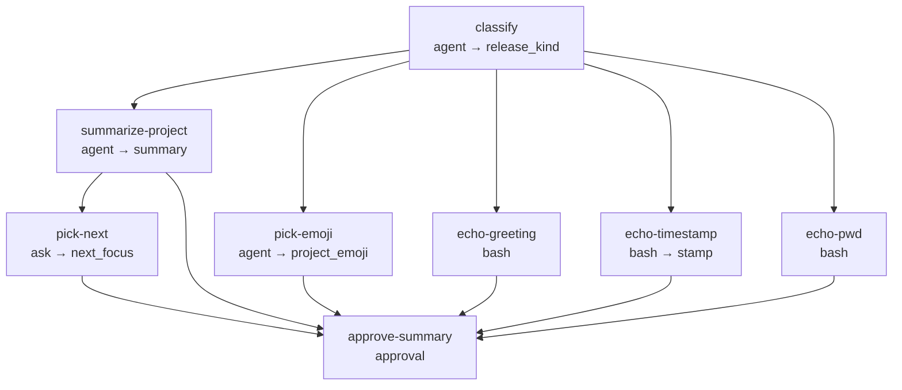

# example-workflow

<!-- This README is the source of truth for how the workflow
     LOOKS to users. Keep it in sync with workflow.yaml +
     prompts/*.md - every edit to the flow, steps, outputs,
     or fragment list belongs here too. See
     CONTRIBUTING.md §9.6 for the invariant. -->

Reference `version: 2` workflow that exercises every step type the TS
engine runs (`agent`, `bash`, `ask`, `approval`; `units` is the
engine-side ticket / plan loop and has no place in a smoke test), the
parallel-wave dispatcher, the pre-flight questionary (two tuning
groups asked in stages, one `from-context` input) and structured
`schema:` outputs. Harmless to run: it classifies the current project,
runs five parallel fan-out steps that either prompt a harness child or
`echo` under a randomised sleep, asks one question, and asks for
approval. Use it to verify the workflow subsystem after an install, a
schema change, or a dep upgrade.

## When to use

- After installing / updating the wise plugin, to confirm the engine,
  the harness adapter, and step-type dispatch all work end-to-end.
- While developing the workflow subsystem: change an engine module,
  run this, see if anything regressed.
- As a reference when authoring a new workflow: the YAML exercises
  parallel waves (same `depends_on`), `schema:` + `outputs:` capture,
  tuning groups with a fallback harness, an `ask` gate, and an
  approval gate.

## When not to use

- It's not a "real" workflow: it doesn't do anything useful beyond
  proving the subsystem is wired correctly.

## Prerequisites

- `/wise-init` completed at least once (bun or Node 24 for the engine).
- Run from inside a git repository: `project-selection: current`
  auto-detects the project from the current directory.

## Flow


```mermaid
flowchart TD
    B[classify<br/>agent → release_kind] --> C[summarize-project<br/>agent → summary]
    B --> E[pick-emoji<br/>agent → project_emoji]
    B --> F[echo-greeting<br/>bash]
    B --> G[echo-timestamp<br/>bash → stamp]
    B --> H[echo-pwd<br/>bash]
    C --> N[pick-next<br/>ask → next_focus]
    C --> I
    E --> I
    F --> I
    G --> I
    H --> I
    N --> I[approve-summary<br/>approval]
```

The five steps between `classify` and the gates share
`depends_on: [classify]`, so they run as one parallel wave (the engine
caps concurrent harness children). `pick-next` then parks the run as
an `ask` gate, `approve-summary` as an `approval` gate; in
`synchronous` control mode both are answered automatically.

Pre-flight asks, per tuning group (`classify`, `summarize`; both default
to `claude-haiku-4-5`, `summarize` with `codex` as fallback harness),
which CLI runs it when more than one is logged in, then which model
from the engine's catalog, then the effort that model takes; and the
optional `focus` input (pre-filled from the run context's `guidance`
when present).

## Steps

| Step | Type | Purpose |
|---|---|---|
| `classify` | `agent` | Classifies the project as `frontend` / `backend` / `fullstack` / `other` through a `schema:` enum, no tools, `max_turns: 2`. Captures `release_kind`. `classify` tuning group. |
| `summarize-project` | `agent` | One-sentence summary of a `{{release_kind}}` project, focused on `{{focus}}`. Captures `summary`. `summarize` tuning group. |
| `pick-emoji` | `agent` | Single emoji matching the project kind. Captures `project_emoji`. `summarize` tuning group. |
| `echo-greeting` | `bash` | `sleep RANDOM; echo "hello from {{project.name}}"`. |
| `echo-timestamp` | `bash` | `sleep RANDOM; date -u`. Captures `stamp`. |
| `echo-pwd` | `bash` | `pwd`. |
| `pick-next` | `ask` | `tests` / `docs` / `performance` or free text. Captures `next_focus`. |
| `approve-summary` | `approval` | Final gate: renders the project, kind, emoji, summary and next focus; approve to complete the run. |

## Inputs

| Name | Required | Description |
|---|---|---|
| `focus` | no | What the summary should focus on; pre-filled from the run context's `guidance`. |

## Outputs

| Name | Source | Used for |
|---|---|---|
| `release_kind` | `classify` | Templated into downstream step prompts and the approval message. |
| `summary` | `summarize-project` | Included in the `approve-summary` message. |
| `project_emoji` | `pick-emoji` | Included in the `approve-summary` message. |
| `stamp` | `echo-timestamp` | The bash step's captured output. |
| `next_focus` | `pick-next` | Included in the `approve-summary` message. |

## Examples

```
/wise-workflow-run example-workflow
```

## Related

- [Definition YAML](./workflow.yaml)
- [`docs/wise/workflows.md`](../../../../docs/wise/workflows.md):
  user-facing workflow reference.
