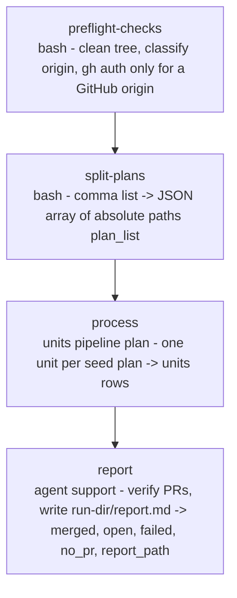

# impl-plan-auto

<!-- This README is the source of truth for how the workflow LOOKS to
     users. Keep it in sync with workflow.yaml: every edit to the flow,
     steps, inputs or outputs belongs here too (CONTRIBUTING.md 9.6). -->

Autonomous plan-file -> PR pipeline, `version: 2`, run by the TS
engine. Give it one or more `PLAN-*.md` files (for example the plans
`/wise-revise` writes into `docs/plans/`); for each one the engine's
`units` step claims a branch and worktree, re-plans the seed against
current HEAD, implements the refreshed plan, converges the branch
through a review / fix loop, pushes, opens a PR, requests the bot
reviews, watches CI and the bots, fixes what they raise, and merges
once the PR is green and quiet. One worktree + branch + PR per plan
file. A merged PR loses its worktree and local branch; anything else
stays open for a human with the worktree kept for inspection. No
prompts after launch.

The per-plan loop is engine code (`plugins/wise/engine/wise_engine/units.py`,
`pipeline: plan`; design in `docs/wise/research-ts-engine.md` P4). It
is the same loop `ticket-auto` runs; only the plan phase differs (its
template `engine/wise_engine/prompts/units/plan/plan.md` re-plans from the seed
file instead of from a ticket). `/wise-implement-plan-auto` is the
implement-only building block (task waves + commits, no push / PR /
watch); this workflow is the full pipeline around a plan file.

## When to use

- You have ready-made plan files (from `/wise-revise`, `ticket-plan`,
  or written by hand in the same schema) and want each turned into a
  reviewed, merged PR unattended.

## When not to use

- You want to run a plan's tasks and stop before pushing: use
  `/wise-implement-plan-auto <plan>`.
- You start from a ticket, not a plan: use `ticket-auto`.

## Prerequisites

- `/wise-init` completed at least once (Python 3.11+, gh CLI + auth).
  `gh` auth is required only when `origin` is a GitHub remote.
- Run from inside the project's git repository (`project-selection:
  current`); the base working tree must be clean (`preflight-checks`
  refuses otherwise). An `origin` remote is optional: with a GitHub
  `origin` the full push / PR / watch half runs; with no origin each
  unit commits locally; with a non-GitHub origin each unit pushes but
  opens no PR (verdict `no-pr`).
- Pre-flight asks for a permission floor once per selected provider.
  `Auto` is recommended; `Bypass permissions` is available when the
  provider must run fully unsandboxed. A phase's stronger mode still wins.
- Every plan file must exist; `split-plans` stops the run before any
  worktree exists when one is missing.

## Flow



Inside `process`, per plan file and in this order (branch = the file
name without `PLAN-` and `.md`, sanitised):

| Phase | Kind | Group / model | What it does |
|---|---|---|---|
| `claim` | code | - | Idempotent ownership: a ledger under `<run-dir>/units/` marks the unit ours; a branch that already exists locally, on origin or in a worktree moves the unit to the first free `<branch>-N` (N from 2), never reused, never touched. With no origin remote the "taken" probe is local-only (no `git ls-remote`). |
| `worktree` | code | - | `<run-dir>/worktrees/<branch>` on the plan branch off the fetched `base_branch`. With no origin remote the fetch is skipped and a local-only base is accepted (no PR targets it). |
| `plan` | model | `plan` | Reads the seed, checks drift against its `SOURCE_SHA`, re-audits the scope at HEAD, writes the refreshed plan to `<run-dir>/plans/PLAN-<ref>.md`. `insufficient-context` (with a `BLUEPRINT-<ref>.md`) fails the unit. |
| `implement` | model | `implement` | Task waves, one atomic commit per task, validation after each commit. `done = 0` or no commits fails the unit. |
| `review` <-> `fix` | model | `review` / `fix` | 3-lens review of `origin/<base>..HEAD` writes a findings file; the fixer applies it (resuming the reviewer's session under `resume: unit` when both run on the same harness, else fresh); repeats up to `max_review_cycles`, then pushes anyway with `converged: false`. |
| `push`, `pr`, `request-review` | code | - | `git push -u`, PR from the repo template or a compact body (links the plan), `gh pr edit --add-reviewer` for each login in `reviewers`. Skipped without a GitHub remote: `none` skips push too, `other` still pushes; the unit ends `no-pr`. |
| `watch` (+ `fix`, `push`) | model | `watch` / `fix` | One pass per poll: CI state, human comments, bot reviews. Red CI or open bot items go to `fix` then `push` (each counts against `max_fix_attempts`); a stuck bot gets the substitute review once per head; a human comment stands the loop down; `watch_stable_passes` consecutive green passes merge (squash, then merge commit). |
| `cleanup` | code | - | Only on `merged`: remove the worktree and the local branch. |

### No GitHub remote

The engine classifies `origin` once per run (logged as one `remote:`
line) and adjusts the pipeline: with **no `origin`** (`none`) `push`,
`pr`, `request-review` and `watch` are skipped and the branch keeps its
commits locally; with a **non-GitHub `origin`** (`other`) the branch is
pushed and only `pr`, `request-review` and `watch` are skipped. Either
way the unit ends `no-pr` with its worktree kept (only `merged` removes
it), and the step summary appends ` no-pr=N`. Add a GitHub `origin` and
resume to continue into `push` / `pr`.

## Pre-flight questions

| Id | Kind | Default | Notes |
|---|---|---|---|
| `tuning-scope` | choice | `per-group` | Asked first after `worktree`: `single` asks harness, model and effort once (`harness.all`, `model.all`, `effort.all`) for every group, `per-group` asks them per group as below. |
| `harness.<group>` | choice | `claude` | One per group (`plan`, `implement`, `fix`, `review`, `watch`, `support`), each labelled with what the model will do; asked whenever another harness is installed (a logged-out one is offered with its login command). Always put to the user, like `model.<group>` and `effort.<group>`: the run refuses to start on a skipped one. |
| `permissions.<harness>` | choice | `auto` | Once per selected or fallback provider. `Auto` is recommended; `Bypass permissions` is also available. The selected value is a floor, so a phase that requires more access keeps it. |
| `model.<group>` | choice | `claude-opus-5-5` (`watch`, `support`: `claude-sonnet-5`) | The engine's catalog for the chosen harness. |
| `effort.<group>` | choice | `high` (`watch`, `support`: `medium`) | The chosen model's efforts; skipped when it takes one or none. |
| `input.base_branch` | choice (free text allowed) | the checked-out base branch, else the default branch | The branch every plan branch starts from and every PR targets: the checked-out branch first when it is `main` / `master` / `release*`, then the default branch, then the five most recent `release*` branches. |
| `input.plans` | text | - | Comma-separated `PLAN-*.md` paths; relative paths resolve against the repo root. |
| `input.guidance` | text | `""` (or the context `guidance`) | Standing instruction the engine hands to every model phase. |

Unit caps (`profiles.medium.caps`; only `medium` is applied):

| max_review_cycles | max_fix_attempts | watch_minutes | watch_poll_seconds | watch_stable_passes |
|---|---|---|---|---|
| 3 | 5 | 60 | 60 | 2 |

## Steps

| Step | Type | Purpose |
|---|---|---|
| `preflight-checks` | `bash` | Clean base tree; classify `origin` (host only) and require `gh auth status` only for a GitHub origin. Logs `REMOTE: ...`. |
| `split-plans` | `bash` | Splits the `plans` input on commas and semicolons, trims, dedupes, resolves each path against the repo root, fails when a file is missing, emits a JSON array of absolute paths as `plan_list`. |
| `process` | `units` | `pipeline: plan`, `items: {{plan_list}}`. Groups `plan`, `implement`, `review`, `fix`, `watch`; caps from `profiles.medium`; `reviewers: [copilot-pull-request-reviewer]`; `resume: unit`. Emits `units` (one row per plan). |
| `report` | `agent` (`support` group) | `trigger-rule: all-done`. Renders the `units` rows, verifies every PR with `gh pr view`, writes `<run-dir>/report.md` (table, why each non-merged unit stopped, `git worktree remove` commands, usage per unit). Emits `merged`, `open`, `failed`, `no_pr`, `report_path`. |

## Inputs

| Name | Required | Description |
|---|---|---|
| `plans` | yes | Comma-separated `PLAN-*.md` paths, relative to the repo root or absolute. |
| `base_branch` | yes | The branch plan branches are cut from and PRs target. With a GitHub `origin` it resolves to `origin/<base_branch>`, so the branch must exist on `origin`; a branch that exists only locally stops the unit at `worktree` because a PR cannot target it - push it to origin, then re-run. Without a GitHub remote no PR is opened, so a local-only base is accepted. Options come from the checkout (`options-from: branches`); free text accepted but must be a plain git branch name. Defaults to the checked-out base branch, else the default branch. |
| `guidance` | no | Free-form operator guidance for the whole run (libraries to prefer, files to avoid, guardrails). Pre-filled from the context `guidance`. |

## Outputs

| Name | Source | Content |
|---|---|---|
| `plan_list` | `split-plans` | JSON array of absolute seed plan paths, the `units` items. |
| `units` | `process` | `UnitRow[]`: `unit` (ref, branch, worktree, base, plan_path = the seed, pr), `verdict` (`merged`, `all-green`, `blocked`, `partial`, `exhausted`, `human-intervention`, `failed`, `skipped`, `no-pr`), `reason`, `review` (converged, cycles), `cleaned`. `no-pr` = no GitHub remote (committed locally or pushed to a non-GitHub origin, no PR). Full ledgers under `<run-dir>/units/<branch>.json`, the refreshed plans under `<run-dir>/plans/`. |
| `merged`, `open`, `failed`, `no_pr`, `report_path` | `report` | Counts and the report file. |

## Examples

```
/wise-workflow-run impl-plan-auto
# Pre-flight asks harness, provider permissions, model and effort per group, the base branch and the plan files.

/wise-workflow-run impl-plan-auto main docs/plans/PLAN-api-caching.md,docs/plans/PLAN-auth-debt.md
# Base branch, then two plans, no spaces. Sequential units, one PR each, all against main.

/wise-workflow-run impl-plan-auto release-26-9-0 docs/plans/PLAN-api-caching.md keep the public API unchanged
# Everything after the second token is the guidance input.
```

## Related

- [Definition YAML](./workflow.yaml)
- [`ticket-auto`](../ticket-auto/README.md): the same pipeline started
  from tickets.
- [`/wise-revise`](../../skills/wise-revise/SKILL.md): writes the
  `PLAN-*.md` files this workflow consumes.
- [`/wise-implement-plan-auto`](../../skills/wise-implement-plan-auto/SKILL.md):
  the implement-only building block.
- `docs/wise/research-ts-engine.md` P4: the `units` contract.
