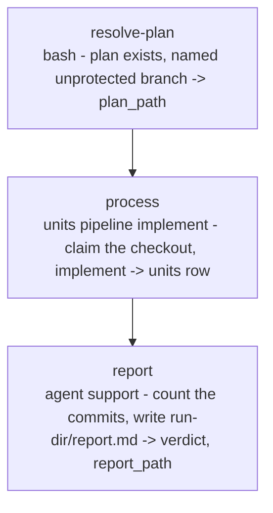

# impl-plan

<!-- This README is the source of truth for how the workflow LOOKS to
     users. Keep it in sync with workflow.yaml: every edit to the flow,
     steps, inputs or outputs belongs here too (CONTRIBUTING.md 9.6). -->

Implement one `PLAN-*.md` on the checked-out branch, `version: 2`, run
by the wise engine. The engine's `units` step on the `implement`
pipeline binds to the checked-out branch and runs the same implement
phase `ticket-auto` runs: the plan's task waves become atomic commits,
each task tidied (the simplify pass) and validated. Nothing is pushed,
no PR is opened, no worktree or branch is created. No prompts after
launch; pre-flight asks harness, model and effort for the implementer.
`/wise-implement-plan-auto` conducts this workflow.

## When to use

- You have a ready plan (from `ticket-plan`, `/wise-revise`, or written
  by hand in the same schema) and want its tasks landed as commits on
  the branch you have checked out, then stop for review.

## When not to use

- You want the full plan → PR → merge pipeline: use `impl-plan-auto`.
- You start from a ticket: use `ticket-auto`.

## Prerequisites

- `/wise-init` completed at least once (Python 3.11+).
- Run from inside the project's git repository on a named, unprotected
  branch (`project-selection: current`); a detached HEAD or
  `main` / `master` / `release*` stops `resolve-plan`.
- Pre-flight asks for a permission floor once per selected provider.

## Flow



Inside `process`, for the plan and in this order:

| Phase | Kind | Group / model | What it does |
|---|---|---|---|
| `claim` | code | - | Binds to the checkout: named unprotected branch, plan file present. Base from the repo default branch. |
| `implement` | model | `implement` | Task waves, one atomic commit per task, validation after each commit; the verdict is `all-green` with `implemented: <done> of <tasks> tasks in <n> commits (failed <f>)`. `done = 0` or no commits fails the unit. |
| `cleanup` | code | - | Always keeps the current tree and branch. |

## Pre-flight questions

| Id | Kind | Default | Notes |
|---|---|---|---|
| `input.plan` | text | - | The `PLAN-*.md` path, relative to the repo root or absolute. Skipped when `/wise-implement-plan-auto <path>` supplied it. |
| `input.guidance` | text | `""` (or the context `guidance`) | Standing instruction the engine hands to the implementer. |
| `harness.<group>` | choice | `claude` | One per group (`implement`, `support`); asked whenever another harness is installed. Always put to the user, like `model.<group>` and `effort.<group>`. |
| `permissions.<harness>` | choice | `auto` | Once per selected or fallback provider. The selected value is a floor. |
| `model.<group>` | choice | `claude-opus-5` (`support`: `claude-sonnet-5`) | The engine's catalog for the chosen harness. Each group's label says what the model will do. |
| `effort.<group>` | choice | `high` (`support`: `medium`) | The chosen model's efforts; skipped when it takes one or none. |

The worktree question is not asked (`preflight.lock-worktree: true`):
implementation lands on the checked-out branch.

## Steps

| Step | Type | Purpose |
|---|---|---|
| `resolve-plan` | `bash` | Resolves the `plan` input to an absolute path, fails when the file is missing, refuses a detached HEAD and `main` / `master` / `release*`. Emits `plan_path`. |
| `process` | `units` | `pipeline: implement`, `items: {{plan_path}}`. Group `implement`. Emits `units` (one row). |
| `report` | `agent` (`support` group) | Renders the `units` row, counts the run's commits with `git log`, writes `<run-dir>/report.md` (plan, branch, waves and tasks done / failed, commits, next step per failed task, nothing pushed). Emits `verdict`, `report_path`. |

## Inputs

| Name | Required | Description |
|---|---|---|
| `plan` | yes | The `PLAN-*.md` path. |
| `guidance` | no | Free-form operator guidance (libraries to prefer, files to avoid, guardrails). Pre-filled from the context `guidance`. |

## Outputs

| Name | Source | Content |
|---|---|---|
| `plan_path` | `resolve-plan` | Absolute plan path, the `units` item. |
| `units` | `process` | `UnitRow[]` (one row): `unit` (ref, branch, worktree, base, plan_path), `verdict` (`all-green`, `failed`, `skipped`), `reason`, `cleaned`. Ledger under `<run-dir>/units/<branch>.json` with the implement counters. |
| `verdict`, `report_path` | `report` | The verdict and the report file. |

## Examples

```
/wise-implement-plan-auto docs/plans/PLAN-api-caching.md
# The plan input is settled; pre-flight asks guidance, then harness, permissions, model and effort for implement and support.

/wise-workflow-run impl-plan docs/plans/PLAN-api-caching.md keep the public API unchanged
# The same run from the generic conductor; everything after the path is the guidance input.
```

## Related

- [Definition YAML](./workflow.yaml)
- [`/wise-implement-plan-auto`](../../skills/wise-implement-plan-auto/SKILL.md): the conductor.
- [`impl-plan-auto`](../impl-plan-auto/README.md): the full plan → PR pipeline.
- [`/wise-revise`](../../skills/wise-revise/SKILL.md): writes the `PLAN-*.md` files.
