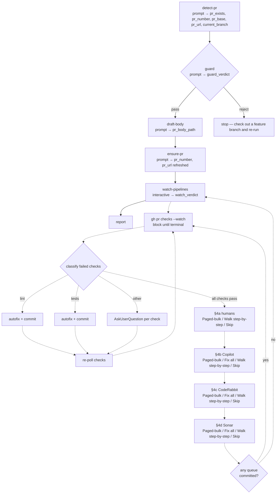

# pr-interactive

<!-- This README is the source of truth for how the workflow
     LOOKS to users. Keep it in sync with workflow.yaml +
     prompts/*.md — every edit to the flow, steps, outputs,
     or fragment list belongs here too. See
     plugins/wise/CLAUDE.md for the invariant. -->

Take a feature branch from "just pushed" to "ready for review".
Detects whether a PR exists, creates or refreshes its body from
a project-override-or-workflow-fallback template, then
unconditionally enters the strategy-driven watch loop: lint /
tests / other auto-fixers, followed by four sequential
reviewable queues (humans → Copilot → CodeRabbit → SonarCloud).
Exits when every check is green AND every queue returned
`all-clear` / `partial` / `unchecked`.

Reviewer attachment is NOT part of this workflow — it lives in
the `/wise-pr-add-reviewers` standalone skill. Run that when you're
ready to request review.

## When to use

- You've pushed a feature branch and want wise to drive the full
  "open PR → green CI → resolve bot reviews" dance in one shot.
- Your PR has CI failures you want auto-fixed (lint, tests) and
  review comments you want walked through interactively.
- You want the PR body generated from your project's template
  without hand-filling each section.

## When not to use

- You want to create a PR without the watch loop — use
  [`/wise-pr-create`](../../skills/wise-pr-create/SKILL.md) instead.
- You only want to drive the watch loop on an existing PR — use
  [`/wise-pr-watch`](../../skills/wise-pr-watch/SKILL.md).
- You only want to attach reviewers — use
  [`/wise-pr-add-reviewers`](../../skills/wise-pr-add-reviewers/SKILL.md).
- Your branch is `main` / `master` / a release branch **and** no
  PR exists yet — the workflow's `guard` step refuses (creating
  a PR from a protected branch is almost always a mistake).

## Prerequisites

- `/wise-init` completed at least once (Python + Node + gh CLI +
  `gh auth login`).
- Current branch has commits you want in the PR.
- Project checked out with a remote; gh CLI authenticated.
- **Sonar access** (for §4d):
  - Preferred: a SonarQube / SonarCloud MCP server configured
    in your Claude Code session — auth is handled transparently,
    tool names match `mcp__*sonar*__*`.
  - Fallback: `SONAR_TOKEN` in your shell env for private
    projects. Public projects work anonymously.
  - Neither present + the project is private: the Sonar queue
    routes to an `Open issues page / Mark unchecked / Abort`
    prompt rather than silently claiming "zero issues".

## Flow



Solid arrows are the step DAG. Dotted arrows show the internal
loop `watch-pipelines` drives via its prompt fragment:

1. Block on `gh pr checks --watch --interval 5` until CI
   terminates.
2. Dispatch any FAILED checks by class (lint / tests / other);
   autofix + commit where possible; re-poll.
3. Once CI is clean, sweep the PR for review threads GitHub
   flagged as `Outdated` but never resolved, auto-resolve them
   as a one-line batch (the lines they anchor to moved or
   were deleted, so the comment is stale by construction), and
   then walk four reviewable queues **in order** (humans →
   Copilot → CodeRabbit → Sonar). Each queue offers
   a top-level gate. **Bot queues (Copilot, CodeRabbit) and
   Sonar:** `Paged-bulk (5/page, auto-classified, recommended)
   / Fix all in one shot / Walk step-by-step / Skip queue`.
   **Humans:** `Paged-bulk (5/page, recommended) / Walk
   step-by-step / Skip queue` — no fix-all and no auto-
   classify, to keep human review explicit. Paged-bulk renders
   5 items per page with Claude's pre-classified decision per
   item (bots + Sonar); the user confirms or edits the whole
   page in one prompt. The first option's verb is queue-
   specific — bot queues read `Fix: <decisions>`, Sonar reads
   `Accept: <decisions>` (Sonar suppression is a distinct
   semantic from fixing a comment). See
   [`paged-bulk-mode.md`](./prompts/paged-bulk-mode.md) for the
   shared algorithm.
4. Each queue runs a **4-phase apply** after collection: (A)
   collect every decision, no side effects — (B) apply Fix /
   Fix-using-suggestion / Sonar-Accept edits locally and commit
   ONCE with `push=no` — (C) post replies, resolve threads, run
   any Sonar MCP `change_issue_status` calls — (D) push ONCE at
   the end of the queue. The strict ordering removes the
   back-and-forth that per-item inline applies produced
   pre-2.6.0 and lets a queue abort cleanly without leaving
   half-applied state on the PR.
5. If any queue pushed code, re-poll (push may trigger new
   CI + new bot passes). Otherwise exit.

## Steps

| Step | Type | Purpose |
|---|---|---|
| `detect-pr` | `prompt` | `git rev-parse` + `gh pr view` for the current branch; captures branch, exists flag, number, base, url in one structured line. |
| `guard` | `prompt` | Rejects protected branches (`main` / `master` / `release[/-]…`) **when no PR exists yet**. Protected + existing PR → pass (refresh-only flow). |
| `draft-body` | `prompt` | Template resolution ladder (project `.github/pull_request_template.md` → `.github/PULL_REQUEST_TEMPLATE.md` → `docs/pull_request_template.md` → workflow fallback). Fills from branch diff + commits; Jira key auto-detected. Writes body to `/tmp`. Uses `surface: file` so the body renders inline in the wave-results. |
| `ensure-pr` | `prompt` | `pr_exists=yes` → `gh pr edit --body-file` to refresh. `pr_exists=no` → interactive base-branch picker (main + 5 recent `release*`), `gh pr create`. |
| `watch-pipelines` | `interactive` | Main-thread loop: polls `gh pr checks --watch`, classifies failures (lint / tests / other), drives per-class autofixers; then four sequential reviewable queues (humans → Copilot → CodeRabbit → Sonar), each with a `Paged-bulk / Fix all / Walk step-by-step / Skip queue` gate (humans drop `Fix all`). Paged-bulk is the default — 5 items on screen per page with Claude's pre-classified decision per item (auto-classify is on for bots + Sonar and off for humans); the user confirms or edits the page in one prompt. The first option's verb is queue-specific — bot queues read `Fix: <decisions>`, Sonar reads `Accept: <decisions>`. Each queue runs a 4-phase apply after collection: collect → local edits + one commit (push=no) → remote thread-resolves + replies + Sonar MCP `change_issue_status` calls → one `git push`. Every per-item preamble (paged and walk) includes a clickable `Link:` row (GitHub `/changes#r<id>` for line-level comments, `html_url` for top-level issue comments, `sonarcloud.io/…&open=<issueKey>` for Sonar issues). Exits when CI is green AND every queue returned `all-clear` / `partial` / `unchecked`. Runs in the conductor's main conversation so `AskUserQuestion` works — `type: prompt` here would silently no-op the wizards. |
| `report` | `prompt` | One-paragraph summary + pointer at `/wise-pr-add-reviewers`. |

## Inputs

None — the workflow derives everything from the current branch
and PR state.

## Outputs

| Name | Source | Used for |
|---|---|---|
| `current_branch` | `detect-pr` | Referenced throughout the flow. |
| `pr_exists` | `detect-pr` | Gates guard rule + ensure-pr create-vs-edit branch. |
| `pr_number` / `pr_url` / `pr_base` | `detect-pr` (then refreshed by `ensure-pr`) | Final summary; handed to watch-pipelines. |
| `guard_verdict` | `guard` | `when:` gate for all downstream steps. |
| `pr_body_path` | `draft-body` | Read by ensure-pr and surfaced inline in the wave-results render. |
| `watch_verdict` | `watch-pipelines` | `all-green` / `partial url=… accepted=<csv>` / `aborted`. The `accepted` list rolls up per-queue markers (`humans-skipped=N`, `copilot-skipped=N`, `coderabbit-skipped=N`, `sonar-skipped=N`, `sonar-unchecked`) so the report surfaces exactly what's left. |

## Examples

```
# From a feature branch with commits pushed
/wise-workflow-run pr-interactive
```

Typical wave cadence, wave-sync mode:

1. `detect-pr` (single step, ~5s)
2. `guard` (single step, single LLM call)
3. `draft-body` (single step; reads template + diff; writes /tmp file; inline body preview)
4. `ensure-pr` (AskUserQuestion if creating; `gh pr edit` if refreshing)
5. `watch-pipelines` (long-running; one wave regardless of iterations)
6. `report`

## Related

- [Definition YAML](./workflow.yaml)
- [Shared prompt fragments](./prompts/):
  - [`draft-body.md`](./prompts/draft-body.md) — diff + template
    + Jira detection → drafted PR body.
  - [`ensure-pr.md`](./prompts/ensure-pr.md) — `gh pr create` /
    `gh pr edit` logic.
  - [`watch-pipelines.md`](./prompts/watch-pipelines.md) —
    main orchestrator for §3 (check failures) + §4
    (reviewable queues).
  - [`handle-human-comments.md`](./prompts/handle-human-comments.md)
    — §4a queue.
  - [`handle-bot-reviews.md`](./prompts/handle-bot-reviews.md)
    — §4b/§4c queues (takes `bot_filter=copilot|coderabbit`).
  - [`handle-sonar-issues.md`](./prompts/handle-sonar-issues.md)
    — §4d queue (prefers Sonar MCP).
  - [`paged-bulk-mode.md`](./prompts/paged-bulk-mode.md) —
    shared 5-items-per-page triage algorithm + decision-string
    parser, driven by each queue handler when the user picks
    `Paged-bulk` at the top-level gate.
  - [`commit-from-fix.md`](./prompts/commit-from-fix.md) —
    autofix-aware delegate over
    [`commit-routine.md`](../../skills/wise-commit/commit-routine.md);
    adds the `fix_kind` classification bias and the `fix_summary`
    drafting hint on top, then defers staging / drafting / commit /
    push to the routine. Used by every autofix commit inside the
    watch loop. It passes `SIMPLIFY=yes`, so every watch fix-commit
    runs the routine's simplify (code-simplifier) cleanup pass before
    staging (the cleanup lands inside the same fix commit).
  - [`ensure-reviewers.md`](./prompts/ensure-reviewers.md) +
    [`propose-reviewers.md`](./prompts/propose-reviewers.md) —
    NOT used by this workflow; consumed only by the
    `/wise-pr-add-reviewers` standalone skill.
- [PR body fallback template](./templates/pr-template.md).
- [`/wise-pr-create`](../../skills/wise-pr-create/SKILL.md) —
  standalone create/refresh, no watch loop.
- [`/wise-pr-add-reviewers`](../../skills/wise-pr-add-reviewers/SKILL.md)
  — standalone reviewer attachment (Copilot + Claude-picked extras).
- [`/wise-pr-watch`](../../skills/wise-pr-watch/SKILL.md) — standalone
  watch loop over an existing PR.
- [`/wise-commit-message`](../../skills/wise-commit-message/SKILL.md)
  — shared Conventional-Commits drafter.
