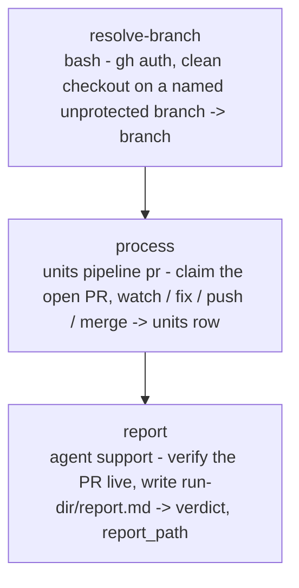

# pr-watch

<!-- This README is the source of truth for how the workflow LOOKS to
     users. Keep it in sync with workflow.yaml: every edit to the flow,
     steps, inputs or outputs belongs here too (CONTRIBUTING.md 9.6). -->

Watch the open pull request of the checked-out branch until it is
merged or needs a human, `version: 2`, run by the wise engine. The
engine's `units` step on the `pr` pipeline binds to the branch's open
PR, then runs the same loop `ticket-auto` runs once its PR is open:
poll CI and the review bots, fix what they raise, push, run wise's own
substitute review when a bot is stuck (if allowed at pre-flight), and
merge once the PR is green and quiet. Runs in the current checkout,
never creates a worktree or branch. No prompts after launch;
pre-flight asks harness, model and effort per phase.
`/wise-pr-watch-auto` conducts this workflow.

## When to use

- A PR is open for the branch you have checked out and you want it
  driven to merge unattended, on any harness.

## When not to use

- You want to walk the review queues yourself, or the PR is gated on
  Sonar: use `/wise-pr-watch` (the engine loop has no Sonar handling).
- There is no PR yet: `/wise-pr-create-auto` first.
- You start from a ticket or a plan: `ticket-auto` / `impl-plan-auto`
  open the PR and watch it in one run.

## Prerequisites

- `/wise-init` completed at least once (Python 3.11+, gh CLI + auth).
- Run from inside the project's git repository on the PR branch
  (`project-selection: current`); a detached HEAD, a protected
  branch (`main` / `master` / `release*`) or uncommitted / untracked
  changes stop `resolve-branch`.
- Pre-flight asks for a permission floor once per selected provider.
  `Auto` is recommended; `Bypass permissions` is available when the
  provider must run fully unsandboxed. A phase's stronger mode still wins.

## Flow



Inside `process`, for the checked-out branch and in this order:

| Phase | Kind | Group / model | What it does |
|---|---|---|---|
| `claim` | code | - | Binds to the checkout: named unprotected branch, matching the item, with an open PR (`MERGED` -> verdict `merged`, closed -> `skipped`). Base from the PR. |
| `watch` (+ `fix`, `push`, `review`) | model | `watch` / `fix` / `review` | One pass per poll: CI state, human comments, bot reviews. Red CI or open bot items go to `fix` then `push` (each counts against `max_fix_attempts`); after the push the engine reconciles CodeRabbit's state for the new head (reviews bound to the head, its check run, notices and trigger comments created after the head appeared) and, when the head is silent past a 2-minute grace or CodeRabbit says automatic reviews are off, posts one `@coderabbitai review` per head (`references/pr/review-verification.md`; ledger `watch.verification`), holding the merge while the request is unanswered or the review runs; a stuck bot gets the substitute review once per head when `substitute_review` is `yes`, else the run stands down (`all-green reason=review-consent-declined`); a human comment stands the loop down; `watch_stable_passes` consecutive green passes merge (squash, then merge commit). |
| `cleanup` | code | - | Always keeps the current tree and branch. |

## Pre-flight questions

| Id | Kind | Default | Notes |
|---|---|---|---|
| `input.substitute_review` | choice | `yes` | The consent gate, asked once: may the run review the branch itself (one read-only 3-lens pass on the `review` group's model) when a bot is stuck? `no` stands the run down on a stuck bot. |
| `input.max_fix_attempts` | text | `""` (cap 10) | Fix + push rounds before standing down; overrides the cap when given. Skipped when `/wise-pr-watch-auto <n>` supplied it. |
| `input.watch_minutes` | text | `""` (cap 120) | Wall-clock budget in minutes; overrides the cap when given. Skipped when `--minutes <n>` supplied it. |
| `harness.<group>` | choice | `claude` | One per group (`watch`, `fix`, `review`, `support`); asked whenever another harness is installed. Always put to the user, like `model.<group>` and `effort.<group>`: the run refuses to start on a skipped one. |
| `permissions.<harness>` | choice | `auto` | Once per selected or fallback provider. The selected value is a floor. |
| `model.<group>` | choice | `claude-opus-5` (`watch`, `support`: `claude-sonnet-5`) | The engine's catalog for the chosen harness. Each group's label says what the model will do. |
| `effort.<group>` | choice | `high` (`watch`, `support`: `medium`) | The chosen model's efforts; skipped when it takes one or none. |

The worktree question is not asked (`preflight.lock-worktree: true`):
the PR lives on the checked-out branch.

Unit caps (`profiles.medium.caps`):

| max_fix_attempts | watch_minutes | watch_poll_seconds | watch_stable_passes |
|---|---|---|---|
| 10 | 120 | 60 | 2 |

## Steps

| Step | Type | Purpose |
|---|---|---|
| `resolve-branch` | `bash` | `gh auth status`, the checked-out branch name; refuses a detached HEAD, `main` / `master` / `release*` and a dirty checkout (`git status --porcelain` non-empty). Emits `branch`. |
| `process` | `units` | `pipeline: pr`, `items: {{branch}}`. Groups `watch`, `fix`, `review`; caps from `profiles.medium` (overridden by the inputs of the same name); `reviewers: [copilot-pull-request-reviewer]`; `resume: unit`. Emits `units` (one row). |
| `report` | `agent` (`support` group) | Renders the `units` row, verifies the PR with `gh pr view`, writes `<run-dir>/report.md` (verdict and reason, passes and fix rounds, what was fixed, the verification requests per head from the ledger's `watch.verification`, the next step for a human). Emits `verdict`, `report_path`. |

## Inputs

| Name | Required | Description |
|---|---|---|
| `substitute_review` | yes | `yes` (default) / `no`: whether the run may run wise's substitute review when a bot is stuck. |
| `max_fix_attempts` | no | Positive integer; blank keeps the cap (10). |
| `watch_minutes` | no | Positive integer; blank keeps the cap (120). |

## Outputs

| Name | Source | Content |
|---|---|---|
| `branch` | `resolve-branch` | The checked-out branch, the `units` item. |
| `units` | `process` | `UnitRow[]` (one row): `unit` (branch, worktree, base, pr), `verdict` (`merged`, `all-green`, `blocked`, `partial`, `exhausted`, `human-intervention`, `failed`, `skipped`), `reason`, `review`, `cleaned`. Ledger under `<run-dir>/units/<branch>.json`; its `watch.verification.<provider>.<head>` records the verification requests for the 5 most recent heads (state, attempts, comment id, retry time). |
| `verdict`, `report_path` | `report` | The verdict and the report file. |

## Examples

```
/wise-pr-watch-auto
# Pre-flight asks the substitute-review consent, the caps, then harness, permissions, model and effort per group.

/wise-pr-watch-auto 3 --minutes 30
# Three fix rounds at most, half an hour; those two inputs are not asked.

/wise-workflow-run pr-watch
# The same run started from the generic conductor.
```

## Related

- [Definition YAML](./workflow.yaml)
- [`/wise-pr-watch-auto`](../../skills/wise-pr-watch-auto/SKILL.md): the conductor.
- [`/wise-pr-watch`](../../skills/wise-pr-watch/SKILL.md): the interactive watcher (Sonar, review queues walked with the user).
- [`ticket-auto`](../ticket-auto/README.md): the same loop after its own PR step.
