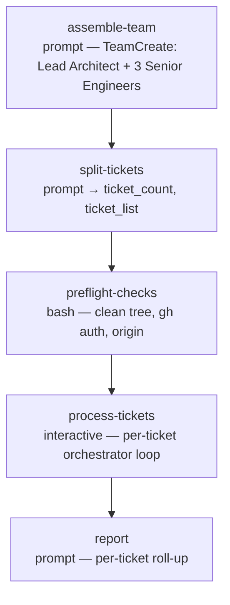

# ticket-auto

<!-- This README is the source of truth for how the workflow
     LOOKS to users. Keep it in sync with workflow.yaml +
     prompts/*.md — every edit to the flow, steps, outputs,
     or fragment list belongs here too. See
     plugins/wise/CLAUDE.md for the invariant. -->

Autonomous ticket → PR pipeline. Give it one or more tickets; for each
one a Lead Architect plus three Senior Engineers plan it, implement it
in an isolated git worktree, code-review the branch at medium effort,
commit, push, open a PR, request review, watch + fix CI, then wait for
CodeRabbit / Copilot to finish reviewing
and resolve every review comment — end to end, with **no user
prompts**. One worktree + branch + PR per ticket. When a PR's checks
all pass, both review bots have finished, and every comment is
fixed-or-dismissed it is **merged** (squash, respecting branch
protection); a PR that can't be driven fully resolved — including one
with a non-minor bot comment Claude can't confidently handle — is left
open for a human.

It follows a spec-driven, phase-gated model:
fresh-context executor agents working the plan's task waves in
parallel, one atomic commit per task (each simplified before
commit), a medium-depth multi-agent code-review gate over the whole
branch before pushing, autonomous chaining.

## When to use

- You have one or more well-specified tickets and want each turned
  into a reviewed-ready PR unattended — fire it and come back to a set
  of open PRs.
- The tickets are clear enough that reasonable autonomous decisions
  won't go badly wrong.

## When not to use

- A ticket is ambiguous or high-stakes and you want to review and
  adjust the plan before any code — use the interactive `ticket-plan`
  workflow (it plans autonomously, then you review / comment), then
  implement and PR yourself.
- You want a human in the loop for CI fixes or review comments — use
  `pr-interactive`.

## Prerequisites

- `/wise-init` completed at least once (Python + Node + gh CLI + auth).
- Run from inside the project's git repository — `project-selection:
  current` auto-detects it; the base working tree must be **clean**
  (`preflight-checks` refuses a dirty base).
- No tracker plugin needs to be pre-installed — the plan phase probes
  for a tracker MCP / CLI and degrades gracefully when none is found.
- Recommended ≤ 5 tickets per run (each ticket's full pipeline is
  substantial; see Notes).

## Flow



`process-tickets` is the engine of the workflow. For each ticket it
runs an isolated sub-pipeline:

```
worktree → plan → implement → review (code-review medium) → commit+push
        → create PR → request review → watch + fix CI loop → record
```

The wise workflow engine has no DAG loops, so the per-ticket loop and
each per-ticket pipeline live *inside* the `process-tickets` step
(`type: interactive`, run in the conductor with full Bash/Task
access). Every heavy sub-task is delegated to a `Task` subagent to
keep the step's context bounded.

`control-mode` is pinned `synchronous`, `worktree` `current`,
`rename_session` `skip` — the run takes no pre-flight input beyond the
tickets. There are no `ask` / `approval` steps.

## Steps

| Step | Type | Purpose |
|---|---|---|
| `assemble-team` | `prompt` | `TeamCreate`: one Lead Architect (decision-maker) + three Senior Engineers (20+ yrs, polyglot). |
| `split-tickets` | `prompt` | Parse `ticket_ids` into a clean list; emit count + semicolon-joined list. |
| `preflight-checks` | `bash` | Refuse a dirty base repo; verify `gh` auth and an `origin` remote. |
| `process-tickets` | `interactive` | The orchestrator — loops the ticket list, running the full plan→implement→PR→watch pipeline per ticket in its own worktree. |
| `report` | `prompt` | Per-ticket roll-up: branch, worktree path, PR url, verdict; flags which PRs need a human; lists worktree-cleanup commands. |

## Per-ticket pipeline (inside `process-tickets`)

Driven by `prompts/process-tickets.md`, which follows these fragments:

| Phase | Fragment | Autonomous analogue of |
|---|---|---|
| Plan | `prompts/plan-ticket.md` | the interactive `ticket-plan` workflow |
| Implement | `prompts/implement-plan.md` | (new — phase-gated executor; code-simplifier per task commit) |
| Review | `prompts/review-branch-auto.md` | (new — medium-depth multi-agent code-review gate, before push) |
| Push | `wise-commit/commit-routine.md` | `/wise-commit-push` |
| Create PR | `prompts/ensure-pr-auto.md` | `/wise-pr-create` |
| Request review | `prompts/request-review-auto.md` | `/wise-pr-add-reviewers` |
| Watch + fix | `prompts/watch-pipelines-auto.md` | `/wise-pr-watch` |

Each fragment is also the source of truth for a standalone reusable
skill — `wise-implement-plan-auto`, `wise-code-review-auto`,
`wise-pr-create-auto`, `wise-pr-request-review-auto`,
`wise-pr-watch-auto`.

The `Watch + fix` phase waits for CodeRabbit / Copilot to finish
reviewing the PR head, then handles every review comment via the
sub-fragment `prompts/handle-bot-reviews-auto.md` — each comment is
classified by severity (minors fixed quickly, major/critical ones via
a considered consolidated decision), genuine false positives are
dismissed with a reasoned reply, and every handled thread is resolved
on the PR before the merge gate is checked.

## Inputs

| Name | Required | Description |
|---|---|---|
| `ticket_ids` | yes | Comma-separated list of ticket URLs or ids. Each gets its own worktree + branch + PR. |
| `max_fix_attempts` | no | Cap on autonomous CI-fix rounds per ticket before the watch loop stops. Blank → 6. |

## Outputs

| Name | Source | Used for |
|---|---|---|
| `ticket_count` / `ticket_list` | `split-tickets` | The parsed ticket list driving the orchestrator loop. |
| `tickets_processed` / `tickets_green` / `tickets_partial` / `tickets_failed` | `process-tickets` | Run tallies surfaced by `report`. |

## Examples

```
/wise-workflow-run ticket-auto
# Prompts for the ticket list + max-fix-attempts at pre-flight.
```

## Notes

- **Merges on fully resolved.** A PR is merged (squash, fallback merge
  commit) only when its checks all pass, both review bots have
  finished, and every bot comment is fixed-or-dismissed with its
  thread resolved. Branch protection is respected — if the repo
  requires a human approval the merge is left to a human and the PR
  stays open. A PR with a non-minor bot comment Claude can't
  confidently resolve is left open too (the `blocked` verdict). Any PR
  that isn't fully resolved is left open.
- **Worktrees are left in place** for inspection — `report` lists the
  `git worktree remove` commands.
- **≤ 5 tickets/run recommended.** Each ticket runs a full
  plan+implement+watch pipeline; the orchestrator delegates heavy work
  to subagents to bound context, but very large batches still risk the
  run growing long.

## Related

- [Definition YAML](./workflow.yaml)
- [`ticket-plan`](../ticket-plan/README.md) — the interactive
  plan-only workflow (it plans autonomously and you review / comment;
  you implement).
- [`pr-interactive`](../pr-interactive/README.md) — interactive
  create-PR + watch + review-queue workflow.
- [`wise-estimation`](../../skills/wise-estimation/SKILL.md) — SP
  estimation reference consulted by the plan phase.
