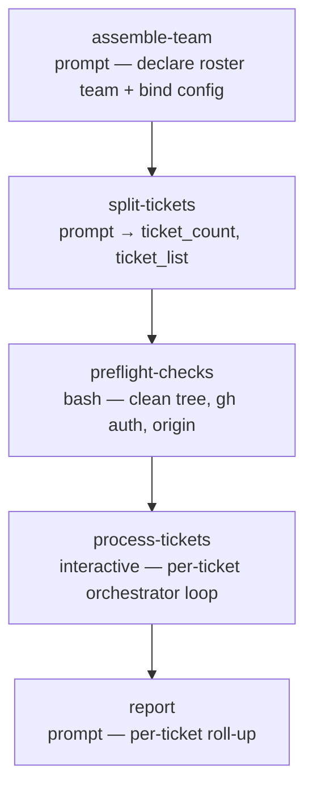

# ticket-auto

<!-- This README is the source of truth for how the workflow
     LOOKS to users. Keep it in sync with workflow.yaml +
     prompts/*.md — every edit to the flow, steps, outputs,
     or fragment list belongs here too. See
     plugins/wise/CLAUDE.md for the invariant. -->

Autonomous ticket → PR pipeline. Give it one or more tickets; for each
one the wise SDLC roster plans it (`wise:architect`), implements it
(`wise:software-engineer`) in an isolated git worktree, runs an
independent **review↔fix loop** (`wise:code-reviewer` judges,
`wise:software-engineer` fixes) until the branch passes, commits, pushes,
opens a PR, requests the bot reviews (attaches Copilot, triggers
CodeRabbit), watches + fixes CI, then waits for both bots to review the
head — bypassing CodeRabbit when it is out of credits and
retrying-then-giving-up on a rate limit, while a requested Copilot
review is awaited strictly — and resolves every review comment — end to
end, with **no user prompts**. One worktree + branch + PR per ticket. When a PR's checks
all pass, both review bots have finished, and every comment is
fixed-or-dismissed it is **merged** (squash, respecting branch
protection); a PR that can't be driven fully resolved — including one
with a non-minor bot comment Claude can't confidently handle — is left
open for a human. When a PR is merged, its worktree and local branch are
removed to keep the base repo clean; a PR left open keeps its worktree
for inspection.

It follows a spec-driven, phase-gated model:
fresh-context executor agents working the plan's task waves in
parallel, one atomic commit per task (each simplified before
commit), then an independent review↔fix loop over the whole branch
(reviewer judges, a separate engineer fixes, cycling until clean)
before pushing, autonomous chaining.

## When to use

- You have one or more well-specified tickets and want each turned
  into a reviewed-ready PR unattended — fire it and come back to a set
  of open PRs.
- The tickets are clear enough that reasonable autonomous decisions
  won't go badly wrong.

## When not to use

- A ticket is ambiguous or high-stakes and you want to review and
  adjust the plan before any code — use the interactive `ticket-plan`
  workflow (it plans autonomously, then you review / comment), then
  implement and PR yourself.
- You want a human in the loop for CI fixes or review comments — use
  the standalone `/wise-pr-watch` on your own PR.

## Prerequisites

- `/wise-init` completed at least once (Python + Node + gh CLI + auth).
- Run from inside the project's git repository — `project-selection:
  current` auto-detects it; the base working tree must be **clean**
  (`preflight-checks` refuses a dirty base).
- No tracker plugin needs to be pre-installed — the plan phase probes
  for a tracker MCP / CLI and degrades gracefully when none is found.
- Recommended ≤ 5 tickets per run (each ticket's full pipeline is
  substantial; see Notes).

## Flow



`process-tickets` is the engine of the workflow. For each ticket it
runs an isolated sub-pipeline:

```
ensure-worktree (create or adopt on resume) → plan → implement
        → review↔fix loop (reviewer ⇄ fixer) → commit+push → create PR
        → request review → watch + fix CI loop
        → record (+ remove worktree & local branch if merged)
```

The wise workflow engine has no DAG loops, so the per-ticket loop and
each per-ticket pipeline live *inside* the `process-tickets` step
(`type: interactive`, run in the conductor with full Bash/Task
access). Every heavy sub-task is delegated to a `Task` subagent to
keep the step's context bounded.

`control-mode` is pinned `synchronous`, `worktree` `current`,
`rename_session` `skip` — the only pre-flight input is the ticket list
(required) and an optional free-form `config_prompt`. There are no
`ask` / `approval` steps, and no tuning questions: every quality /
depth dial takes its maximum-value default (e.g. the review gate runs
at **high** effort — five reviewer lenses + a confidence pass). The
review↔fix cycle cap and the CI-fix cap both default to 10 (each
overridable from `config_prompt`).

## Steps

| Step | Type | Purpose |
|---|---|---|
| `assemble-team` | `prompt` | Run-start declaration of the roster team (`wise:architect` lead + `wise:software-engineer` + `wise:code-reviewer`) and binding of the operator `config_prompt`. `agent: off` (plain confirmation step), `model: sonnet`. |
| `split-tickets` | `prompt` | Parse `ticket_ids` into a clean list; emit count + semicolon-joined list. `model: sonnet`. |
| `preflight-checks` | `bash` | Refuse a dirty base repo; verify `gh` auth and an `origin` remote. |
| `process-tickets` | `interactive` | The orchestrator — loops the ticket list, running the full plan→implement→review↔fix→PR→watch pipeline per ticket in its own worktree. |
| `report` | `prompt` | Per-ticket roll-up: branch, worktree path, PR url, verdict; flags which PRs need a human (incl. `review=not-converged`); notes merged tickets were auto-cleaned and lists worktree-removal commands for any that remain. Dispatched to `wise:technical-writer` on `sonnet`. |

The workflow sets `agents: auto`, but most of its work runs inside the
`process-tickets` fragment, which dispatches each phase to a concrete
roster role + model — brought in **fresh per phase** so transcripts
release and the multi-ticket run stays within its context budget. The
per-phase roles and models are in the [pipeline table](#per-ticket-pipeline-inside-process-tickets)
below; at the step level `report` → `wise:technical-writer`. Model
tiering: `opus` for the planning + review brains, `sonnet` for the
hands-on engineering and bookkeeping steps. See
[Agents, model and effort](../../../../docs/wise/workflows.md#agents-model-and-effort).

## Per-ticket pipeline (inside `process-tickets`)

Driven by `prompts/process-tickets.md`, which follows these fragments:

| Phase | Fragment | Role · model | Autonomous analogue of |
|---|---|---|---|
| Plan | `prompts/plan-ticket.md` | `wise:architect` · opus | the interactive `ticket-plan` workflow |
| Implement | `prompts/implement-plan.md` | `wise:software-engineer` · sonnet | (phase-gated executor; code-simplifier per task commit) |
| Review ↔ fix | `prompts/review-branch-auto.md` (`fixer=delegate`) | `wise:code-reviewer` · opus ⇄ `wise:software-engineer` · sonnet | high-depth review gate (judges only) + an independent fixer, cycling before push |
| Push | `wise-commit/commit-routine.md` | (inline) | `/wise-commit-push` |
| Create PR | `prompts/ensure-pr-auto.md` | (inline) | `/wise-pr-create` |
| Request review | `prompts/request-review-auto.md` | (inline) | `/wise-pr-add-reviewers` |
| Watch + fix | `prompts/watch-pipelines-auto.md` | `wise:software-engineer` · sonnet | `/wise-pr-watch` |

The **Review ↔ fix** phase separates judging from fixing: a
`wise:code-reviewer` reviews the branch in `fixer=delegate` mode (reports
findings, applies nothing), then a `wise:software-engineer` applies
exactly those findings and commits. The two cycle — re-review verifies
each fix — until the reviewer returns `verdict=clean` or the cap (10,
`config_prompt`-overridable) is hit. On non-convergence the branch is
pushed anyway and the ticket is flagged `review=not-converged` for the
human + the CI/bot review to catch.

Each fragment is also the source of truth for a standalone reusable
skill — `wise-implement-plan-auto`, `wise-code-review-auto`,
`wise-pr-create-auto`, `wise-pr-request-review-auto`,
`wise-pr-watch-auto`. The shared `review-branch-auto.md` keeps its
default `fixer=self` behaviour for the standalone `/wise-code-review-auto`
skill; `ticket-auto` passes `fixer=delegate` to drive the loop above.

The `Watch + fix` phase **detects, triggers, and waits for** the review
bots rather than inferring their absence from an empty footprint (the
bug that let an early run merge before either bot reviewed). Copilot is
the strict gate — a requested review must land on the head or the PR is
left for a human (`copilot-review-timeout`). CodeRabbit is triggered
hard (`@coderabbitai review`) but never deadlocks the run: if it reports
being **out of credits** the phase bypasses it, and if it is
**rate-limited** the phase re-triggers every 30 s up to 10 times before
giving up — either way recorded as `coderabbit=bypassed|gave-up` on the
verdict so `report` flags it. Once a bot has reviewed, every review
comment is handled via the sub-fragment
`prompts/handle-bot-reviews-auto.md` — each comment classified by
severity (minors fixed quickly, major/critical ones via a considered
consolidated decision), genuine false positives dismissed with a
reasoned reply, and every handled thread resolved on the PR before the
merge gate is checked.

## Inputs

| Name | Required | Description |
|---|---|---|
| `ticket_ids` | yes | Comma-separated list of ticket URLs or ids. Each gets its own worktree + branch + PR. First positional arg; when passed positionally use **no spaces** between items (`PROJ-1,PROJ-2`). |
| `config_prompt` | no | Free-form guidance to tune the run — skills / libraries to prefer, guidelines, guardrails, files to avoid, knob overrides (e.g. "cap CI fixes at 4", "cap review cycles at 5"). The `wise:architect` (plan phase) applies it to every decision and **predicts** any answer it implies rather than prompting; later phases honour it too. As the last input it absorbs the remainder of the command line. Blank → none (max-value defaults; CI-fix + review-cycle caps 10). |

## Outputs

| Name | Source | Used for |
|---|---|---|
| `ticket_count` / `ticket_list` | `split-tickets` | The parsed ticket list driving the orchestrator loop. |
| `tickets_processed` / `tickets_green` / `tickets_partial` / `tickets_failed` | `process-tickets` | Run tallies surfaced by `report`. |

## Examples

```
/wise-workflow-run ticket-auto
# Bare: prompts only for the ticket list (config_prompt is optional and skipped).

/wise-workflow-run ticket-auto PROJ-1,PROJ-2
# Two tickets, no prompts. Comma-separated, NO spaces. Max-value defaults.

/wise-workflow-run ticket-auto ENG-42 prefer the design-system lib; never touch infra/*; cap CI fixes at 4
# One ticket + free-form config_prompt (everything after the first token).
# Steers the Lead Architect's decisions; still no questions asked.
```

## Notes

- **Merges on fully resolved.** A PR is merged (squash, fallback merge
  commit) only when its checks all pass, both review bots have
  finished, and every bot comment is fixed-or-dismissed with its
  thread resolved. Branch protection is respected — if the repo
  requires a human approval the merge is left to a human and the PR
  stays open. A PR with a non-minor bot comment Claude can't
  confidently resolve is left open too (the `blocked` verdict). Any PR
  that isn't fully resolved is left open.
- **Merged tickets are cleaned up; open/failed ones are kept.** When a
  ticket's PR is merged, its worktree and local branch are removed (the
  work is preserved on the remote) so the base repo stays clean. A ticket
  left open for a human, or failed, keeps its worktree + branch for
  inspection — `report` lists the `git worktree remove` command for each
  one that remains. After the last ticket a `git worktree prune` tidies
  any stale entries.
- **Resumable on interrupt.** Per-ticket progress is checkpointed to a ledger
  under the run directory (off the git tree, surviving the interrupt). If a
  context compaction orphans the run mid-flight, `/wise-workflow-resume`
  re-enters `process-tickets`, **adopts** each ticket's existing worktree /
  branch / PR via live `git`/`gh` probes, and continues it from where it left
  off — pushing committed-but-unpushed work, finding or creating the PR, and
  driving it to a verdict instead of stranding it. A worktree/branch this run
  did not create is left untouched (never stomped).
- **≤ 5 tickets/run recommended.** Each ticket runs a full
  plan+implement+watch pipeline; the orchestrator delegates heavy work
  to subagents to bound context, but very large batches still risk the
  run growing long.

## Related

- [Definition YAML](./workflow.yaml)
- [`ticket-plan`](../ticket-plan/README.md) — the interactive
  plan-only workflow (it plans autonomously and you review / comment;
  you implement).
- The standalone PR skills —
  [`/wise-pr-create`](../../skills/wise-pr-create/SKILL.md),
  [`/wise-pr-add-reviewers`](../../skills/wise-pr-add-reviewers/SKILL.md),
  [`/wise-pr-watch`](../../skills/wise-pr-watch/SKILL.md) — the
  interactive create-PR + watch + review-queue surface.
- [`wise-estimation`](../../skills/wise-estimation/SKILL.md) — SP
  estimation reference consulted by the plan phase.
