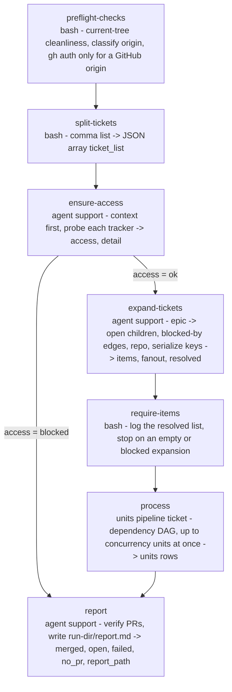

# ticket-auto

<!-- This README is the source of truth for how the workflow LOOKS to
     users. Keep it in sync with workflow.yaml: every edit to the flow,
     steps, inputs or outputs belongs here too (CONTRIBUTING.md 9.6). -->

Autonomous ticket -> PR pipeline, `version: 2`, run by the TS engine.
For each ticket the engine's `units` step claims a branch and worktree,
plans the ticket, implements the plan, converges the branch through a
review / fix loop, pushes, opens a PR, requests the bot reviews,
watches CI and the bots, fixes what they raise, and merges once the PR
is green and quiet. Pre-flight asks current tree or new worktree before
the ticket input that determines branch names. New worktrees are the default:
a merged PR loses its separate worktree and local branch. Current-tree mode
runs tickets sequentially and always retains the checkout and its branches.
Other outcomes keep the worktree for inspection. No prompts after launch:
pre-flight asks harness, provider permissions, model and effort per phase group, and the
inputs.

An epic or parent work item is accepted wherever a ticket is, mixed with
plain tickets. `expand-tickets` turns it into its open children, their
`blocked-by` edges and their target repositories before any branch
exists, and the `units` step runs every child under the same pre-flight
answers: a child waits until its blockers merged, a failed blocker
blocks its dependents, and independent children run up to `concurrency`
at a time. See [Epic runs](#epic-runs).

The per-ticket loop is engine code (`plugins/wise/engine/wise_engine/units.py`,
design in `docs/wise/research-ts-engine.md` P4). The five model phases
run from the engine's prompt templates under
`plugins/wise/engine/wise_engine/prompts/units/`; this workflow declares only
the phase -> tuning-group binding, the unit caps, the reviewers,
the intake and the report. The prompt fragments still under `prompts/`
(`implement-plan.md`, `review-branch-auto.md`, `watch-pipelines-auto.md`,
...) are shared routines the standalone `/wise-*-auto` skills and
`ticket-plan` read; the pipeline itself no longer loads them.

Those shared skill procedures follow
[model fallback](../../references/workflow-host-control.md#model-fallback) when
a requested model or native agent route is unavailable. The main harness asks
through GUI/TUI using its verified model options before substitution; children
relay the question. Review consent, fresh-reviewer guarantees and merge gates
remain separate. This does not change the engine pipeline's selected models or
automatically restart failed units.

## When to use

- One or more well-specified tickets that should each become a
  reviewed, merged PR unattended.
- An epic (a Linear parent issue or project, a Jira epic, a GitHub issue
  with sub-issues) whose children should each become a merged PR, in
  dependency order, from one pre-flight questionary.

## When not to use

- A ticket you want to review or steer before any code exists: use
  `ticket-plan`, then implement and open the PR yourself.
- A human should decide CI fixes or review replies: use `/wise-pr-watch`
  on your own PR.

## Prerequisites

- `/wise-init` completed at least once (Python 3.11+, gh CLI + auth).
  `gh` auth is required only when `origin` is a GitHub remote.
- Run from inside the project's git repository (`project-selection:
  current`). An `origin` remote is optional: with a GitHub `origin` the
  full push / PR / watch half runs; with no origin each unit commits
  locally; with a non-GitHub origin (GitLab, Bitbucket, a bare path)
  each unit pushes but opens no PR (verdict `no-pr`). Current-tree mode
  also requires a clean source checkout; new-worktree mode preserves
  local changes.
- Pre-flight asks for a permission floor once per selected provider.
  `Auto` is recommended; `Bypass permissions` is available when the
  provider must run fully unsandboxed. A phase's stronger mode still wins.
- No tracker plugin is required up front: `ensure-access` probes for a
  tracker MCP, CLI or public URL per ticket and stops the run with an
  actionable message when one is unreachable. Nothing is planned from
  an id alone.

## Flow


```mermaid
flowchart TD
    A[preflight-checks<br/>bash - current-tree cleanliness, classify origin, gh auth only for a GitHub origin] --> B[split-tickets<br/>bash - comma list -> JSON array ticket_list]
    B --> C[ensure-access<br/>agent support - context first, probe each tracker -> access, detail]
    C -->|access = ok| X[expand-tickets<br/>agent support - epic -> open children, blocked-by edges, repo, serialize keys -> items, fanout, resolved]
    X --> Y[require-items<br/>bash - log the resolved list, stop on an empty or blocked expansion]
    Y --> D[process<br/>units pipeline ticket - dependency DAG, up to concurrency units at once -> units rows]
    C -->|access = blocked| E
    D --> E[report<br/>agent support - verify PRs, write run-dir/report.md -> merged, open, failed, no_pr, report_path]
```

Inside `process`, per ticket and in this order:

| Phase | Kind | Group / model | What it does |
|---|---|---|---|
| `claim` | code | - | Idempotent ownership: a ledger under `<run-dir>/units/` marks the unit ours; a branch that already exists locally, on origin or in a worktree moves the unit to the first free `<branch>-N` (N from 2), never reused, never touched. With no origin remote the "taken" probe is local-only (no `git ls-remote`). An open same-repo PR on `<branch>` or `<branch>-N` is resumed instead of duplicated: ours (the `gh` user's) is adopted and the unit jumps to `watch`; someone else's skips the unit (`open-pr-exists`). |
| `worktree` | code | - | Selected current tree or `<run-dir>/worktrees/<branch>` on the branch `claim` selected (`<ticket-ref>` or its free `<ticket-ref>-N`) off the fetched `base_branch`. With no origin remote the fetch is skipped and a local-only base is accepted (no PR targets it). |
| `plan` | model | `plan` | Reads the ticket (context body first, else the tracker), audits the worktree, writes `<run-dir>/plans/PLAN-<ref>.md`. `no-access` or `insufficient-context` (with a `BLUEPRINT-<ref>.md`) fails the unit. |
| `implement` | model | `implement` | Task waves, one atomic commit per task, validation after each commit. `done = 0` or no commits fails the unit. |
| `review` <-> `fix` | model | `review` / `fix` | 3-lens review of `origin/<base>..HEAD` writes a findings file; the fixer applies it (resuming the reviewer's session under `resume: unit` when both run on the same harness, else fresh); repeats up to `max_review_cycles`, then pushes anyway with `converged: false`. |
| `push`, `pr`, `request-review` | code | - | Before the first push the branch is rebased onto the freshly fetched base (never after it is on origin, so no force push; a conflict fails the unit), and a numbered file it adds (`0042_x.sql`, `V42__x.sql`, `0007-adr.md`) whose number the base already uses in that directory goes to one `fix` pass to renumber; a collision that survives fails the unit. Then `git push -u`, PR from the repo template or a compact body, `gh pr edit --add-reviewer` for each login in `reviewers`. Skipped without a GitHub remote: `none` skips push too, `other` still pushes; the unit ends `no-pr`. |
| `watch` (+ `fix`, `push`) | model | `watch` / `fix` | One pass per poll: CI state, human comments, bot reviews. Red CI or open bot items go to `fix` then `push` (each counts against `max_fix_attempts`); a stuck bot gets the substitute review once per head; a human comment stands the loop down only when GitHub shows a `User`-type, non-bot commenter since the watch started (bot-only threads continue); `watch_stable_passes` consecutive green passes merge (squash, then merge commit). `merged` is recorded only when `gh pr view` reports `MERGED`. |
| `cleanup` | code | - | Only on `merged`: remove a separate worktree and its local branch. Always retain the current tree and its branches. |

On the `cursor` harness, `implement` and `fix` rewrite the commits they
made without cursor's `Co-authored-by` trailer before anything is pushed.

### Epic runs

`expand-tickets` follows
[`references/epic-expansion.md`](../../references/epic-expansion.md): it
reads the conductor's expansion from run context first, replaces every
epic or parent by its children recursively, drops Done / Canceled /
Duplicate children, and returns one item per child with `depends_on`
(tracker blocked-by / blocks and an order the epic body states),
`serialize` keys (`migrations`, `adr`, `file:<path>`, a shared contract)
and `repo` when the child targets another repository. A plain ticket
passes through as one item.

The `units` step schedules the items as a DAG:

- A child starts once every blocker in the run ended `merged`. A blocker
  that ended anything else marks its dependents `blocked`, transitively.
  A blocker outside the run is logged and not waited for. A cycle fails
  the step.
- Up to `concurrency` children run at once (`current` tree: one). Two
  children that share a `serialize` key in the same repository never
  overlap.
- `on_child_failure: stop` starts no new child after a `failed`,
  `partial` or `exhausted` one; the rest end `skipped`.
- A child in another repository runs in its own worktree under
  `<run-dir>/worktrees/<repo>/`, off that repository's default branch.
  Its checkout is the `repo_paths` mapping, else a sibling directory of
  this project whose `origin` is that repository; with neither the child
  is `skipped`, never cloned.
- The engine re-checks each item's tracker state and skips a terminal one.

All children share the run's pre-flight answers: harness, model and
effort are asked once per tuning group, never per child. Epic runs reuse
the one engine daemon; `daemon stop --now` refuses while runs are active
unless `--force` is added.

The report opens with one epic table: child ref, repo, verdict
(`merged`, `pr-open`, `blocked`, `failed`, `skipped`), PR URL, SHA and
notes, verified with `gh pr view`. Nothing is written to the tracker.

### No GitHub remote

The engine classifies `origin` once per run (logged as one `remote:`
line) and adjusts the branch-owning pipeline accordingly:

- **No `origin`** (`none`): `plan`, `implement` and the review / fix
  loop run; `push`, `pr`, `request-review` and `watch` are skipped. The
  branch keeps its commits locally.
- **Non-GitHub `origin`** (`other`, e.g. GitLab / Bitbucket / a bare
  path): the same phases run and the branch is pushed to `origin`; only
  `pr`, `request-review` and `watch` are skipped. Open the merge request
  on that host manually.

Either way the unit ends with verdict `no-pr` and its worktree is kept
(only `merged` removes it). The step summary appends ` no-pr=N` when
any unit ends that way. Add a GitHub `origin` and resume to continue
into `push` / `pr`.

## Pre-flight questions

| Id | Kind | Default | Notes |
|---|---|---|---|
| `harness.<group>` | choice | `claude` | One per group (`plan`, `implement`, `fix`, `review`, `watch`, `support`), each labelled with what the model will do; asked whenever another harness is installed (a logged-out one is offered with its login command). Always put to the user, like `model.<group>` and `effort.<group>`: the run refuses to start on a skipped one. |
| `permissions.<harness>` | choice | `auto` | Once per selected or fallback provider. `Auto` is recommended; `Bypass permissions` is also available. The selected value is a floor, so a phase that requires more access keeps it. |
| `model.<group>` | choice | `claude-opus-5-5` (`watch`, `support`: `claude-sonnet-5`) | The engine's catalog for the chosen harness. |
| `effort.<group>` | choice | `high` (`watch`, `support`: `medium`) | The chosen model's efforts; skipped when it takes one or none. |
| `worktree` | choice | `new` | `current` uses this checkout and runs units sequentially; `new` creates separate worktrees. This shared question is asked first and stored as `worktree_mode`. |
| `input.tickets` | text | pre-filled from the run context (`ticket[].ref`) | Comma-separated URLs or ids; an epic or parent expands to its open children. |
| `input.concurrency` | choice | `2` (`1` in the current tree) | Only when the tickets fan out (more than one ref, or a context ticket with children). `1`-`4`; an answer above `1` with `worktree: current` is rejected and asked again. |
| `input.on_child_failure` | choice | `continue` | Only when the tickets fan out. `continue` or `stop`. |
| `input.repo_paths` | text | `""` | Only when the tickets fan out. `owner/name=/abs/path` pairs for children in other repositories. |
| `input.base_branch` | choice (free text allowed) | the checked-out base branch, else the default branch | The branch every ticket branch starts from and every PR targets: the checked-out branch first when it is `main` / `master` / `release*`, then the default branch, then the five most recent `release*` branches. |
| `input.guidance` | text | `""` (or the context `guidance`) | Standing instruction the engine hands to every model phase. |

Unit caps (`profiles.medium.caps`; only `medium` is applied):

| max_review_cycles | max_fix_attempts | watch_minutes | watch_poll_seconds | watch_stable_passes |
|---|---|---|---|---|
| 3 | 5 | 60 | 60 | 2 |

## Steps

| Step | Type | Purpose |
|---|---|---|
| `preflight-checks` | `bash` | Clean source tree in current mode; classify `origin` (host only) and require `gh auth status` only for a GitHub origin. Logs `REMOTE: ...`. |
| `split-tickets` | `bash` | Splits the `tickets` input on commas and semicolons, trims, dedupes, validates the charset, emits a JSON array as `ticket_list`. Fails on an empty list. |
| `ensure-access` | `agent` (`support` group) | Reads `wise_context("ticket")` first; probes a granted CLI (`gh`, `glab`, `linear`, or `jira`) or public URL for tickets whose tracker identity is established. Custom or private tracker content must be preloaded into run context. Ambiguous bare IDs fail closed. Emits `access` (`ok` / `blocked`) and `detail`. |
| `expand-tickets` | `agent` (`support` group) | `when: access == 'ok'`. Follows `references/epic-expansion.md`. Emits `items` (JSON specs: ref, url, title, state, parent, repo, depends_on, serialize), `item_count`, `fanout` (`yes` / `no`), `expansion` (`ok` / `blocked`), `resolved` (the list the log shows), `expansion_detail`. Writes nothing to a tracker. |
| `require-items` | `bash` | Prints the resolved list; fails the run when the expansion is blocked or no open ticket is left. |
| `process` | `units` | `pipeline: ticket`, `items: {{items}}`, `when: access == 'ok'`. The item specs drive the dependency DAG, `concurrency` and `on_child_failure`. Groups `plan`, `implement`, `review`, `fix`, `watch`; caps from `profiles.medium`; `reviewers: [copilot-pull-request-reviewer]`; `resume: unit`. Emits `units` (one row per ticket, input order; a dependency-blocked row carries `blocked_by`). |
| `report` | `agent` (`support` group) | `trigger-rule: all-done`. Renders the `units` rows, verifies every PR with `gh pr view`, writes `<run-dir>/report.md` (table, why each non-merged unit stopped, `git worktree remove` commands for separate worktrees only, usage per unit; for `fanout: yes` the epic table first). Emits `merged`, `open`, `failed`, `no_pr`, `report_path`. |

## Inputs

| Name | Required | Description |
|---|---|---|
| `worktree_mode` | yes | `new` (default) creates a worktree per ticket; `current` uses the current tree, runs tickets sequentially, and refuses to switch with uncommitted or untracked changes. Cleanup never removes the current tree or its branches. |
| `tickets` | yes | Comma-separated ticket URLs or ids; an epic or parent item expands to its open children. Pre-filled from the run context when the conductor already knows them. A URL is normalised to its key by the engine (`branch-naming.md`). |
| `concurrency` | no | `1`-`4`, default `2`: children running at once. `2` equals the engine's per-harness cap for Claude children, so a higher value only helps when phases use different harnesses; `4` is the engine-wide cap. Asked only for a fan-out run. `current` runs one at a time. |
| `on_child_failure` | no | `continue` (default) or `stop`. Asked only for a fan-out run. |
| `repo_paths` | no | `owner/name=/abs/path` pairs, comma-separated, for children in other repositories. Asked only for a fan-out run. |
| `base_branch` | yes | The branch ticket branches are cut from and PRs target. With a GitHub `origin` it resolves to `origin/<base_branch>`, so the branch must exist on `origin`; a branch that exists only locally stops the unit at `worktree` because a PR cannot target it - push it to origin, then re-run. Without a GitHub remote no PR is opened, so a local-only base is accepted. Options come from the checkout (`options-from: branches`); free text accepted but must be a plain git branch name. Defaults to the checked-out base branch, else the default branch. |
| `guidance` | no | Free-form operator guidance for the whole run (libraries to prefer, files to avoid, guardrails). Pre-filled from the context `guidance`. |

## Outputs

| Name | Source | Content |
|---|---|---|
| `ticket_list` | `split-tickets` | JSON array of ticket refs, the expansion input. |
| `access`, `detail` | `ensure-access` | `ok` / `blocked` and the per-tracker lines. |
| `items`, `item_count`, `fanout`, `expansion`, `resolved`, `expansion_detail` | `expand-tickets` | The item specs the `units` step schedules and the expansion summary. |
| `units` | `process` | `UnitRow[]`: `unit` (ref, branch, worktree, base, pr, repo), `verdict` (`merged`, `all-green`, `blocked`, `partial`, `exhausted`, `human-intervention`, `failed`, `skipped`, `no-pr`), `reason`, `review` (converged, cycles), `cleaned`, and `blocked_by` on a row a failed blocker held back. `no-pr` = no GitHub remote (committed locally or pushed to a non-GitHub origin, no PR). Full ledgers under `<run-dir>/units/<branch>.json`. |
| `merged`, `open`, `failed`, `no_pr`, `report_path` | `report` | Counts and the report file. |

## Examples

```
/wise-workflow-run ticket-auto
# Pre-flight asks harness, provider permissions, model and effort per group, working tree, and tickets.

/wise-workflow-run ticket-auto new main PROJ-1,PROJ-2
# Two tickets, no spaces. Sequential units, one PR each, all against main.

/wise-workflow-run ticket-auto current release-26-9-0 PROJ-1 prefer the design-system lib; never touch infra/*
# Working tree, base branch and tickets are the first three inputs; the remaining text is guidance.

/wise-workflow-run ticket-auto new main ENG-100
# ENG-100 is a Linear parent issue: its open sub-issues run in blocked-by order, two at a time.
```

## Related

- [Definition YAML](./workflow.yaml)
- [`impl-plan-auto`](../impl-plan-auto/README.md): the same pipeline
  started from `PLAN-*.md` files instead of tickets.
- [`ticket-plan`](../ticket-plan/README.md): the interactive
  plan-first workflow.
- [`branch-naming.md`](../../references/branch-naming.md): the ticket =
  branch rule the `worktree` phase follows.
- [`epic-expansion.md`](../../references/epic-expansion.md): the
  expansion routine `expand-tickets` follows.
- `docs/wise/research-ts-engine.md` P4: the `units` contract.

The shared `watch-pipelines-auto.md` prompt used by `/wise-pr-watch-auto` requires
main-harness consent before each substitute review, preferring blocking or
asynchronous GUI/TUI controls, then rendered MCP forms, with text fallback when
neither structured route is usable. Children relay through Wise/the parent.
Declining or an unavailable answer channel stops that watch without review or
merge.
