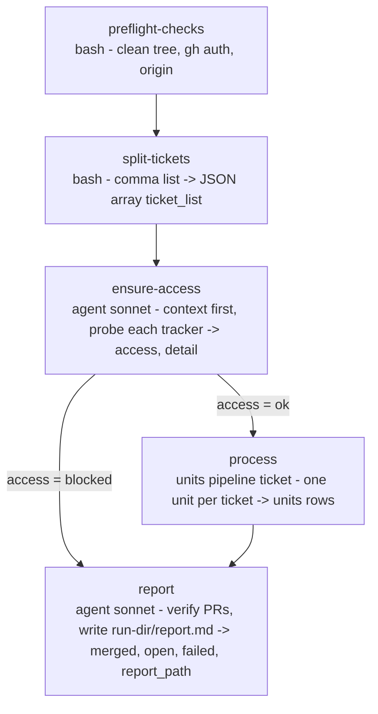

# ticket-auto

<!-- This README is the source of truth for how the workflow LOOKS to
     users. Keep it in sync with workflow.yaml: every edit to the flow,
     steps, inputs or outputs belongs here too (CONTRIBUTING.md 9.6). -->

Autonomous ticket -> PR pipeline, `version: 2`, run by the TS engine.
For each ticket the engine's `units` step claims a branch and worktree,
plans the ticket, implements the plan, converges the branch through a
review / fix loop, pushes, opens a PR, requests the bot reviews,
watches CI and the bots, fixes what they raise, and merges once the PR
is green and quiet. One worktree + branch + PR per ticket. A merged PR
loses its worktree and local branch; anything else stays open for a
human with the worktree kept for inspection. No prompts after launch:
pre-flight asks the budget profile, one tuning question per phase
group, and the inputs.

The per-ticket loop is engine code (`plugins/wise/engine/src/units.ts`,
design in `docs/wise/research-ts-engine.md` P4). The five model phases
run from the engine's prompt templates under
`plugins/wise/engine/src/prompts/units/`; this workflow declares only
the phase -> tuning-group binding, the caps per profile, the reviewers,
the intake and the report. The prompt fragments still under `prompts/`
(`implement-plan.md`, `review-branch-auto.md`, `watch-pipelines-auto.md`,
...) are shared routines the standalone `/wise-*-auto` skills and
`ticket-plan` read; the pipeline itself no longer loads them.

## When to use

- One or more well-specified tickets that should each become a
  reviewed, merged PR unattended.

## When not to use

- A ticket you want to review or steer before any code exists: use
  `ticket-plan`, then implement and open the PR yourself.
- A human should decide CI fixes or review replies: use `/wise-pr-watch`
  on your own PR.

## Prerequisites

- `/wise-init` completed at least once (Node, gh CLI + auth).
- Run from inside the project's git repository (`project-selection:
  current`); the base working tree must be clean and have an `origin`
  remote (`preflight-checks` refuses otherwise).
- No tracker plugin is required up front: `ensure-access` probes for a
  tracker MCP, CLI or public URL per ticket and stops the run with an
  actionable message when one is unreachable. Nothing is planned from
  an id alone.

## Flow


```mermaid
flowchart TD
    A[preflight-checks<br/>bash - clean tree, gh auth, origin] --> B[split-tickets<br/>bash - comma list -> JSON array ticket_list]
    B --> C[ensure-access<br/>agent sonnet - context first, probe each tracker -> access, detail]
    C -->|access = ok| D[process<br/>units pipeline ticket - one unit per ticket -> units rows]
    C -->|access = blocked| E
    D --> E[report<br/>agent sonnet - verify PRs, write run-dir/report.md -> merged, open, failed, report_path]
```

Inside `process`, per ticket and in this order:

| Phase | Kind | Group / model | What it does |
|---|---|---|---|
| `claim` | code | - | Idempotent ownership: a ledger under `<run-dir>/units/` marks the unit ours; a foreign worktree or branch is skipped. |
| `worktree` | code | - | `<run-dir>/worktrees/<branch>` on branch `<ticket-ref>` off the fetched base. |
| `plan` | model | `plan` | Reads the ticket (context body first, else the tracker), audits the worktree, writes `<run-dir>/plans/PLAN-<ref>.md`. `no-access` or `insufficient-context` (with a `BLUEPRINT-<ref>.md`) fails the unit. |
| `implement` | model | `implement` | Task waves, one atomic commit per task, validation after each commit. `done = 0` or no commits fails the unit. |
| `review` <-> `fix` | model | `review` / `implement` | 3-lens review of `origin/<base>..HEAD` writes a findings file; the fixer applies it (resuming the reviewer's session, `resume: unit`); repeats up to `max_review_cycles`, then pushes anyway with `converged: false`. |
| `push`, `pr`, `request-review` | code | - | `git push -u`, PR from the repo template or a compact body, `gh pr edit --add-reviewer` for each login in `reviewers`. |
| `watch` (+ `fix`, `push`) | model | `watch` / `implement` | One pass per poll: CI state, human comments, bot reviews. Red CI or open bot items go to `fix` then `push` (each counts against `max_fix_attempts`); a stuck bot gets the substitute review once per head; a human comment stands the loop down; `watch_stable_passes` consecutive green passes merge (squash, then merge commit). |
| `cleanup` | code | - | Only on `merged`: remove the worktree and the local branch. |

## Pre-flight questions

| Id | Kind | Default | Notes |
|---|---|---|---|
| `profile` | choice | `medium` (or the session profile from `/wise-profile`) | `low` / `medium` / `max`; see the caps below. |
| `tuning.plan` | choice | `default` (`claude / opus / high`) | `economy` = Opus 4.8 at high. |
| `tuning.implement` | choice | `default` (`claude / opus / high`) | `economy` = sonnet at high. Also binds `fix`. |
| `tuning.review` | choice | `default` (`claude / opus / high`) | `economy` = Opus 4.8 at medium. |
| `tuning.watch` | choice | `default` (`claude / sonnet / medium`) | `economy` = sonnet at low. |
| `input.tickets` | text | pre-filled from the run context (`ticket[].ref`) | Comma-separated URLs or ids. |
| `input.guidance` | text | `""` (or the context `guidance`) | Standing instruction the engine hands to every model phase. |

Profiles (`low` never dispatches Opus 5):

| Profile | plan | implement / fix | review | watch | max_review_cycles | max_fix_attempts | watch_minutes | watch_poll_seconds | watch_stable_passes |
|---|---|---|---|---|---|---|---|---|---|
| `low` | Opus 4.8 / high | sonnet / high | Opus 4.8 / medium | sonnet / low | 2 | 3 | 30 | 60 | 2 |
| `medium` | opus / high | opus / high | opus / high | sonnet / medium | 3 | 5 | 60 | 60 | 2 |
| `max` | opus / high | opus / high | opus / high + adversarial verification | sonnet / medium | 5 | 10 | 120 | 60 | 2 |

## Steps

| Step | Type | Purpose |
|---|---|---|
| `preflight-checks` | `bash` | Clean base tree, `gh auth status`, `origin` remote. |
| `split-tickets` | `bash` | Splits the `tickets` input on commas and semicolons, trims, dedupes, validates the charset, emits a JSON array as `ticket_list`. Fails on an empty list. |
| `ensure-access` | `agent` (sonnet) | Reads `wise_context("ticket")` first; probes a real channel (MCP, CLI, public URL) for every ticket not already in the context. Emits `access` (`ok` / `blocked`) and `detail`. |
| `process` | `units` | `pipeline: ticket`, `items: {{ticket_list}}`, `when: access == 'ok'`. Groups `plan`, `implement`, `review`, `fix -> implement`, `watch`; caps from the profile; `reviewers: [copilot-pull-request-reviewer]`; `resume: unit`. Emits `units` (one row per ticket). |
| `report` | `agent` (sonnet) | `trigger-rule: all-done`. Renders the `units` rows, verifies every PR with `gh pr view`, writes `<run-dir>/report.md` (table, why each non-merged unit stopped, `git worktree remove` commands, usage per unit). Emits `merged`, `open`, `failed`, `report_path`. |

## Inputs

| Name | Required | Description |
|---|---|---|
| `tickets` | yes | Comma-separated ticket URLs or ids. Pre-filled from the run context when the conductor already knows them. A URL is normalised to its key by the engine (`branch-naming.md`). |
| `guidance` | no | Free-form operator guidance for the whole run (libraries to prefer, files to avoid, guardrails). Pre-filled from the context `guidance`. |

## Outputs

| Name | Source | Content |
|---|---|---|
| `ticket_list` | `split-tickets` | JSON array of ticket refs, the `units` items. |
| `access`, `detail` | `ensure-access` | `ok` / `blocked` and the per-tracker lines. |
| `units` | `process` | `UnitRow[]`: `unit` (ref, branch, worktree, base, pr), `verdict` (`merged`, `all-green`, `blocked`, `partial`, `exhausted`, `human-intervention`, `failed`, `skipped`), `reason`, `review` (converged, cycles), `cleaned`. Full ledgers under `<run-dir>/units/<branch>.json`. |
| `merged`, `open`, `failed`, `report_path` | `report` | Counts and the report file. |

## Examples

```
/wise-workflow-run ticket-auto
# Pre-flight asks the profile, the four tuning groups and the tickets.

/wise-workflow-run ticket-auto PROJ-1,PROJ-2
# Two tickets, no spaces. Sequential units, one PR each.

/wise-workflow-run ticket-auto PROJ-1 prefer the design-system lib; never touch infra/*
# Everything after the first token is the guidance input.
```

## Related

- [Definition YAML](./workflow.yaml)
- [`impl-plan-auto`](../impl-plan-auto/README.md): the same pipeline
  started from `PLAN-*.md` files instead of tickets.
- [`ticket-plan`](../ticket-plan/README.md): the interactive
  plan-first workflow.
- [`branch-naming.md`](../../references/branch-naming.md): the ticket =
  branch rule the `worktree` phase follows.
- `docs/wise/research-ts-engine.md` P4: the `units` contract.
