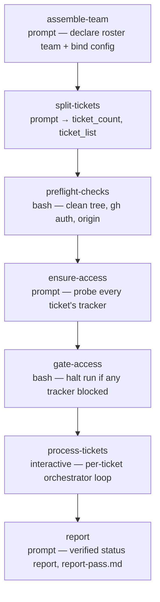

# ticket-auto

<!-- This README is the source of truth for how the workflow
     LOOKS to users. Keep it in sync with workflow.yaml +
     prompts/*.md — every edit to the flow, steps, outputs,
     or fragment list belongs here too. See
     CONTRIBUTING.md §9.6 for the invariant. -->

Autonomous ticket → PR pipeline. Give it one or more tickets; for each
one the wise SDLC roster plans it (`wise:architect`), implements it
(`wise:software-engineer`) in an isolated git worktree, runs an
independent **review↔fix loop** (`wise:code-reviewer` judges,
`wise:software-engineer` fixes) until the branch passes, commits, pushes,
opens a PR, requests the bot reviews (attaches Copilot, triggers
CodeRabbit), watches + fixes CI, then waits for both bots to review the
head — bypassing CodeRabbit when it is out of credits and
retrying-then-giving-up on a rate limit, and degrading **either** stuck
bot to wise's own review panel rather than parking the PR — and resolves
every review comment — end to end, with **no prompts after launch**
(pre-flight asks one optional model/effort tuning questionary before
autonomy starts). One worktree + branch + PR per ticket. When a PR's
checks all pass, every review bot has finished (a stuck one counts only
when the local review fallback covered the same head), and every comment
is fixed-or-dismissed it is **merged** (squash, respecting branch
protection); a PR that can't be driven fully resolved — including one
with a non-minor bot comment Claude can't confidently handle — is left
open for a human. When a PR is merged, its worktree and local branch are
removed to keep the base repo clean; a PR left open keeps its worktree
for inspection.

It follows a spec-driven, phase-gated model:
fresh-context executor agents working the plan's task waves in
parallel, one atomic commit per task (each simplified before
commit), then an independent review↔fix loop over the whole branch
(reviewer judges, a separate engineer fixes, cycling until clean)
before pushing, autonomous chaining.

## When to use

- You have one or more well-specified tickets and want each turned
  into a reviewed-ready PR unattended — fire it and come back to a set
  of open PRs.
- The tickets are clear enough that reasonable autonomous decisions
  won't go badly wrong.

## When not to use

- A ticket is ambiguous or high-stakes and you want to review and
  adjust the plan before any code — use the interactive `ticket-plan`
  workflow (it plans autonomously, then you review / comment), then
  implement and PR yourself.
- You want a human in the loop for CI fixes or review comments — use
  the standalone `/wise-pr-watch` on your own PR.

## Prerequisites

- `/wise-init` completed at least once (Python + Node + gh CLI + auth).
- Run from inside the project's git repository — `project-selection:
  current` auto-detects it; the base working tree must be **clean**
  (`preflight-checks` refuses a dirty base).
- No tracker plugin needs to be pre-installed — the `ensure-access` gate
  probes for a tracker MCP / CLI / public URL up front and **halts the
  run with an actionable message** when a required tracker is
  unreachable. It never plans from invented ticket content.
- Recommended ≤ 5 tickets per run (each ticket's full pipeline is
  substantial; see Notes).

## Flow


```mermaid
flowchart TD
    A[assemble-team<br/>prompt — declare roster team + bind config] --> B[split-tickets<br/>prompt → ticket_count, ticket_list]
    B --> C[preflight-checks<br/>bash — clean tree, gh auth, origin]
    C --> G[ensure-access<br/>prompt — probe every ticket's tracker]
    G --> H[gate-access<br/>bash — halt run if any tracker blocked]
    H --> D[process-tickets<br/>interactive — per-ticket orchestrator loop]
    D --> E[report<br/>prompt — verified status report, report-pass.md]
```

`process-tickets` is the engine of the workflow. For each ticket it
runs an isolated sub-pipeline:

```
ensure-worktree (create or adopt; carry over .worktreeinclude) → plan → implement
        → review↔fix loop (reviewer ⇄ fixer) → commit+push → create PR
        → request review → watch + fix CI loop
        → record (+ remove worktree & local branch if merged)
```

The wise workflow engine has no DAG loops, so the per-ticket loop and
each per-ticket pipeline live *inside* the `process-tickets` step
(`type: interactive`, run in the conductor with full Bash/Task
access). Every heavy sub-task is delegated to a `Task` subagent to
keep the step's context bounded.

`control-mode` is pinned `synchronous`, `worktree` `current`,
`rename_session` `skip` — pre-flight collects the ticket list
(required), an optional free-form `config_prompt`, and one **budget
profile question** (`tuning: prompt` + the `profiles:` block):
**low** (opus/high plan, sonnet implement/watch, fix cap 3, review-cycle cap 2),
**medium** (the declared defaults — opus/high plan and
implement+fix, sonnet watch), **max** (opus/high across phases), or
**Custom** per phase group (plan / implement / watch). The session
profile set by `/wise-profile` pre-answers it as the Recommended
option. The groups are advisory (the phases dispatch inside
`process-tickets`, not at the step level), so the choices reach the
orchestrator as per-group `tuning_<group>` (+ `cap_<name>`) outputs,
which every phase treats as binding. The **review gate is pinned at
every profile**: the medium review pass — opus, the 3-lens set
(correctness, security, tests) at high effort — never follows the
budget down or up,
so it has no tuning group and is never asked. After launch there are
no `ask` / `approval` steps and no further questions. The review↔fix
cycle cap and the CI-fix cap default to 10; precedence: profile
`cap_*` value → `config_prompt` override → 10.

## Steps

| Step | Type | Purpose |
|---|---|---|
| `assemble-team` | `prompt` | Run-start declaration of the roster team (`wise:architect` lead + `wise:software-engineer` + `wise:code-reviewer`) and binding of the operator `config_prompt`. `agent: off` (plain confirmation step), `model: sonnet`. Declaration-only — explicitly guarded against planning, codebase work, or spawning any subagent. |
| `split-tickets` | `prompt` | Parse `ticket_ids` into a clean list; emit count + semicolon-joined list. `model: sonnet`. |
| `preflight-checks` | `bash` | Refuse a dirty base repo; verify `gh` auth and an `origin` remote. |
| `ensure-access` | `prompt` | Verify every ticket's tracker is actually reachable (MCP / CLI / public URL). Emits a final `ACCESS: ok` / `ACCESS: blocked` line whose verdict is captured into `access_status` (value `ok` or `blocked`, from the `until:` regex group); on `blocked` it first prints the per-tracker fix. Never plans from invented ticket content. `model: sonnet`. |
| `gate-access` | `bash` | Hard stop: exits non-zero with an actionable ERROR when `access_status != ok`, so a `blocked` outcome halts the run before any worktree / branch / plan / PR — the detailed fixes stay surfaced in-chat from `ensure-access`. |
| `process-tickets` | `interactive` | The orchestrator — loops the ticket list, running the full plan→implement→review↔fix→PR→watch pipeline per ticket in its own worktree. |
| `report` | `prompt` | End-of-run verified status report: follows the shared `references/report-pass.md` (`SCOPE` = this run, `MODE=full`, `SAVE=yes`, `RETURN=summary` — the full report lands in the per-workspace handoff store; the run conversation gets only the per-section counts + saved path), verifying the run's claims against `state.yaml`, the per-ticket ledgers, and live `gh pr view` probes; a `## Run specifics` addendum keeps the per-ticket roll-up (branch, worktree path, PR url, verdict, incl. `review=not-converged`), blueprint pointers, and worktree-removal commands. Ends with the parseable `REPORT:` line. Dispatched to `wise:qa-engineer` on `sonnet` (needs Bash for the verification probes). |

The workflow sets `agents: auto`, but most of its work runs inside the
`process-tickets` fragment, which dispatches each phase to a concrete
roster role + model — brought in **fresh per phase** so transcripts
release and the multi-ticket run stays within its context budget. The
per-phase roles and models are in the [pipeline table](#per-ticket-pipeline-inside-process-tickets)
below; at the step level `report` → `wise:qa-engineer`. Model
tiering (`opus` = the latest Opus, Opus 5): `opus` at `high` for the
planning brain — `high` is Opus 5's policy ceiling, so an authored
`xhigh` resolves to `high` (see
[Effort ceilings](../../../../docs/wise/workflows.md#effort-ceilings)) —
`opus` at `high` for the hands-on engineering
(implement / fix / executors) + review brains, `sonnet` for the
watch+fix CI conductor and the
hands-on engineering and bookkeeping steps. These are the defaults —
the pre-flight tuning questionary can override them per phase group
(the choices reach `process-tickets` as per-group `tuning_<group>`
outputs). See
[Agents, model and effort](../../../../docs/wise/workflows.md#agents-model-and-effort).

## Per-ticket pipeline (inside `process-tickets`)

Driven by `prompts/process-tickets.md`, which follows these fragments:

| Phase | Fragment | Role · model | Autonomous analogue of |
|---|---|---|---|
| Plan | `prompts/plan-ticket.md` | `wise:architect` · opus · high | the interactive `ticket-plan` workflow |
| — grill context sweep + gap check | `references/grill/research-sources.md` + `references/grill/gap-analysis.md` (inside Plan) | (Explore subagents + the architect) | `/wise-grill` |
| Implement | `prompts/implement-plan.md` | `wise:software-engineer` · opus · high | (phase-gated executor, supervised — a watchdog nudges hung executors; code-simplifier per task commit) |
| Review ↔ fix | `prompts/review-branch-auto.md` (`fixer=delegate`) | `wise:code-reviewer` · opus · high ⇄ `wise:software-engineer` · opus · high | high-depth review gate (judges only) + an independent fixer, cycling before push |
| Push | `wise-commit/commit-routine.md` | (inline) | `/wise-commit-push` |
| Create PR | `prompts/ensure-pr-auto.md` | (inline) | `/wise-pr-create` |
| Request review | `prompts/request-review-auto.md` | (inline) | `/wise-pr-add-reviewers` |
| Watch + fix | `prompts/watch-pipelines-auto.md` | `wise:software-engineer` · sonnet | `/wise-pr-watch` |
| — review fallback (stuck bot) | `prompts/review-fallback-auto.md` (inside Watch + fix) | reviewer panel · high | `/wise-code-review-auto` |

The **Plan** phase runs a four-way parallel research wave — design,
related items, the grill **multi-source context sweep**
(`references/grill/research-sources.md`, `mode=autonomous`: lexicon
harvest, the ticket's comment thread + screenshots, wiki / chat /
Drive channels where an MCP is available, codebase + git history) and
the reuse-first codebase audit — then **gap-checks** the consolidated
evidence (`references/grill/gap-analysis.md`, autonomous mode). Every
ordinary gap becomes a predicted-answer assumption in the plan; a
ticket whose **goal or scope** cannot be established from any
researched source is **unplannable** — the phase writes a
`BLUEPRINT-<ref>.md` with targeted per-person questions beside the
plan path and fails that ticket
(`reason=plan-insufficient-context`) instead of building from guesses.
The `report` step points the operator at the blueprint.

The **Review ↔ fix** phase separates judging from fixing: a
`wise:code-reviewer` reviews the branch in `fixer=delegate` mode (reports
findings, applies nothing), then a `wise:software-engineer` applies
exactly those findings and commits. The two cycle — re-review verifies
each fix — until the reviewer returns `verdict=clean` or the cap (10,
`config_prompt`-overridable) is hit. On non-convergence the branch is
pushed anyway and the ticket is flagged `review=not-converged` for the
human + the CI/bot review to catch.

Each fragment is also the source of truth for a standalone reusable
skill — `wise-implement-plan-auto`, `wise-code-review-auto`,
`wise-pr-create-auto`, `wise-pr-request-review-auto`,
`wise-pr-watch-auto`. The shared `review-branch-auto.md` keeps its
default `fixer=self` behaviour for the standalone `/wise-code-review-auto`
skill; `ticket-auto` passes `fixer=delegate` to drive the loop above.

The `Watch + fix` phase **detects and waits for** the review bots
rather than inferring their absence from an empty footprint (the bug
that let an early run merge before either bot reviewed). Copilot is
attached and waited on; CodeRabbit is watched through its **check
run** (`Review in progress` / `Review completed` / `Review rate
limited`) — comments are a last resort: at most ONE
`@coderabbitai review` per head SHA (only when the check stalls, never
as an installation probe, never while rate-limited), and every trigger
the run posts is deleted again before the run ends, so the PR timeline
never accumulates them. **Out of credits** → bypassed; rate-limited
past the wait budget → gives up.

**Neither bot is a merge gate.** When one gets stuck — Copilot times
out / errors / is rate-limited, CodeRabbit is bypassed / gives up — the
phase does not park the PR for a human. It runs the local review
fallback (`prompts/review-fallback-auto.md`), which drives the same
reviewer panel as `/wise-code-review-auto` over the branch
diff, commits and pushes what it finds, posts one audit comment naming
the bot it stood in for, and lets the run keep going to green and merge.
The verdict records both halves (`copilot=stuck reason=…`,
`coderabbit=bypassed|gave-up`, `review-fallback=ran applied=<n>`) so
`report` flags what actually reviewed the branch. The fallback runs at
most once per head SHA and three times per watch run (two productive
runs plus a confirming pass — each run that commits advances the head,
so the budget has to allow a clean read on the new one); if it fails,
the PR is left open (`all-green reason=review-fallback-failed`) because
nothing reviewed the branch. Once a bot has reviewed, every review
comment is handled via the sub-fragment
`prompts/handle-bot-reviews-auto.md` — each comment classified by
severity (minors fixed quickly, major/critical ones via a considered
consolidated decision), genuine false positives dismissed with a
reasoned reply, and every handled thread resolved on the PR before the
merge gate is checked.

Open SonarCloud issues are driven to **zero** too (sub-fragment
`prompts/handle-sonar-issues-auto.md`): a green Sonar quality gate can
still leave OPEN issues on the PR, so the phase fetches them every
iteration and Fixes or Accepts (suppresses with a rationale, or a Sonar
MCP `change_issue_status`) each — there is no Skip, and the merge gate
requires Sonar verified clean. When the issues can't be fetched (no
`SONAR_TOKEN`, no Sonar MCP), it **postpones**: it keeps working every
other check/comment, reminds the operator, and leaves the PR open
(`all-green reason=sonar-unchecked`) rather than merging on an unverified
Sonar state. A repo with **no Sonar project at all** is a different case
and is not postponed: when the handler finds no Sonar config in the
tree, no Sonar check on the PR and no Sonar bot footprint **and** the
issues-search then returns an explicit 404 confirming no such project
exists, it returns `not-configured` and Sonar drops out of the merge
gate entirely, like an `absent` review bot. The 404 is required: a
missing footprint alone only raises the question, and any other fetch
outcome (200, auth failure, network error, a guessed key) keeps Sonar
in the gate.

Reaching green once does not trigger the merge. The phase then holds a
**post-green stability window** (3 min) and re-checks CI + comments; a
late failing check or bot comment folds back into the fix/handle loop
and restarts the count. The PR is merged only after **two consecutive**
clean windows. If reviewers keep posting past `STABILITY_MAX_ROUNDS`
(10) windows, the phase stands down (`human-intervention
reason=stability-capped`) and leaves the green PR open for a human.

## Inputs

| Name | Required | Description |
|---|---|---|
| `ticket_ids` | yes | Comma-separated list of ticket URLs or ids. Each gets its own worktree + branch + PR. First positional arg; when passed positionally use **no spaces** between items (`PROJ-1,PROJ-2`). |
| `config_prompt` | no | Free-form guidance to tune the run — skills / libraries to prefer, guidelines, guardrails, files to avoid, knob overrides (e.g. "cap CI fixes at 4", "cap review cycles at 5"). The `wise:architect` (plan phase) applies it to every decision and **predicts** any answer it implies rather than prompting; later phases honour it too. As the last input it absorbs the remainder of the command line. Blank → none (max-value defaults; CI-fix + review-cycle caps 10). |

## Outputs

| Name | Source | Used for |
|---|---|---|
| `ticket_count` / `ticket_list` | `split-tickets` | The parsed ticket list driving the orchestrator loop. |
| `tickets_processed` / `tickets_green` / `tickets_partial` / `tickets_failed` | `process-tickets` | Run tallies surfaced by `report`. |

## Examples

```
/wise-workflow-run ticket-auto
# Bare: pre-flight asks the budget profile (one click keeps the
# session profile / medium) and the ticket list (config_prompt is
# optional and skipped).

/wise-workflow-run ticket-auto PROJ-1,PROJ-2
# Two tickets. Comma-separated, NO spaces. The only question is the
# pre-flight budget profile, then fully unattended.

/wise-workflow-run ticket-auto ENG-42 prefer the design-system lib; never touch infra/*; cap CI fixes at 4
# One ticket + free-form config_prompt (everything after the first token).
# Steers the Lead Architect's decisions; no questions after launch.
```

## Notes

- **Merges on fully resolved.** A PR is merged (squash, fallback merge
  commit) only when its checks all pass, every review bot has finished
  (a stuck one counts only when the local review fallback covered the
  same head), and every bot comment is fixed-or-dismissed with its
  thread resolved. Branch protection is respected — if the repo
  requires a human approval the merge is left to a human and the PR
  stays open. A PR with a non-minor bot comment Claude can't
  confidently resolve is left open too (the `blocked` verdict). Any PR
  that isn't fully resolved is left open.
- **Merged tickets are cleaned up; open/failed ones are kept.** When a
  ticket's PR is merged, its worktree and local branch are removed (the
  work is preserved on the remote) so the base repo stays clean. A ticket
  left open for a human, or failed, keeps its worktree + branch for
  inspection — `report` lists the `git worktree remove` command for each
  one that remains. After the last ticket a `git worktree prune` tidies
  any stale entries.
- **Resumable on interrupt.** Per-ticket progress is checkpointed to a ledger
  under the run directory (off the git tree, surviving the interrupt). If a
  context compaction orphans the run mid-flight, `/wise-workflow-resume`
  re-enters `process-tickets`, **adopts** each ticket's existing worktree /
  branch / PR via live `git`/`gh` probes, and continues it from where it left
  off — pushing committed-but-unpushed work, finding or creating the PR, and
  driving it to a verdict instead of stranding it. A worktree/branch this run
  did not create is left untouched (never stomped).
- **≤ 5 tickets/run recommended.** Each ticket runs a full
  plan+implement+watch pipeline; the orchestrator delegates heavy work
  to subagents to bound context, but very large batches still risk the
  run growing long.

## Related

- [Definition YAML](./workflow.yaml)
- [`ticket-plan`](../ticket-plan/README.md) — the interactive
  plan-only workflow (it plans autonomously and you review / comment;
  you implement).
- The standalone PR skills —
  [`/wise-pr-create`](../../skills/wise-pr-create/SKILL.md),
  [`/wise-pr-add-reviewers`](../../skills/wise-pr-add-reviewers/SKILL.md),
  [`/wise-pr-watch`](../../skills/wise-pr-watch/SKILL.md) — the
  interactive create-PR + watch + review-queue surface.
- [`wise-estimation`](../../skills/wise-estimation/SKILL.md) — SP
  estimation reference consulted by the plan phase.
- [`grill/research-sources.md`](../../references/grill/research-sources.md) /
  [`grill/gap-analysis.md`](../../references/grill/gap-analysis.md) /
  [`grill/blueprint-format.md`](../../references/grill/blueprint-format.md)
  — the shared grill routines the plan phase runs (context sweep + gap
  check + the insufficient-context blueprint).
- [`/wise-grill`](../../skills/wise-grill/SKILL.md) — the standalone
  interactive research + gap-analysis pass; run it on a blueprint-failed
  ticket once the questions are answered.
