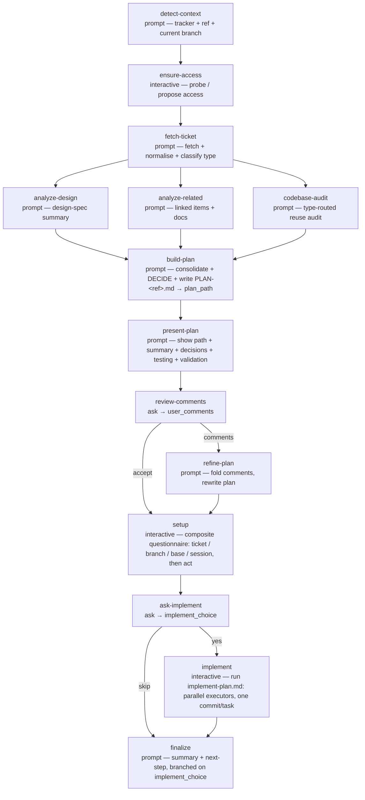

# ticket-plan

<!-- This README is the source of truth for how the workflow
     LOOKS to users. Keep it in sync with workflow.yaml +
     prompts/*.md — every edit to the flow, steps, outputs,
     or fragment list belongs here too. See
     plugins/wise/CLAUDE.md for the invariant. -->

Turn a ticket from any task tracker into an implementation plan. The
workflow identifies which tracker the ticket belongs to, confirms it
can reach that tracker (probing for an MCP or CLI and proposing install
options when it can't), fetches and normalises the ticket, analyses
design links + related tickets + reference docs in parallel, runs a
"reuse first" codebase audit, then — **autonomously, no question-by-
question wizard** — consolidates the findings and makes every scope /
approach / component / design / testing decision, writes a
`PLAN-<ref>.md` into the run directory, and **presents the consolidated
decision + plan for you to review and comment**. Only after the plan is
settled does it ask the git / session **setup** choices, as one
composite questionnaire.

## When to use

- You've been assigned a ticket (Jira, Linear, GitHub / GitLab Issues,
  Asana, …) and want to go from "I've read the summary" to "I've got a
  written plan ready to implement" without re-reading every linked
  document by hand.
- The ticket has design links and you want a design-spec summary
  surfaced explicitly.
- The ticket has parent / linked tickets / reference docs you'd
  otherwise skim and forget.

## When not to use

- Quick fixes that don't need planning (typo, one-line change) — skip
  the workflow and just edit.
- Tickets without enough information to plan against — fix the ticket
  first, or grab the PM.

## Prerequisites

- Run from inside the project's git repository —
  `project-selection: current` auto-detects the project from cwd.
- `/wise-init` completed at least once.
- No tracker plugin needs to be pre-installed — the `ensure-access`
  step probes for a tracker MCP / CLI at run time and proposes install
  options (or a manual-paste fallback) when none is found.

## Flow



No setup questions fire before the plan: decisions are made
autonomously in `build-plan`, presented in `present-plan`, optionally
adjusted via `review-comments` → `refine-plan`, and only then does the
single `setup` questionnaire collect ticket / branch / base / session
choices. `setup` depends on both `review-comments` and `refine-plan`
with `trigger-rule: all-done`, so it runs whether or not `refine-plan`
fired.

After setup, `ask-implement` offers a yes/no opt-in to implement the
plan right now. On **yes**, the conditional `implement` step runs the
shared `implement-plan.md` procedure in-session — dispatching each task
wave's tasks to parallel executor subagents and landing one atomic
commit per task (nothing is pushed). On **skip**, `implement` is
bypassed and the plan is left for later. `finalize` depends on both
`ask-implement` and `implement` with `trigger-rule: all-done`, so it
closes the run either way, branching its message on the choice.

The pre-flight `rename_session` prompt is pinned to `skip` — at
pre-flight all we have is the run ULID; the rename is folded into the
`setup` questionnaire once the ticket ref is known.

The three analysis steps share `depends_on: [fetch-ticket]`, so they
run as one parallel wave — typically the longest wave of the run — on
the current branch (the analysis is read-only; no branch is created
until `setup`).

## Steps

| Step | Type | Purpose |
|---|---|---|
| `detect-context` | `prompt` | Identifies the tracker from the input URL/id (host map, WebSearch fallback) and reads the current git branch; emits tracker slug + bare ticket ref + current branch. |
| `ensure-access` | `interactive` | Probes for a tracker MCP / CLI; when none is found, web-searches for options and proposes installs (or a manual-paste fallback) via AskUserQuestion. |
| `fetch-ticket` | `prompt` | Fetches the ticket via the established access, normalises it into a tracker-agnostic shape, and classifies it as frontend / backend / fullstack / other. |
| `analyze-design` | `prompt` | Design-spec summary (layout / states / responsive) from any design links. Emits `NO-DESIGN` for backend tickets or when there are none. |
| `analyze-related` | `prompt` | Fetches linked / parent tickets + reference docs. Emits `NO-RELATED` when empty. |
| `codebase-audit` | `prompt` | Type-routed "reuse first" audit — UI layer for frontend, API/data/service layer for backend, both for fullstack. |
| `build-plan` | `prompt` | Lead-Architect step: consolidates the three analyses, makes every decision autonomously (with rationale), and writes `PLAN-<ref>.md` into the run directory; emits its path as `plan_path`. |
| `present-plan` | `prompt` | Informational — surfaces the plan-file path + Summary, Design Notes, Decisions Made, Testing, and Validation sections for review. |
| `review-comments` | `ask` | Free-text: comment to adjust the plan, or skip to accept it as-is. Skip is the approval. |
| `refine-plan` | `prompt` | `when: user_comments != ''` — folds the comments in and overwrites the plan once. |
| `setup` | `interactive` | One composite questionnaire — ticket-ref confirm + branch (omitted when current branch already equals the target) + base + session rename — then acts (create/switch the branch, named exactly the ticket ref per `branch-naming.md`; print the `/rename` command). |
| `ask-implement` | `ask` | Binary opt-in: start implementing the plan now, or skip to save it for later. Records `implement_choice`. |
| `implement` | `interactive` | `when: implement_choice == 'yes'` — runs the shared `implement-plan.md` procedure on the work branch: each task wave's tasks dispatched to parallel executor subagents, one atomic commit per task, no push. |
| `finalize` | `prompt` | Closing summary (branch, plan path), branched on `implement_choice`: when it implemented, points at `/wise-code-review-auto` + `/wise-pr-create`; otherwise the `/wise-implement-plan-auto <plan_path>` / save-for-later pointer. |

## Inputs

| Name | Required | Description |
|---|---|---|
| `ticket_id` | yes | A ticket URL (`https://acme.atlassian.net/browse/PROJ-1`, `https://linear.app/acme/issue/ENG-45`, …) or a bare id (`PROJ-123`, `ENG-45`, `#678`). `detect-context` resolves the tracker and the bare ref from it. |

## Outputs

| Name | Source | Used for |
|---|---|---|
| `tracker_slug` | `detect-context` | The short tracker name (jira / linear / gh / …); used in the plan heading. |
| `ticket_ref` | `detect-context` | The bare ticket ref; the target branch name (per `branch-naming.md`), the session label, and the plan heading. |
| `current_branch` | `detect-context` | The branch at run start; compared against the target in `setup` to decide whether to ask the branch question. |
| `plan_path` | `build-plan` | Absolute path to `PLAN-<ref>.md` in the run directory; surfaced in `present-plan` / `finalize` and consumable by `/wise-implement-plan-auto`. |
| `user_comments` | `review-comments` | Drives `refine-plan` when non-empty. |
| `work_branch` / `session_renamed` | `setup` | The branch the run ended on, and whether the session was renamed. |
| `implement_choice` | `ask-implement` | `yes` when the user opted to implement now; gates the `implement` step and branches `finalize`. |
| `impl_waves` / `impl_tasks` / `impl_done` / `impl_failed` | `implement` | Implementation tallies (set only when `implement` ran). |

The plan file lives at `<run-dir>/plans/PLAN-<ref>.md` (beside
`state.yaml`, off the project tree), so it persists with the run and
never lands in the feature branch. `/wise-workflow-status <run-ulid>`
shows `plan_path`.

## Examples

```
/wise-workflow-run ticket-plan
# Prompts for the ticket URL or id at pre-flight; no other questions
# until the plan is ready to review.
```

## Related

- [Definition YAML](./workflow.yaml)
- [`branch-naming.md`](../../references/branch-naming.md) — the ticket =
  branch rule `setup` follows.
- [`wise-estimation`](../../skills/wise-estimation/SKILL.md) — SP
  estimation reference consumed by `build-plan`.
