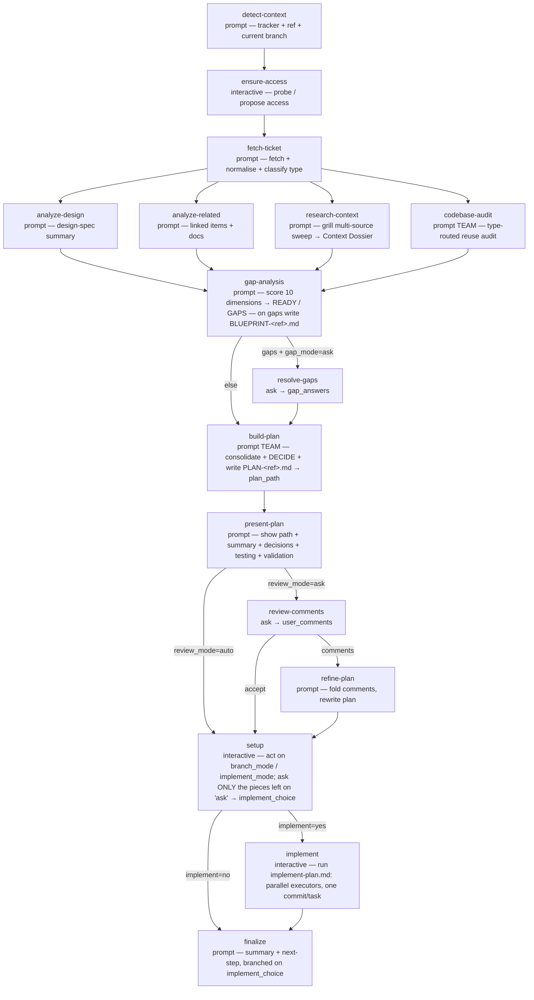

# ticket-plan

<!-- This README is the source of truth for how the workflow
     LOOKS to users. Keep it in sync with workflow.yaml +
     prompts/*.md — every edit to the flow, steps, outputs,
     or fragment list belongs here too. See
     CONTRIBUTING.md §9.6 for the invariant. -->

Turn a ticket from any task tracker into an implementation plan. The
workflow identifies which tracker the ticket belongs to, confirms it
can reach that tracker (probing for an MCP or CLI and proposing install
options when it can't), fetches and normalises the ticket, analyses
design links + related tickets + reference docs in parallel, runs a
grill **multi-source context sweep** (the ticket's comment thread +
screenshots, wiki / Slack / Drive / design channels where reachable,
codebase + git history) and a "reuse first" codebase audit, then
**gap-checks** the evidence: when critical dimensions are unknown it
writes a `BLUEPRINT-<ref>.md` with targeted per-person questions and
lets you answer inline (or pause the run and take them to your team);
otherwise — **autonomously, no question-by-question wizard** — it
consolidates the findings and makes every scope / approach / component
/ design / testing decision, writes a `PLAN-<ref>.md` into the run
directory, presents it, sets up the branch, and (optionally)
implements it. **Every decision is collected up front**,
ticket-auto-style: pre-flight asks the model/effort profile, the stage
preset, and four flow modes (gap handling / plan review / branch /
implement) — with the default modes the run is **fully autonomous
after launch**, and each mode keeps an `ask` value that restores the
old mid-run prompt for exactly that decision.

## When to use

- You've been assigned a ticket (Jira, Linear, GitHub / GitLab Issues,
  Asana, …) and want to go from "I've read the summary" to "I've got a
  written plan ready to implement" without re-reading every linked
  document by hand.
- The ticket has design links and you want a design-spec summary
  surfaced explicitly.
- The ticket has parent / linked tickets / reference docs you'd
  otherwise skim and forget.

## When not to use

- Quick fixes that don't need planning (typo, one-line change) — skip
  the workflow and just edit.
- A ticket you only want researched / clarified, not planned yet — use
  the standalone [`/wise-grill`](../../skills/wise-grill/SKILL.md)
  skill instead; it runs the same research + gap analysis and stops at
  the plan-or-blueprint fork, without the branch / setup / implement
  tail. (Tickets without enough information no longer disqualify this
  workflow — the `gap-analysis` step catches them and produces the
  questions to ask.)

## Prerequisites

- Run from inside the project's git repository —
  `project-selection: current` auto-detects the project from cwd.
- `/wise-init` completed at least once.
- No tracker plugin needs to be pre-installed — the `ensure-access`
  step probes for a tracker MCP / CLI at run time and proposes install
  options (or a manual-paste fallback) when none is found.

## Flow


```mermaid
flowchart TD
    T[detect-context<br/>prompt — tracker + ref + current branch] --> X[ensure-access<br/>interactive — probe / propose access]
    X --> A[fetch-ticket<br/>prompt — fetch + normalise + classify type]
    A --> C[analyze-design<br/>prompt — design-spec summary]
    A --> D[analyze-related<br/>prompt — linked items + docs]
    A --> RCx[research-context<br/>prompt — grill multi-source sweep → Context Dossier]
    A --> E[codebase-audit<br/>prompt TEAM — type-routed reuse audit]
    C --> G[gap-analysis<br/>prompt — score 10 dimensions → READY / GAPS — on gaps write BLUEPRINT-&lt;ref&gt;.md]
    D --> G
    RCx --> G
    E --> G
    G -->|gaps + gap_mode=ask| RG[resolve-gaps<br/>ask → gap_answers]
    G -->|else| B
    RG --> B[build-plan<br/>prompt TEAM — consolidate + DECIDE + write PLAN-&lt;ref&gt;.md → plan_path]
    B --> P[present-plan<br/>prompt — show path + summary + decisions + testing + validation]
    P -->|review_mode=ask| RC[review-comments<br/>ask → user_comments]
    P -->|review_mode=auto| S
    RC -->|comments| RF[refine-plan<br/>prompt — fold comments, rewrite plan]
    RC -->|accept| S
    RF --> S[setup<br/>interactive — act on branch_mode / implement_mode; ask ONLY the pieces left on 'ask' → implement_choice]
    S -->|implement=yes| IM[implement<br/>interactive — run implement-plan.md: parallel executors, one commit/task]
    S -->|implement=no| FN
    IM --> FN[finalize<br/>prompt — summary + next-step, branched on implement_choice]
```

No questions fire mid-run unless a flow mode asked for them: with
`gap_mode=defaults` the `gap-analysis` gate records its open questions
in the blueprint and proceeds on their stated defaults (each becomes a
`default-accepted` assumption in the plan); with `gap_mode=ask` the
`resolve-gaps` prompt fires once (answer inline, or interrupt and
`/wise-workflow-resume` after asking your team). Decisions are made
autonomously in `build-plan` and presented in `present-plan`; with
`review_mode=ask` the run pauses for your comments (`review-comments`
→ one `refine-plan` pass), with `auto` it flows straight to `setup`,
which acts on `branch_mode` / `implement_mode` and only asks about
the pieces left on `ask`. `build-plan` depends
directly on the four evidence steps plus `gap-analysis` +
`resolve-gaps` with `trigger-rule: none-failed` (a skipped dep — a
when-skipped `resolve-gaps`, or any stage deselected at pre-flight —
never blocks it; a *failed* dep still does — the plan is never built
over a crashed investigation); `gap-analysis` uses the same rule for
the same reason; `setup` depends on `review-comments` + `refine-plan`
with `trigger-rule: all-done`, so it runs whether or not `refine-plan`
fired.

The implement decision comes out of `setup` as `implement_choice`,
resolved from the pre-flight `implement_mode` (`now` / `plan-only`)
or from the setup questionnaire when the mode was `ask`. On **yes**,
the conditional `implement` step runs the shared `implement-plan.md`
procedure in-session — dispatching each task wave's tasks to parallel
executor subagents and landing one atomic commit per task (nothing is
pushed). Otherwise `implement` is bypassed and the plan is left for
later. `finalize` depends on `setup` + `implement` with
`trigger-rule: all-done`, so it closes the run either way, branching
its message on the choice.

The pre-flight `control-mode` is pinned to `auto-advance`: the
workflow runs wave-to-wave on its own, with **no between-wave
"continue?" menu**, and stops only where a question is still armed —
`ensure-access` when no tracker access exists, plus whichever of
`resolve-gaps` / `review-comments` / the `setup` questionnaire a flow
mode left on `ask`. With the default modes nothing stops after
launch. This DAG is mostly one step per wave, so wave-sync's
between-wave menu would interrupt after nearly every step;
auto-advance keeps the in-step prompts while dropping that menu.
(synchronous mode is the wrong choice — it would auto-skip
`ensure-access`'s fallback prompt and any mode left on `ask`.)

The pre-flight `rename_session` prompt is pinned to `skip` — at
pre-flight all we have is the run ULID; the rename is folded into the
`setup` questionnaire once the ticket ref is known.

All configuration happens at pre-flight, before the DAG launches:

- **Model/effort tuning** (`tuning: prompt`) — one profile question
  (`Defaults` / `Economy` — sonnet at high everywhere / `Custom`);
  Custom opens one question per group. Two tunable groups: **evidence
  & research** (`analyze-design`, `research-context`,
  `codebase-audit`) and **plan authoring** (`gap-analysis`,
  `build-plan`, `refine-plan`). An override binds at dispatch
  (`resolve-team --model/--effort`) and wins over step- and
  team-member pins.
- **Stage selection** (`step-select: prompt`) — one preset question:
  **Full** (everything), **Standard** (skip the deep-dive context
  sweep), **Minimal** (fetch + codebase audit + plan only — no
  research wave, no gap analysis), or **Custom** (multiSelect over
  the four optional research stages: design analysis, related tickets
  & docs, deep-dive sweep, gap analysis). Deselected stages are
  pre-marked `skipped` in run state; the `none-failed` trigger-rules
  above keep the DAG flowing past them.
- **Flow modes** (choice inputs, asked as one composite questionary) —
  `gap_mode` (**proceed on defaults** / pause and ask), `review_mode`
  (**accept as-is** / pause for review), `branch_mode` (**ticket
  branch automatically** / stay on current / ask at setup), and
  `implement_mode` (**plan only** / implement right away / ask after
  setup). The bolded defaults make the run autonomous after launch;
  any mode set to `ask` restores exactly that mid-run prompt.

The four analysis steps share `depends_on: [fetch-ticket]`, so they
run as one parallel wave — typically the longest wave of the run — on
the current branch (the analysis is read-only; no branch is created
until `setup`).

## Steps

| Step | Type | Purpose |
|---|---|---|
| `detect-context` | `prompt` | Identifies the tracker from the input URL/id (host map, WebSearch fallback) and reads the current git branch; emits tracker slug + bare ticket ref + current branch. |
| `ensure-access` | `interactive` | Probes for a tracker MCP / CLI; when none is found, web-searches for options and proposes installs (or a manual-paste fallback) via AskUserQuestion. |
| `fetch-ticket` | `prompt` | Fetches the ticket via the established access, normalises it into a tracker-agnostic shape, and classifies it as frontend / backend / fullstack / other. |
| `analyze-design` | `prompt` | Design-spec summary (layout / states / responsive) from any design links. Emits `NO-DESIGN` for backend tickets or when there are none. Dispatched to `wise:ux-designer` on `opus`, `effort: high` (design specs are load-bearing for the plan). |
| `analyze-related` | `prompt` | Fetches linked / parent tickets + reference docs. Emits `NO-RELATED` when empty. |
| `research-context` | `prompt` | The grill multi-source sweep ([`grill/research-sources.md`](../../references/grill/research-sources.md)): harvests the lexicon of unresolved terms, probes every reachable channel (tracker comments + screenshots, wiki, Slack, Drive, design, codebase + git history, web), works the channel families under bounded search rules, and returns the Context Dossier (incl. the People map and sources-unavailable list) — persisted to `<run-dir>/research/dossier.md` so the isolated `gap-analysis` subagent can read it. Runs on `opus`, `effort: high` (the dossier is the evidence base every later step plans off). |
| `codebase-audit` | `prompt` | Type-routed "reuse first" audit — UI layer for frontend, API/data/service layer for backend, both for fullstack. Dispatched to a **team** — `wise:software-engineer` (lead) + `wise:architect` — on `sonnet`, `effort: high`. |
| `gap-analysis` | `prompt` | Scores the ten dimensions of [`grill/gap-analysis.md`](../../references/grill/gap-analysis.md) against the dossier file at `<run-dir>/research/dossier.md` (supplementing thin sections with its own Read/Grep of the project) and prints the scorecard. On GAPS, writes `BLUEPRINT-<ref>.md` ([`grill/blueprint-format.md`](../../references/grill/blueprint-format.md)) into the run directory and prints the paste-ready per-person question blocks. Emits `readiness` + `open_questions`. Dispatched to `wise:architect` on `opus`, `effort: xhigh` (the READY / GAPS judgement is a planning call). |
| `resolve-gaps` | `ask` | `when: [readiness == 'gaps', gap_mode == 'ask']` — free-text: answer any of the surfaced questions inline, or skip to proceed on the stated defaults (each recorded as a `default-accepted` assumption). Interrupt + `/wise-workflow-resume` to take the questions to the team instead. With `gap_mode=defaults` this never fires. |
| `build-plan` | `prompt` | Cross-functional planning **team**: consolidates the four analyses + gap scorecard, folds in `gap_answers` (answered = CLEAR evidence; unanswered = default-accepted assumptions; updates the blueprint's Clarifications log when one exists), and makes every decision autonomously (with rationale), then writes `PLAN-<ref>.md` into the run directory; emits its path as `plan_path`. Team — `wise:architect` (lead) + `wise:product-manager` + `wise:software-engineer` + `wise:qa-engineer`, the whole panel on `opus`, conductor-synthesized, `effort: high`. |
| `present-plan` | `prompt` | Informational — surfaces the plan-file path + Summary, Design Notes, Decisions Made, Testing, and Validation sections for review. |
| `review-comments` | `ask` | `when: review_mode == 'ask'` — free-text: comment to adjust the plan, or skip to accept it as-is. Skip is the approval. With `review_mode=auto` the plan is accepted as presented. |
| `refine-plan` | `prompt` | `when: [review_mode == 'ask', user_comments != '']` — folds the comments in and overwrites the plan once. Dispatched to `wise:architect` on `opus`, `effort: xhigh`. |
| `setup` | `interactive` | Acts on the pre-flight `branch_mode` / `implement_mode`: creates/switches the ticket branch automatically (`auto`), stays put (`current`), or asks the composite questionnaire (ticket-ref confirm + branch + base + session rename) for the pieces left on `ask`. With no `ask` modes it asks nothing and acts silently. Emits `work_branch` + `session_renamed` + `implement_choice`. |
| `implement` | `interactive` | `when: implement_choice == 'yes'` — runs the shared `implement-plan.md` procedure on the work branch: each task wave's tasks dispatched to parallel executor subagents, one atomic commit per task, no push. |
| `finalize` | `prompt` | Closing summary (branch, plan path), branched on `implement_choice`: when it implemented, points at `/wise-code-review-auto` + `/wise-pr-create`; otherwise the `/wise-implement-plan-auto <plan_path>` / save-for-later pointer. |

The workflow sets `agents: auto`. The analytical / authoring `prompt`
steps pin roster roles and **teams**:

- `analyze-design` → `wise:ux-designer`.
- `codebase-audit` → a team — `wise:software-engineer` (lead) +
  `wise:architect` — covering both implementation-level and
  structural/pattern-level reuse.
- `gap-analysis` → `wise:architect` (the READY / GAPS judgement is a
  planning call).
- `build-plan` → a cross-functional team — `wise:architect` (lead) +
  `wise:product-manager` + `wise:software-engineer` + `wise:qa-engineer`
  — whose drafts the conductor synthesizes into the plan.
- `refine-plan` → `wise:architect`.

**Model tiering** (`opus` = the latest Opus, Opus 5): the solo
plan-authoring steps — `gap-analysis`, `refine-plan` — run on `opus`
at `effort: xhigh`; `build-plan` (the whole team) runs on `opus` at
`effort: high` — the four-role panel already buys the depth, so
per-member `xhigh` would only add latency and cost; the load-bearing
evidence steps (`analyze-design` + `research-context` — everything
downstream plans off what these two surface) run on `opus` at
`effort: high`; `sonnet` for every other step. The
tracker-fetch and git steps (`detect-context`, `fetch-ticket`,
`analyze-related`, `research-context` — the sweep needs whatever
tracker / wiki / chat MCP tools the session has) and the presentation
steps (`present-plan`,
`finalize`) carry no `agent:` and stay on `general-purpose` via the
conductor's tool-aware auto-selection — they need tracker-MCP / git
tools no scoped role carries — but still run on their pinned model
(`opus` for `research-context`, `sonnet` for the rest). These are the
defaults — the pre-flight tuning questionary can override them per
group (see Flow above). See
[Agents, model and effort](../../../../docs/wise/workflows.md#agents-model-and-effort).

## Inputs

| Name | Required | Description |
|---|---|---|
| `ticket_id` | yes | A ticket URL (`https://acme.atlassian.net/browse/PROJ-1`, `https://linear.app/acme/issue/ENG-45`, …) or a bare id (`PROJ-123`, `ENG-45`, `#678`). `detect-context` resolves the tracker and the bare ref from it. |
| `gap_mode` | yes (choice) | `defaults` (default — open gap questions proceed on their stated defaults, recorded as assumptions) / `ask` (pause at `resolve-gaps`). |
| `review_mode` | yes (choice) | `auto` (default — accept the plan as presented) / `ask` (pause at `review-comments` for one refine pass). |
| `branch_mode` | yes (choice) | `auto` (default — create/switch the ticket branch off the repo's default branch, no questions) / `current` (stay on the current branch) / `ask` (composite setup questionnaire). |
| `implement_mode` | yes (choice) | `plan-only` (default — stop after setup) / `now` (implement autonomously after setup) / `ask` (ask once the plan and branch are settled). |

The four mode inputs render as one composite pre-flight questionary
(consecutive choice inputs are batched); each also accepts its value
positionally, e.g. `/wise-workflow-run ticket-plan PROJ-1 defaults
auto auto now`.

## Outputs

| Name | Source | Used for |
|---|---|---|
| `tracker_slug` | `detect-context` | The short tracker name (jira / linear / gh / …); used in the plan heading. |
| `ticket_ref` | `detect-context` | The bare ticket ref; the target branch name (per `branch-naming.md`), the session label, and the plan heading. |
| `current_branch` | `detect-context` | The branch at run start; compared against the target in `setup` to decide whether to ask the branch question. |
| `readiness` / `open_questions` | `gap-analysis` | `ready` or `gaps` + the open-question count; `gaps` gates the `resolve-gaps` ask. |
| `gap_answers` | `resolve-gaps` | The user's inline answers (may be empty); folded into `build-plan` as CLEAR evidence, with unanswered questions proceeding on their defaults. |
| `plan_path` | `build-plan` | Absolute path to `PLAN-<ref>.md` in the run directory; surfaced in `present-plan` / `finalize` and consumable by `/wise-implement-plan-auto`. |
| `user_comments` | `review-comments` | Drives `refine-plan` when non-empty (only when `review_mode=ask`). |
| `work_branch` / `session_renamed` | `setup` | The branch the run ended on, and whether the session was renamed. |
| `implement_choice` | `setup` | `yes` / `no`, resolved from `implement_mode` (or the setup questionnaire when that mode was `ask`); gates the `implement` step and branches `finalize`. |
| `impl_waves` / `impl_tasks` / `impl_done` / `impl_failed` | `implement` | Implementation tallies (set only when `implement` ran). |

The plan file lives at `<run-dir>/plans/PLAN-<ref>.md` (beside
`state.yaml`, off the project tree), so it persists with the run and
never lands in the feature branch — and, when the gap analysis found
gaps, `BLUEPRINT-<ref>.md` sits beside it as the question / decision
record. `/wise-workflow-status <run-ulid>` shows `plan_path`.

## Examples

```
/wise-workflow-run ticket-plan
# Pre-flight asks everything up front: model/effort profile, stage
# preset, the ticket URL or id, and the four flow modes (one composite
# questionary). With the default modes the run is fully autonomous
# after launch — plan written, ticket branch created, run ends after
# setup with the implement pointers.

/wise-workflow-run ticket-plan PROJ-123
# Same, ticket supplied positionally. Pick "Pause for my review" at
# the review question to keep the old comment-and-refine pause, or
# "Implement right away" to go ticket → plan → implemented branch in
# one unattended run.
```

## Related

- [Definition YAML](./workflow.yaml)
- [`branch-naming.md`](../../references/branch-naming.md) — the ticket =
  branch rule `setup` follows.
- [`wise-estimation`](../../skills/wise-estimation/SKILL.md) — SP
  estimation reference consumed by `build-plan`.
- [`grill/research-sources.md`](../../references/grill/research-sources.md) /
  [`grill/gap-analysis.md`](../../references/grill/gap-analysis.md) /
  [`grill/blueprint-format.md`](../../references/grill/blueprint-format.md)
  — the shared grill routines behind `research-context` and
  `gap-analysis`.
- [`/wise-grill`](../../skills/wise-grill/SKILL.md) — the standalone
  research + gap-analysis pass (plan-or-blueprint fork, no setup /
  implement tail).
