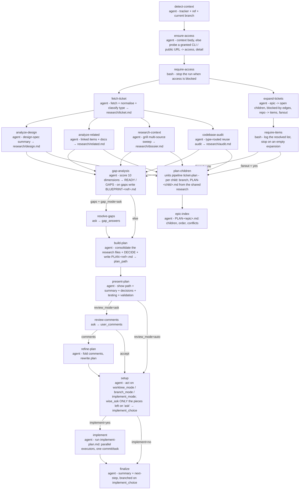

# ticket-plan

<!-- This README is the source of truth for how the workflow
     LOOKS to users. Keep it in sync with workflow.yaml +
     prompts/*.md — every edit to the flow, steps, outputs,
     or fragment list belongs here too. See
     CONTRIBUTING.md §9.6 for the invariant. -->

Turn a ticket from any task tracker into an implementation plan. The
workflow identifies which tracker the ticket belongs to, confirms it
can reach that tracker (probing for an MCP or CLI and proposing install
options when it can't), fetches and normalises the ticket, analyses
design links + related tickets + reference docs in parallel, runs a
grill **multi-source context sweep** (the ticket's comment thread +
screenshots, wiki / Slack / Drive / design channels where reachable,
codebase + git history) and a "reuse first" codebase audit, then
**gap-checks** the evidence: when critical dimensions are unknown it
writes a `BLUEPRINT-<ref>.md` with targeted per-person questions and
lets you answer inline (or pause the run and take them to your team);
otherwise — **autonomously, no question-by-question wizard** — it
consolidates the findings and makes every scope / approach / component
/ design / testing decision, writes a `PLAN-<ref>.md` into the run
directory, presents it, sets up the branch, and (optionally)
implements it. **Every decision is collected up front**,
ticket-auto-style: pre-flight asks harness, provider permissions, model and effort per
tuning group, the research stages, and five flow modes (gap
handling / plan review / working tree / branch / implement) - with the default modes
the run is **fully autonomous after launch**, and each mode except working tree keeps an
`ask` value that restores the mid-run question for exactly that
decision. The definition is a `version: 2` workflow run by the TS
engine: every step is an isolated harness child that sees only its
own prompt, so steps hand results to each other through files under
the run directory (`research/*.md`, `plans/*.md`) and through the
structured outputs their `schema:` declares.

An epic or parent work item (or several comma-separated refs) plans
every open child in one run under one pre-flight questionary. See
[Epic runs](#epic-runs).

## When to use

- You've been assigned a ticket (Jira, Linear, GitHub / GitLab Issues,
  Asana, …) and want to go from "I've read the summary" to "I've got a
  written plan ready to implement" without re-reading every linked
  document by hand.
- The ticket has design links and you want a design-spec summary
  surfaced explicitly.
- The ticket has parent / linked tickets / reference docs you'd
  otherwise skim and forget.
- An epic whose children should each get a plan, with one index that
  orders them and names the files, migration numbers and contracts they
  share.

Pre-flight asks for a permission floor once per selected provider. `Auto`
is recommended; choose `Bypass permissions` when the workflow needs the
provider fully unsandboxed. A step's stronger mode still wins.

## When not to use

- Quick fixes that don't need planning (typo, one-line change) — skip
  the workflow and just edit.
- A ticket you only want researched / clarified, not planned yet — use
  the standalone [`/wise-grill`](../../skills/wise-grill/SKILL.md)
  skill instead; it runs the same research + gap analysis and stops at
  the plan-or-blueprint fork, without the branch / setup / implement
  tail. (Tickets without enough information no longer disqualify this
  workflow — the `gap-analysis` step catches them and produces the
  questions to ask.)

## Prerequisites

- Run from inside the project's git repository —
  `project-selection: current` auto-detects the project from cwd.
- `/wise-init` completed at least once.
- Ticket access is settled before the run: the conductor fetches the
  ticket into run context ahead of every pre-flight question, and the
  `ensure-access` / `require-access` pair re-checks first thing in the
  run and stops it, with the fix, when the ticket is still unreachable.
  No tracker plugin needs to be pre-installed; a granted CLI (`gh`,
  `glab`, `linear`, `jira`) or a public URL is probed when the
  conductor did not supply the body.

## Flow


```mermaid
flowchart TD
    T[detect-context<br/>agent - tracker + ref + current branch] --> X[ensure-access<br/>agent - context body, else probe a granted CLI / public URL -> access, detail]
    X --> RA[require-access<br/>bash - stop the run when access is blocked]
    RA --> A[fetch-ticket<br/>agent - fetch + normalise + classify type → research/ticket.md]
    RA --> EX[expand-tickets<br/>agent - epic -> open children, blocked-by edges, repo -> items, fanout]
    EX --> RI[require-items<br/>bash - log the resolved list, stop on an empty expansion]
    RI -->|fanout = no| G
    RI -->|fanout = yes| PC
    A --> C[analyze-design<br/>agent - design-spec summary → research/design.md]
    A --> D[analyze-related<br/>agent - linked items + docs → research/related.md]
    A --> RCx[research-context<br/>agent - grill multi-source sweep → research/dossier.md]
    A --> E[codebase-audit<br/>agent - type-routed reuse audit → research/audit.md]
    C --> G[gap-analysis<br/>agent - score 10 dimensions → READY / GAPS - on gaps write BLUEPRINT-&lt;ref&gt;.md]
    D --> G
    RCx --> G
    E --> G
    G -->|gaps + gap_mode=ask| RG[resolve-gaps<br/>ask → gap_answers]
    G -->|else| B
    RG --> B[build-plan<br/>agent - consolidate the research files + DECIDE + write PLAN-&lt;ref&gt;.md → plan_path]
    B --> P[present-plan<br/>agent - show path + summary + decisions + testing + validation]
    P -->|review_mode=ask| RC[review-comments<br/>ask → user_comments]
    P -->|review_mode=auto| S
    RC -->|comments| RF[refine-plan<br/>agent - fold comments, rewrite plan]
    RC -->|accept| S
    RF --> S[setup<br/>agent - act on worktree_mode / branch_mode / implement_mode; wise_ask ONLY the pieces left on 'ask' → implement_choice]
    S -->|implement=yes| IM[implement<br/>agent - run implement-plan.md: parallel executors, one commit/task]
    S -->|implement=no| FN
    IM --> FN[finalize<br/>agent - summary + next-step, branched on implement_choice]
    C --> PC[plan-children<br/>units pipeline ticket-plan - per child: branch, PLAN-&lt;child&gt;.md from the shared research]
    D --> PC
    RCx --> PC
    E --> PC
    PC --> EI[epic-index<br/>agent - PLAN-&lt;epic&gt;.md: children, order, conflicts]
```

With `fanout = no` (one plain ticket) `plan-children` and `epic-index`
are skipped and the single-ticket path runs as before. With `fanout =
yes` `gap-analysis`, `build-plan`, `setup` and `finalize` are skipped
(`when: fanout != 'yes'`), and everything after them follows.

The conductor fetches the ticket before the first pre-flight question
(`wise-workflow-run` §1b), so a missing tracker channel surfaces before
any picker, not mid-run.

No questions fire mid-run unless a flow mode asked for them: with
`gap_mode=defaults` the `gap-analysis` gate records its open questions
in the blueprint and proceeds on their stated defaults (each becomes a
`default-accepted` assumption in the plan); with `gap_mode=ask` the
`resolve-gaps` prompt fires once (answer inline, or interrupt and
`/wise-workflow-resume` after asking your team). Decisions are made
autonomously in `build-plan` and presented in `present-plan`; with
`review_mode=ask` the run pauses for your comments (`review-comments`
→ one `refine-plan` pass), with `auto` it flows straight to `setup`,
which acts on `branch_mode` / `implement_mode` and only asks about
the pieces left on `ask`. `build-plan` depends
directly on the four evidence steps plus `gap-analysis` +
`resolve-gaps` with `trigger-rule: none-failed` (a skipped dep — a
when-skipped `resolve-gaps`, or any stage deselected at pre-flight —
never blocks it; a *failed* dep still does — the plan is never built
over a crashed investigation); `gap-analysis` uses the same rule for
the same reason; `setup` depends on `review-comments` + `refine-plan`
with `trigger-rule: all-done`, so it runs whether or not `refine-plan`
fired.

The implement decision comes out of `setup` as `implement_choice`,
resolved from the pre-flight `implement_mode` (`now` / `plan-only`)
or from the setup questionnaire when the mode was `ask`. On **yes**,
the conditional `implement` step runs the shared `implement-plan.md`
procedure in the implement child — each task wave's tasks run by
parallel executor subagents when the harness can spawn them and
sequentially inline otherwise, one atomic commit per task (nothing is
pushed). Otherwise `implement` is bypassed and the plan is left for
later. `finalize` depends on `setup` + `implement` with
`trigger-rule: all-done`, so it closes the run either way, branching
its message on the choice.

The pre-flight `control-mode` is pinned to `interactive`: gates pause
the run and nothing else does. The run stops only where a question is
still armed - `ensure-access` when no tracker access exists, plus
whichever of `resolve-gaps` / `review-comments` / the `setup`
questions a flow mode left on `ask`. With the default modes nothing
stops after launch. (`synchronous` is the wrong choice - it would
auto-answer those gates.) Session naming is the harness's job; the
`finalize` step suggests `/rename <ticket-ref>_ticket-plan`.

All configuration happens at pre-flight, before the DAG launches. The
engine builds the questionary from the definition's `tuning:` /
`step-select:` / `inputs:` blocks and the conductor asks it in stages,
stage selection and inputs first, harnesses and provider permissions next, then model tuning:

- **Tuning scope** - `single` runs every step on one harness, model and
  effort (asked once as `harness.all`, `model.all`, `effort.all`);
  `per-group` (default) asks them per group as described under Tuning.
- **Stage selection** - one multi-select over the optional research
  stages: design analysis, related tickets & docs, deep-dive sweep,
  gap analysis (the `resolve-gaps` question follows gap analysis on
  its own). Deselected steps are pre-marked `skipped` in run state;
  the `none-failed` trigger-rules above keep the DAG flowing past
  them. Asked first: the selection decides which tuning groups are
  worth asking about.
- **Tuning** - one group per model step: design spec
  (`analyze-design`), deep-dive sweep (`research-context`), codebase
  audit (`codebase-audit`), gap analysis, build plan, refine plan,
  implement, plus one `support` group shared by the mechanical steps
  (tracker detection, ticket fetch, related-item summary, plan
  presentation, branch setup, final summary). Every group's label says
  what the model will do. Only the groups of steps that will run are asked:
  deselect the design analysis and its group is skipped; leave
  `review_mode` on `auto` and the refine-plan group is skipped; leave
  `implement_mode` on `plan-only` and the implement group is skipped
  (the engine settles those `when:` gates on the inputs at
  pre-flight). Per group: which harness runs it (asked whenever another
  one is installed, logged in or not).
  After all harnesses are settled, pre-flight asks once per selected or
  fallback provider for a permission floor (`Auto` recommended, with
  `Bypass permissions` available), then asks which model from the
  engine's catalog for that harness, then the effort that model takes. Every one of these questions goes to the
  user; the run refuses to start on a skipped one. Defaults:
  `claude-opus-5-5 / high` for all seven (the authoring four declare
  `xhigh`, which Opus 5.5's ceiling resolves to `high`);
  `claude-sonnet-5 / medium` for `support`.
- **Review depth** - the follow-up branch review is the `code-review`
  workflow, which asks harness, provider permissions, model and effort per reviewer at its
  own pre-flight, so there is no review question here.
- **Flow modes** (choice inputs inferred from strict literal `validate:`
  regexes, defaults pre-filled) - `gap_mode` (**defaults** / ask, asked only when gap analysis is selected), `review_mode`
  (**auto** / ask), `worktree_mode` (**current** / new), `branch_mode` (**auto** / current / ask), and
  `implement_mode` (**plan-only** / now / ask). The bolded defaults
  make the run autonomous after launch; any mode set to `ask`
  restores exactly that mid-run question.

### Epic runs

`expand-tickets` follows
[`references/epic-expansion.md`](../../references/epic-expansion.md): an
epic or parent becomes its open children (recursively; Done, Canceled
and Duplicate dropped) with `blocked-by` edges, `serialize` keys and a
target repository. Research is shared: the four research steps run once,
on the epic, and every child plan reads `<run-dir>/research/` instead of
repeating the sweep; each child researches only its own ticket and the
code it touches. The rejected alternative, a research wave per child,
multiplies the most expensive wave by the child count and sweeps the same
wiki, Slack and codebase each time.

`plan-children` is a `units` step with the `ticket-plan` pipeline:
`claim` (the child's branch, or none with `branch_mode: current`),
`worktree` (with `worktree_mode: new`), `plan` (the `build-plan` tuning
group; `PLAN-<child>.md` in `<run-dir>/plans/`, with a `## Cross-child
notes` section) and `cleanup` (keeps the branch). A child waits for its
blockers' plans; a failed blocker marks its dependents `blocked`; up to
`concurrency` children plan at once (the current tree: one); children
sharing a `serialize` key never overlap. Epic runs are autonomous by
construction: `gap_mode`, `review_mode` and `implement_mode` are not
asked and keep `defaults`, `auto` and `plan-only`; `branch_mode: ask`
settles on `auto`.

`epic-index` writes `<run-dir>/plans/PLAN-<epic>.md`: one row per child
(ref, repo, verdict `plan-written` / `blocked` / `failed` / `skipped`,
plan link, branch, notes), the dependency order to implement in, and the
cross-child conflicts (shared files, migration or ADR numbers, shared
contracts) with a resolution each. Nothing is written to the tracker.
`/wise-workflow-run ticket-auto <epic>` then implements the children.

The four analysis steps share `depends_on: [fetch-ticket]`, so they
run as one parallel wave — typically the longest wave of the run — on
the current branch (the analysis is read-only; no branch is created
until `setup`).

## Steps

| Step | Type | Purpose |
|---|---|---|
| `detect-context` | `agent` | Identifies the tracker from the input URL/id (host map, WebSearch fallback) and reads the current git branch; emits tracker slug + bare ticket ref + current branch. |
| `ensure-access` | `agent` | Reads `wise_context("ticket")` first (the conductor's fetched body); otherwise probes a granted CLI or a public URL for the detected tracker. Never asks. Emits `access` (`ok` / `blocked`) and `detail`. `support` tuning group. |
| `require-access` | `bash` | Fails the run with `detail` when `access` is not `ok`: the safeguard runs before the research wave, so nobody waits through a run to learn the ticket was unreachable. |
| `expand-tickets` | `agent` | Follows `references/epic-expansion.md` on `ticket_id`. Emits `items`, `item_count`, `fanout` (`yes` / `no`), `expansion`, `resolved`, `expansion_detail`. `support` tuning group. |
| `require-items` | `bash` | Prints the resolved list; fails the run when the expansion is blocked or no open ticket is left. |
| `fetch-ticket` | `agent` | Fetches the ticket via the established access (or normalises the `ticket` entry of the run context when the conductor already passed the body), writes the tracker-agnostic shape to `<run-dir>/research/ticket.md`, and classifies it as frontend / backend / fullstack / other. Emits `ticket_path` + `ticket_type`. |
| `analyze-design` | `agent` | Design-spec summary (layout / states / responsive) from any design links, written to `<run-dir>/research/design.md`. Replies `NO-DESIGN` for backend tickets or when there are none. Acts as the `ux-designer` role; `evidence` tuning group (`opus / high`). |
| `analyze-related` | `agent` | Fetches linked / parent tickets + reference docs into `<run-dir>/research/related.md`. Replies `NO-RELATED` when empty. `support` tuning group. |
| `research-context` | `agent` | The grill multi-source sweep ([`grill/research-sources.md`](../../references/grill/research-sources.md)): harvests the lexicon of unresolved terms, probes every reachable channel (tracker comments + screenshots, wiki, Slack, Drive, design, codebase + git history, web), works the channel families under bounded search rules, and builds the Context Dossier (incl. the People map and sources-unavailable list) - persisted to `<run-dir>/research/dossier.md` (the file is the channel: `gap-analysis` and `build-plan` Read it; the step's structured result carries `dossier_path` / `lexicon` / `sources_unavailable`). `evidence` tuning group (`opus / high`). |
| `codebase-audit` | `agent` | Type-routed "reuse first" audit - UI layer for frontend, API/data/service layer for backend, both for fullstack - written to `<run-dir>/research/audit.md`. Acts as `software-engineer` covering the `architect` lens; `evidence` tuning group (`opus / high`). |
| `gap-analysis` | `agent` | Scores the ten dimensions of [`grill/gap-analysis.md`](../../references/grill/gap-analysis.md) against the dossier file at `<run-dir>/research/dossier.md` (supplementing thin sections with its own Read/Grep of the project) and prints the scorecard. On GAPS, writes `BLUEPRINT-<ref>.md` ([`grill/blueprint-format.md`](../../references/grill/blueprint-format.md)) into the run directory; the paste-ready per-person question blocks are printed inline only when `gap_mode=ask` (on `defaults` only the blueprint path + per-person counts are printed - nobody would answer mid-run). Also writes the scorecard to `<run-dir>/research/gap-scorecard.md`. Emits `readiness` + `open_questions`. Acts as `architect`; `authoring` tuning group (`opus / xhigh`, resolved to `high` under Opus 5.5's policy ceiling). |
| `resolve-gaps` | `ask` | `when: readiness == 'gaps' && gap_mode == 'ask'` - free-text: answer any of the surfaced questions inline, or skip to proceed on the stated defaults (each recorded as a `default-accepted` assumption). Interrupt + `/wise-workflow-resume` to take the questions to the team instead. With `gap_mode=defaults` this never fires. |
| `build-plan` | `agent` | Cross-functional planning pass: reads the research files (ticket, design, related, dossier, audit, gap scorecard; missing ones skipped), folds in `gap_answers` (answered = CLEAR evidence; unanswered = default-accepted assumptions; updates the blueprint's Clarifications log when one exists), and makes every decision autonomously (with rationale), then writes `PLAN-<ref>.md` into the run directory; emits its path as `plan_path`. Acts as `architect` covering the product-manager / software-engineer / qa-engineer lenses; `authoring` tuning group. |
| `present-plan` | `agent` | Informational - surfaces the plan-file path + Summary, Design Notes, Decisions Made, Testing, and Validation sections for review. |
| `review-comments` | `ask` | `when: review_mode == 'ask'` — free-text: comment to adjust the plan, or skip to accept it as-is. Skip is the approval. With `review_mode=auto` the plan is accepted as presented. |
| `refine-plan` | `agent` | `when: review_mode == 'ask' && user_comments != '' && user_comments != 'Accept the plan as-is'` - folds the comments in and overwrites the plan once. Acts as `architect`; `authoring` tuning group. |
| `setup` | `agent` | Acts on the pre-flight `worktree_mode` / `branch_mode` / `implement_mode`: creates the ticket branch off the pre-flight `base_branch` or switches to it automatically (`auto`, dirty-tree refused before any source-tree checkout), stays put (`current`), or asks through `wise_ask` (create / switch / stay; the base is already settled) for the pieces left on `ask`. The ticket ref is immutable at this point - a wrong ref means a fresh run, not a rename. With no `ask` modes it asks nothing and acts silently. `support` tuning group, `mode: full-access` for the git operations. Emits `work_path` + `work_branch` + `work_head` + `implement_choice`. |
| `implement` | `agent` | `when: implement_choice == 'yes'` - runs the shared `implement-plan.md` procedure on the work branch: each task wave's tasks run by parallel executor subagents when the harness can spawn them, sequentially inline otherwise; one atomic commit per task, no push. `implement` tuning group, `mode: full-access`. Emits the `impl_*` tallies. |
| `finalize` | `agent` | Closing summary (branch, plan path), branched on `implement_choice`: when it implemented, points at `/wise-workflow-run code-review` + `/wise-pr-create`; otherwise the `/wise-implement-plan-auto <plan_path>` / save-for-later pointer. |
| `plan-children` | `units` | `when: fanout == 'yes'`, `pipeline: ticket-plan`, `items: {{items}}`, `groups: {plan: build-plan}`, `trigger-rule: none-failed` over the research steps. One autonomous plan per child in dependency order. Emits `units` (verdict `plan-written`, `blocked`, `failed` or `skipped` per child). |
| `epic-index` | `agent` | `when: fanout == 'yes'`, `trigger-rule: all-done`. Writes `PLAN-<epic>.md` (children, order, conflicts) and prints the children table. `build-plan` tuning group. Emits `index_path`, `planned`, `blocked`, `failed`, `skipped`. |

Roles are folded into each prompt (v2 has no roster routing or agent
teams): `analyze-design` acts as `ux-designer`, `codebase-audit` as
`software-engineer` covering the `architect` lens, `gap-analysis` /
`build-plan` / `refine-plan` as `architect` (build-plan also covers
the product-manager / software-engineer / qa-engineer lenses).

**Model tiering** (`opus` = the latest Opus, Opus 5.5) comes from the
seven per-step tuning groups: `gap-analysis`, `build-plan`,
`refine-plan` and `implement` default to `opus / xhigh`, which Opus 5.5's
policy ceiling resolves to `high` (see
[Effort ceilings](../../../../docs/wise/workflows.md#effort-ceilings));
`analyze-design`, `research-context` and `codebase-audit` default to
`opus / high`; every other step shares the `support` group
(`sonnet / medium`). The pre-flight answers override the group
defaults at dispatch. See
[Agents, model and effort](../../../../docs/wise/workflows.md#agents-model-and-effort).

## Inputs

| Name | Required | Description |
|---|---|---|
| `ticket_id` | yes | A ticket URL (`https://acme.atlassian.net/browse/PROJ-1`, `https://linear.app/acme/issue/ENG-45`, …) or a bare id (`PROJ-123`, `ENG-45`, `#678`). Pre-filled from the run context (`ticket[].ref`) when the conductor already knows the ticket. `detect-context` resolves the tracker and the bare ref from it. |
| `gap_mode` | yes | `defaults` (default - open gap questions proceed on their stated defaults, recorded as assumptions) / `ask` (pause at `resolve-gaps`). Not asked in an epic run (`unless-fanout`). |
| `review_mode` | yes | `auto` (default - accept the plan as presented) / `ask` (pause at `review-comments` for one refine pass). Not asked in an epic run. |
| `worktree_mode` | yes | Asked immediately before branch handling: `current` (default) uses the current tree; `new` creates a separate worktree at `<run-dir>/worktrees/<ticket-branch>`. Staying on the current branch with a new worktree uses a detached checkout at the source HEAD for plan-only work. Implementation requires a named branch. |
| `branch_mode` | yes | `auto` (default - create/switch the ticket branch off `base_branch`, no questions) / `current` (stay on the current branch) / `ask` (composite setup questionnaire). |
| `implement_mode` | yes | `plan-only` (default - stop after setup) / `now` (implement autonomously after setup) / `ask` (ask once the plan and branch are settled). Not asked in an epic run. |
| `concurrency` | no | `1`-`4`, default `2` (`1` offered in the current tree): children planned at once. Asked only for an epic run; an answer above `1` with the current tree is rejected and asked again. |
| `on_child_failure` | no | `continue` (default) or `stop`. Asked only for an epic run. |
| `repo_paths` | no | `owner/name=/abs/path` pairs for children in other repositories. Asked only for an epic run. |
| `base_branch` | yes | The branch new ticket branches start from (`origin/<base_branch>` when it exists on origin, else the local branch). Options come from the checkout (`options-from: branches`): the checked-out branch first when it is `main` / `master` / `release*`, then the default branch, then the five most recent `release*` branches; free text accepted but must be a plain git branch name. Defaults to the checked-out base branch, else the default branch. |

The five mode inputs are choice inputs inferred from a strict literal
`validate:` regex over the allowed values; `base_branch` is a choice
computed from the checkout. Each also accepts its value positionally in
declared order, e.g. `/wise-workflow-run ticket-plan PROJ-1
defaults auto current auto now main`.

## Outputs

| Name | Source | Used for |
|---|---|---|
| `tracker_slug` | `detect-context` | The short tracker name (jira / linear / gh / …); used in the plan heading. |
| `ticket_ref` | `detect-context` | The bare ticket ref; the target branch name (per `branch-naming.md`), the session label, and the plan heading. |
| `current_branch` | `detect-context` | The branch at run start; compared against the target in `setup` to decide whether to ask the branch question. |
| `access` | `ensure-access` | `ok` / `abort`. |
| `ticket_path` / `ticket_type` | `fetch-ticket` | The normalised ticket file under `<run-dir>/research/` every later step reads, and `frontend` / `backend` / `fullstack` / `other` (routes `codebase-audit`). |
| `dossier_path` | `research-context` | The Context Dossier file (`<run-dir>/research/dossier.md`). |
| `readiness` / `open_questions` | `gap-analysis` | `ready` or `gaps` + the open-question count; `gaps` gates the `resolve-gaps` ask. |
| `gap_answers` | `resolve-gaps` | The user's inline answers (may be empty); folded into `build-plan` as CLEAR evidence, with unanswered questions proceeding on their defaults. |
| `plan_path` | `build-plan` | Absolute path to `PLAN-<ref>.md` in the run directory; surfaced in `present-plan` / `finalize` and consumable by `/wise-implement-plan-auto`. |
| `user_comments` | `review-comments` | Drives `refine-plan` when non-empty (only when `review_mode=ask`). |
| `work_head` | `setup` | Commit at setup, checked when resuming a detached current checkout. |
| `work_path` | `setup` | Absolute checkout path selected for implementation and shown in the final summary. |
| `work_branch` | `setup` | The branch the run ended on. |
| `implement_choice` | `setup` | `yes` / `no`, resolved from `implement_mode` (or the setup questionnaire when that mode was `ask`); gates the `implement` step and branches `finalize`. |
| `impl_waves` / `impl_tasks` / `impl_done` / `impl_failed` | `implement` | Implementation tallies (set only when `implement` ran). |
| `items` / `item_count` / `fanout` / `expansion` / `resolved` / `expansion_detail` | `expand-tickets` | The child item specs and the expansion summary; `fanout` gates the single-ticket and the epic path. |
| `units` | `plan-children` | One row per child: unit (ref, branch, worktree), verdict, reason (`plan: <path>`), `blocked_by` on a held-back child. |
| `index_path` / `planned` / `blocked` / `failed` / `skipped` | `epic-index` | The epic index and its counts. |

The plan file lives at `<run-dir>/plans/PLAN-<ref>.md` (beside
`state.json`, off the project tree), so it persists with the run and
never lands in the feature branch — and, when the gap analysis found
gaps, `BLUEPRINT-<ref>.md` sits beside it as the question / decision
record. `/wise-workflow-status <run-ulid>` shows `plan_path`.

## Examples

```
/wise-workflow-run ticket-plan
# Pre-flight asks everything up front: harness, provider permissions, model and effort per
# group, research stages, the ticket URL or id, and the four flow
# modes. With the default modes the run is fully autonomous
# after launch — plan written, ticket branch created, run ends after
# setup with the implement pointers.

/wise-workflow-run ticket-plan PROJ-123
# Same, ticket supplied positionally. Pick "Pause for my review" at
# the review question to keep the old comment-and-refine pause, or
# "Implement right away" to go ticket → plan → implemented branch in
# one unattended run.

/wise-workflow-run ticket-plan ENG-100
# ENG-100 is a Linear parent issue: the research runs once on it, then
# every open sub-issue gets its own PLAN-<ref>.md and branch, and
# PLAN-ENG-100.md indexes them.
```

## Related

- [Definition YAML](./workflow.yaml)
- [`branch-naming.md`](../../references/branch-naming.md) — the ticket =
  branch rule `setup` follows.
- [`epic-expansion.md`](../../references/epic-expansion.md) - the
  expansion routine `expand-tickets` follows.
- [`wise-estimation`](../../skills/wise-estimation/SKILL.md) — SP
  estimation reference consumed by `build-plan`.
- [`grill/research-sources.md`](../../references/grill/research-sources.md) /
  [`grill/gap-analysis.md`](../../references/grill/gap-analysis.md) /
  [`grill/blueprint-format.md`](../../references/grill/blueprint-format.md)
  — the shared grill routines behind `research-context` and
  `gap-analysis`.
- [`/wise-grill`](../../skills/wise-grill/SKILL.md) — the standalone
  research + gap-analysis pass (plan-or-blueprint fork, no setup /
  implement tail).
